# ☁️ Visão Geral da Amazon Web Services (AWS)

> Documento detalhado sobre os principais serviços, arquitetura, modelos de computação em nuvem e Infraestrutura como Código (IaC) com Terraform.

---

## 📑 Índice

- [O que é AWS?](#-o-que-é-aws)
- [Modelos de Serviço em Nuvem](#-modelos-de-serviço-em-nuvem)
- [Infraestrutura Global](#-infraestrutura-global)
- [Principais Serviços por Categoria](#-principais-serviços-por-categoria)
- [Infraestrutura como Código com Terraform](#-infraestrutura-como-código-com-terraform)
- [Well-Architected Framework](#-well-architected-framework)
- [Modelo de Responsabilidade Compartilhada](#-modelo-de-responsabilidade-compartilhada)
- [Referências](#-referências)

---

## 🌍 O que é AWS?

A **Amazon Web Services (AWS)** é a plataforma de nuvem mais adotada do mundo, oferecendo mais de **200 serviços** em datacenters globais. Lançada em 2006, é conhecida por sua amplitude de serviços, maturidade e inovação contínua.

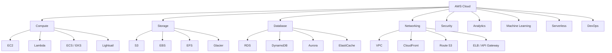

---

## 🏗️ Modelos de Serviço em Nuvem

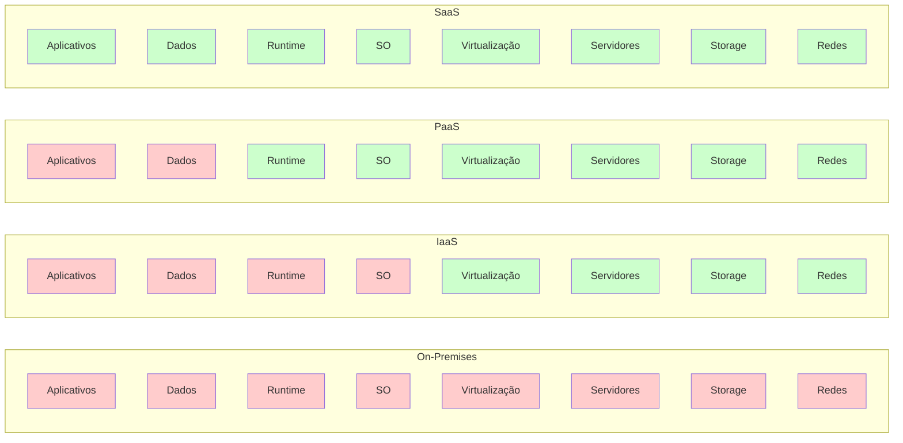

| Modelo | O que você gerencia | Exemplos AWS |
|---|---|---|
| **IaaS** | Aplicação, dados, runtime, SO | EC2, EBS, VPC |
| **PaaS** | Aplicação e dados apenas | Elastic Beanstalk, RDS, Lambda |
| **SaaS** | Nada (tudo gerenciado) | WorkMail, Chime, QuickSight |

---

## 🌐 Infraestrutura Global

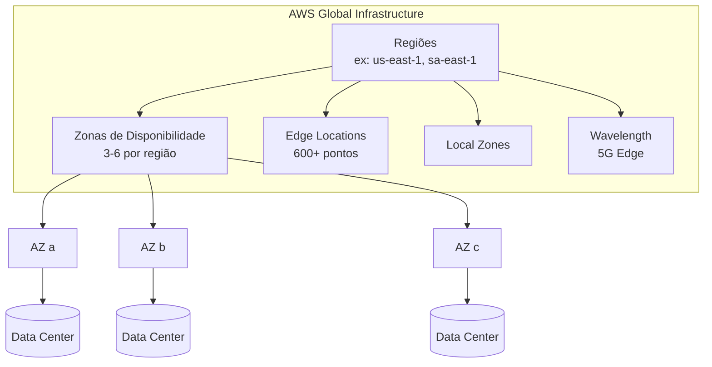

**Conceitos-chave:**
- **Região:** Área geográfica isolada (ex: `us-east-1` — Virgínia, `sa-east-1` — São Paulo)
- **Zona de Disponibilidade (AZ):** Um ou mais datacenters dentro de uma região, com redundância independente
- **Edge Location:** Pontos de presença para entrega de conteúdo via CloudFront
- **Local Zone:** Extensão da região para latência de um dígito em grandes centros urbanos

---

## 🛠️ Principais Serviços por Categoria

### 1. Compute

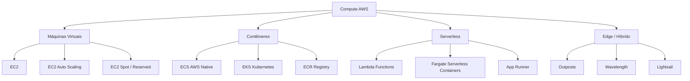

#### Amazon EC2
Máquinas virtuais sob demanda. Centenas de tipos de instância (general purpose, compute optimized, memory optimized, GPU).

#### AWS Lambda
Compute serverless — execute código sem provisionar servidores. Paga por execução e duração. Ideal para eventos, filas, APIs.

#### Amazon ECS / EKS
Orquestração de contêineres. ECS é nativo AWS; EKS é Kubernetes gerenciado.

---

### 2. Storage

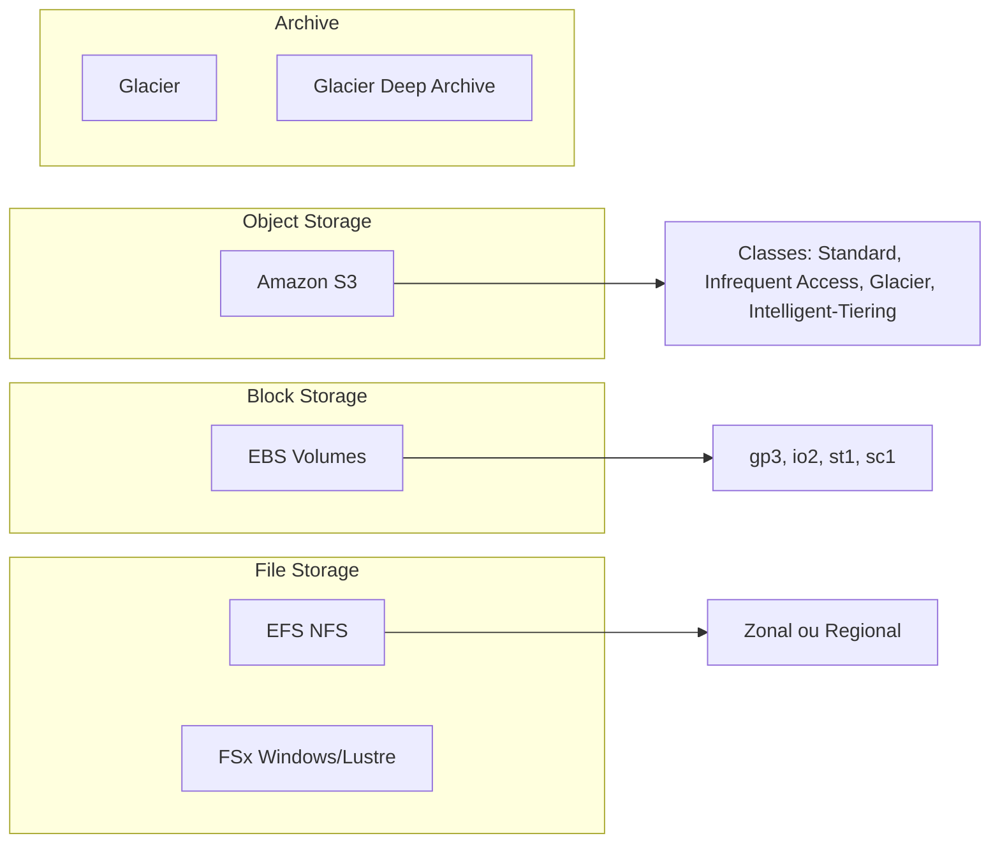

#### Amazon S3
Armazenamento de objetos com durabilidade 99.999999999% (11 noves). Usado para backups, dados de aplicação, data lakes, estáticos web.

#### Amazon EBS
Volumes de blocos para EC2. Persistem independente da instância.

#### Amazon EFS
Sistema de arquivos NFS elástico para Linux. Cresce e encolhe automaticamente.

---

### 3. Database

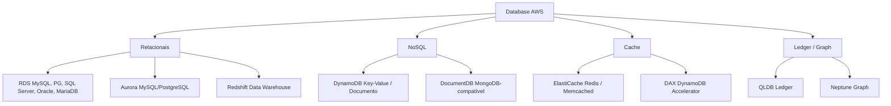

#### Amazon RDS
Banco relacional gerenciado: MySQL, PostgreSQL, SQL Server, Oracle, MariaDB. Multi-AZ, read replicas, backups automáticos.

#### Amazon DynamoDB
Banco NoSQL serverless de latência de milissegundos. Ideal para alta escala, sessões, carrinhos, metadados.

#### Amazon Aurora
MySQL/PostgreSQL compatível com performance 5x superior ao MySQL padrão. Serverless v2 disponível.

---

### 4. Networking & Content Delivery

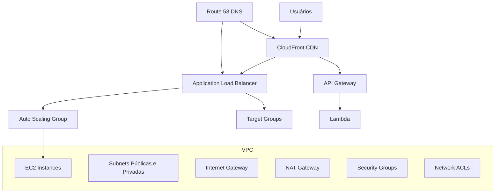

#### Amazon VPC
Rede virtual isolada na AWS. Subnets, route tables, gateways, security groups, NACLs.

#### Amazon CloudFront
CDN global com 600+ edge locations. HTTPS, Lambda@Edge, WAF integrado.

#### Elastic Load Balancer (ELB)
Distribui tráfego entre instâncias. ALB (HTTP/HTTPS), NLB (TCP/UDP), GLB (Gateway Load Balancer).

---

### 5. Security & Identity

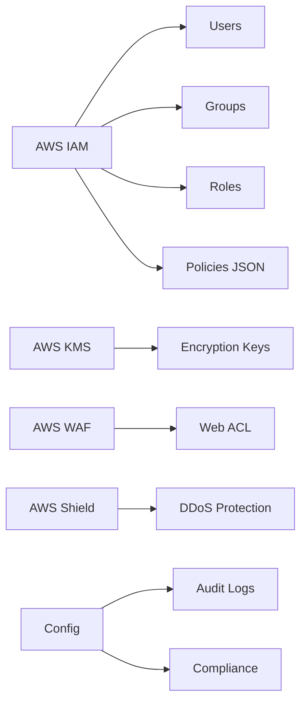

#### AWS IAM
Gerenciamento de identidade e acesso. Usuários, grupos, roles, políticas JSON. Princípio do menor privilégio.

#### AWS KMS
Gerenciamento de chaves de criptografia. Integrado com S3, RDS, DynamoDB, Lambda.

#### AWS WAF + Shield
Proteção contra ataques web e DDoS. WAF filtra requisições HTTP; Shield Advanced protege contra DDoS.

---

### 6. Serverless & Integration

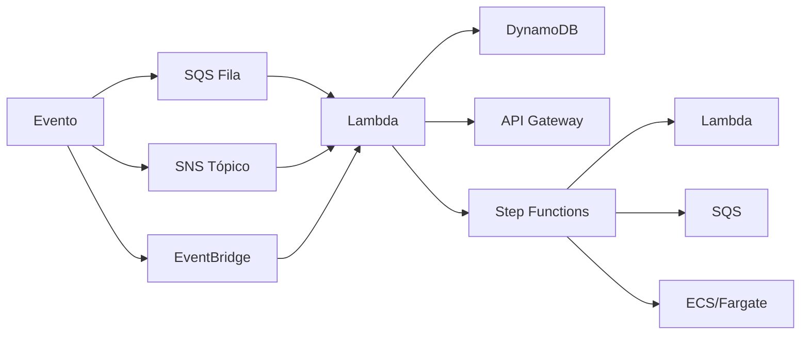

#### Amazon SQS
Fila de mensagens fully managed. Desacopla componentes. Padrão (at-least-once) ou FIFO (exactly-once).

#### Amazon SNS
Pub/sub para notificações. Entrega para SQS, Lambda, email, SMS, HTTP.

#### AWS Step Functions
Orquestrador serverless para fluxos de trabalho. Visual, com retry, error handling, paralelismo.

#### Amazon EventBridge
Barramento de eventos. Conecta serviços AWS, SaaS, e aplicações próprias.

---

### 7. Machine Learning & AI

| Serviço | O que faz |
|---|---|
| **SageMaker** | Plataforma completa de ML: treino, deploy, monitoramento |
| **Bedrock** | Modelos foundation (Claude, Llama, Titan) serverless |
| **Rekognition** | Análise de imagens e vídeos |
| **Polly** | Text-to-Speech |
| **Transcribe** | Speech-to-Text |
| **Comprehend** | NLP, análise de sentimento |
| **Lex** | Chatbots / IVR |
| **Textract** | OCR de documentos |

---

## 📜 Infraestrutura como Código com Terraform

A AWS pode ser provisionada inteiramente via IaC. Abaixo, exemplos com **Terraform (HashiCorp HCL)**.

### Estrutura Recomendada de Projeto

```
infra/
├── environments/
│   ├── dev/
│   │   ├── main.tf
│   │   ├── variables.tf
│   │   └── terraform.tfvars
│   ├── staging/
│   │   └── ...
│   └── prod/
│       └── ...
├── modules/
│   ├── networking/
│   │   ├── main.tf
│   │   ├── variables.tf
│   │   └── outputs.tf
│   ├── compute/
│   └── database/
└── provider.tf
```

### Provider

```hcl
provider "aws" {
  region = var.aws_region
}
```

### VPC + Subnets

```hcl
module "vpc" {
  source = "terraform-aws-modules/vpc/aws"

  name = "app-vpc"
  cidr = "10.0.0.0/16"

  azs             = ["us-east-1a", "us-east-1b", "us-east-1c"]
  private_subnets = ["10.0.1.0/24", "10.0.2.0/24", "10.0.3.0/24"]
  public_subnets  = ["10.0.101.0/24", "10.0.102.0/24", "10.0.103.0/24"]

  enable_nat_gateway = true
  enable_vpn_gateway = false

  tags = { Environment = var.environment }
}
```

### EC2 + Security Group

```hcl
resource "aws_security_group" "web_sg" {
  name        = "web-sg"
  description = "Security group for web tier"
  vpc_id      = module.vpc.vpc_id

  ingress {
    from_port   = 80
    to_port     = 80
    protocol    = "tcp"
    cidr_blocks = ["0.0.0.0/0"]
  }

  ingress {
    from_port   = 443
    to_port     = 443
    protocol    = "tcp"
    cidr_blocks = ["0.0.0.0/0"]
  }

  egress {
    from_port   = 0
    to_port     = 0
    protocol    = "-1"
    cidr_blocks = ["0.0.0.0/0"]
  }
}

resource "aws_instance" "web" {
  ami                    = data.aws_ami.amazon_linux.id
  instance_type          = var.instance_type
  subnet_id              = element(module.vpc.public_subnets, 0)
  vpc_security_group_ids = [aws_security_group.web_sg.id]

  user_data = <<-EOF
    #!/bin/bash
    yum install -y httpd
    systemctl enable httpd
    systemctl start httpd
  EOF

  tags = {
    Name        = "${var.environment}-web"
    Environment = var.environment
  }
}
```

### RDS

```hcl
resource "aws_db_instance" "main" {
  identifier     = "${var.environment}-db"
  engine         = "postgres"
  engine_version = "16.3"
  instance_class = "db.t3.medium"

  db_name  = var.db_name
  username = var.db_username
  password = var.db_password

  allocated_storage     = 100
  storage_encrypted     = true
  storage_type          = "gp3"
  multi_az              = var.environment == "prod"
  backup_retention_period = var.environment == "prod" ? 30 : 7
  skip_final_snapshot   = var.environment != "prod"

  vpc_security_group_ids = [aws_security_group.db_sg.id]
  db_subnet_group_name   = aws_db_subnet_group.main.name

  tags = { Environment = var.environment }
}
```

### S3

```hcl
resource "aws_s3_bucket" "app" {
  bucket = "${var.environment}-app-data-${data.aws_caller_identity.current.account_id}"
}

resource "aws_s3_bucket_versioning" "app" {
  bucket = aws_s3_bucket.app.id
  versioning_configuration {
    status = var.environment == "prod" ? "Enabled" : "Suspended"
  }
}

resource "aws_s3_bucket_server_side_encryption_configuration" "app" {
  bucket = aws_s3_bucket.app.id

  rule {
    apply_server_side_encryption_by_default {
      sse_algorithm = "AES256"
    }
  }
}

resource "aws_s3_bucket_public_access_block" "app" {
  bucket = aws_s3_bucket.app.id

  block_public_acls       = true
  block_public_policy     = true
  ignore_public_acls      = true
  restrict_public_buckets = true
}
```

### Lambda + API Gateway

```hcl
resource "aws_lambda_function" "api" {
  filename         = "function.zip"
  function_name    = "${var.environment}-api-handler"
  role             = aws_iam_role.lambda_role.arn
  handler          = "index.handler"
  runtime          = "nodejs20.x"
  source_code_hash = filebase64sha256("function.zip")

  environment {
    variables = {
      TABLE_NAME = aws_dynamodb_table.main.name
    }
  }
}

resource "aws_apigatewayv2_api" "main" {
  name          = "${var.environment}-http-api"
  protocol_type = "HTTP"
}

resource "aws_apigatewayv2_integration" "lambda" {
  api_id                 = aws_apigatewayv2_api.main.id
  integration_type       = "AWS_PROXY"
  integration_uri        = aws_lambda_function.api.invoke_arn
  payload_format_version = "2.0"
}

resource "aws_lambda_permission" "apigw" {
  statement_id  = "AllowAPIGatewayInvoke"
  action        = "lambda:InvokeFunction"
  function_name = aws_lambda_function.api.function_name
  principal     = "apigateway.amazonaws.com"
  source_arn    = "${aws_apigatewayv2_api.main.execution_arn}/*/*"
}
```

### DynamoDB

```hcl
resource "aws_dynamodb_table" "main" {
  name           = "${var.environment}-${var.table_name}"
  billing_mode   = "PAY_PER_REQUEST"
  hash_key       = "PK"
  range_key      = "SK"

  point_in_time_recovery {
    enabled = var.environment == "prod"
  }

  server_side_encryption {
    enabled = true
  }

  attribute {
    name = "PK"
    type = "S"
  }

  attribute {
    name = "SK"
    type = "S"
  }

  tags = { Environment = var.environment }
}
```

### ECS (Fargate)

```hcl
resource "aws_ecs_cluster" "main" {
  name = "${var.environment}-cluster"
}

resource "aws_ecs_task_definition" "app" {
  family                   = "${var.environment}-app"
  network_mode             = "awsvpc"
  requires_compatibilities = ["FARGATE"]
  cpu                      = "512"
  memory                   = "1024"
  execution_role_arn       = aws_iam_role.ecs_execution.arn

  container_definitions = jsonencode([
    {
      name      = "app"
      image     = "${var.container_image}"
      essential = true
      portMappings = [
        { containerPort = 8080, protocol = "tcp" }
      ]
    }
  ])
}

resource "aws_ecs_service" "app" {
  name            = "${var.environment}-app-service"
  cluster         = aws_ecs_cluster.main.id
  task_definition = aws_ecs_task_definition.app.arn
  desired_count   = 2
  launch_type     = "FARGATE"

  network_configuration {
    subnets         = module.vpc.private_subnets
    security_groups = [aws_security_group.ecs_sg.id]
  }

  load_balancer {
    target_group_arn = aws_lb_target_group.app.arn
    container_name   = "app"
    container_port   = 8080
  }
}
```

---

## 🏛️ Well-Architected Framework

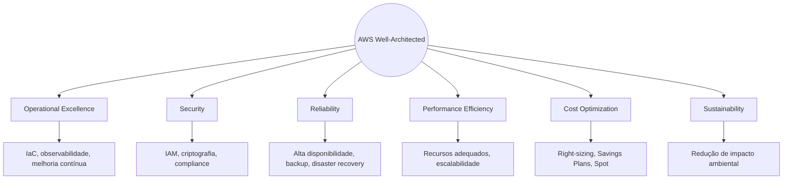

---

## 🤝 Modelo de Responsabilidade Compartilhada

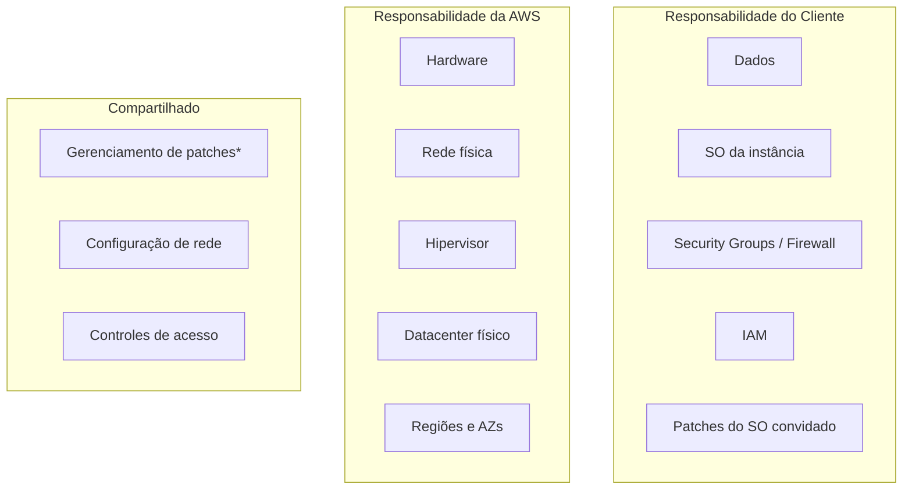

**Regra geral:** AWS é responsável pela **segurança da nuvem**. O cliente é responsável pela **segurança dentro da nuvem**.

---

## 📚 Referências

- [AWS Documentation](https://docs.aws.amazon.com)
- [AWS Well-Architected Framework](https://aws.amazon.com/architecture/well-architected/)
- [Terraform AWS Provider](https://registry.terraform.io/providers/hashicorp/aws/latest/docs)
- [AWS Architecture Center](https://aws.amazon.com/architecture/)

---

*Documento atualizado em Julho de 2026*
