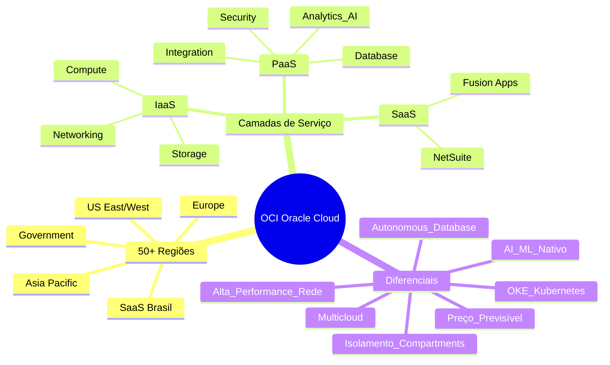
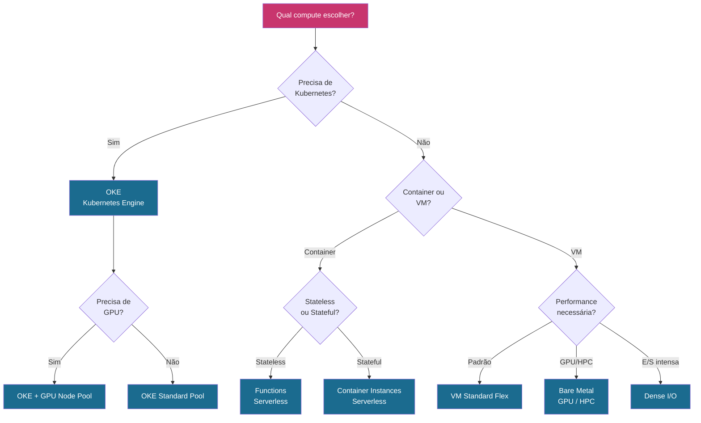
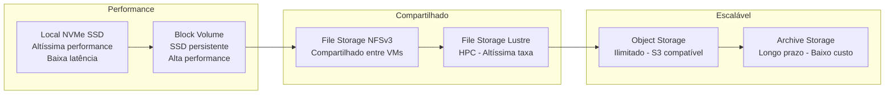
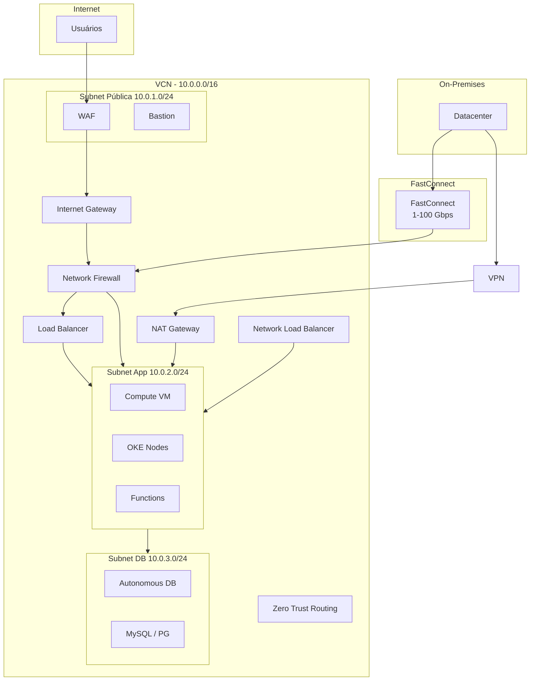
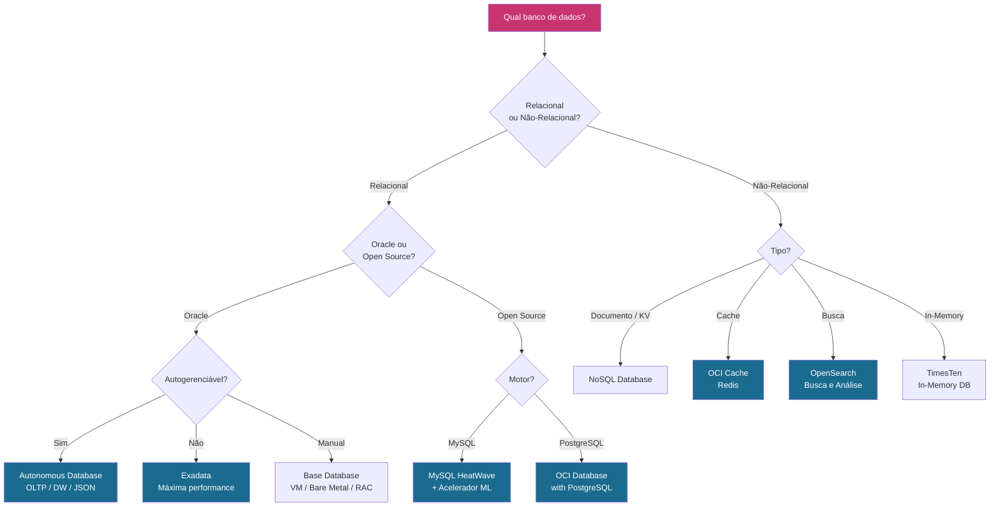
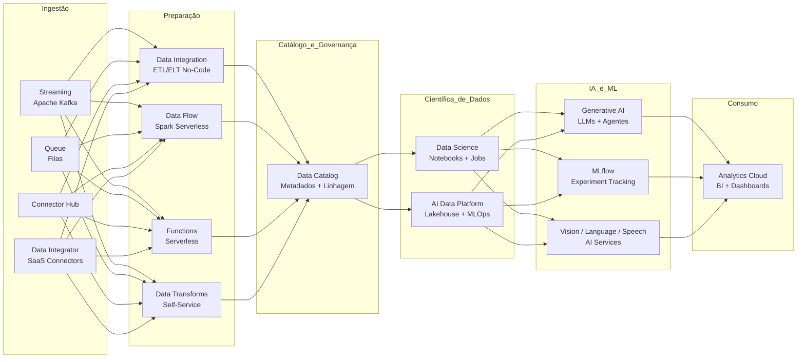
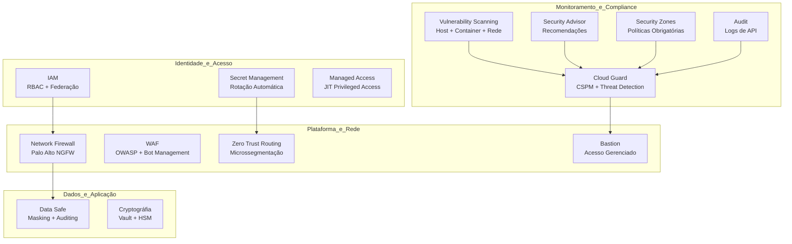
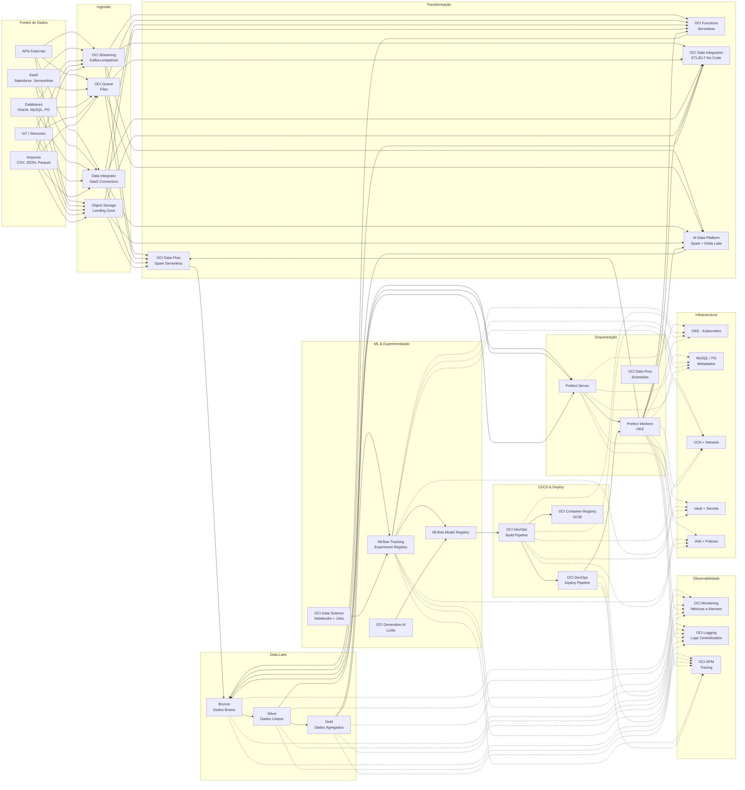

# Visão Geral — Oracle Cloud Infrastructure (OCI)

## 1. O que é a OCI?

A **Oracle Cloud Infrastructure (OCI)** é a plataforma de cloud computing da Oracle, presente em mais de **50 regiões** com **mais de 200 serviços**. A OCI oferece infraestrutura como serviço (IaaS), plataforma como serviço (PaaS) e software como serviço (SaaS), com diferenciais em **desempenho de banco de dados**, **preços previsíveis** e **modelo de rede definido por software**. Suporta desde migrações lift-and-shift até desenvolvimento nativo em cloud com Kubernetes, serverless, Data Science e GenAI.

**Principais diferenciais competitivos:**
- **Autonomous Database** — banco de dados autogerenciável com tuning automático
- **OCI Kubernetes Engine (OKE)** — Kubernetes gerenciado com suporte a clusters enhanced, virtuais e básicos
- **Preço previsível** — sem custo de egress entre serviços
- **Rede de alta performance** — VCN com firewall de próxima geração, FastConnect, Load Balancers
- **Modelo de isolamento** — compartment-based com políticas IAM granulares
- **AI/ML nativo** — Data Science, Generative AI, AI Data Platform Workbench
- **Multicloud** — Oracle Database@AWS/Azure/GCP, interconexões diretas



---

## 2. Catálogo de Recursos OCI

### 2.1 Compute

| Serviço                       | Descrição                                                                                                                                              |
| ----------------------------- | ------------------------------------------------------------------------------------------------------------------------------------------------------ |
| **Compute (VM & Bare Metal)** | Máquinas virtuais e servidores bare metal com shapes flex (custom OCPU/memória), otimizados para uso geral, computação, memória, GPU, HPC e E/S densa. |
| **Dedicated VM Host**         | Hosts físicos single-tenant para VMs.                                                                                                                  |
| **Container Instances**       | Contêineres serverless sem gerenciamento de Kubernetes.                                                                                                |
| **Container Registry (OCIR)** | Registro de imagens Docker/OCI compatível com padrão aberto.                                                                                           |
| **Kubernetes Engine (OKE)**   | Kubernetes gerenciado — clusters Enhanced, Virtual Node e Basic. Integração nativa com VCN, IAM, Load Balancer.                                        |
| **Functions**                 | Funções serverless baseadas no Fn Project.                                                                                                             |
| **Batch**                     | Processamento batch gerenciado em escala.                                                                                                              |
| **Artifact Registry**         | Repositório de artefatos genérico (Maven, npm, Helm charts, etc.).                                                                                     |
| **Secure Desktops**           | Desktops virtuais Windows/Linux hospedados na cloud.                                                                                                   |
| **VMware Solution (OCVS)**    | SDDC VMware rodando sobre bare metal OCI.                                                                                                              |
| **Compute Cloud@Customer**    | Compute OCI executado dentro do datacenter do cliente.                                                                                                 |
| **Roving Edge**               | Dispositivos ruggedizados portáteis para edge computing.                                                                                               |



### 2.2 Storage

| Serviço                        | Descrição                                                                                                                |
| ------------------------------ | ------------------------------------------------------------------------------------------------------------------------ |
| **Block Volume**               | Armazenamento em bloco persistente (SSD) para instâncias de compute. Suporta backup, clonagem, replicação entre regiões. |
| **Object Storage**             | Armazenamento de objetos compatível com S3, com tiers Standard, Infrequent Access e Archive. Ideal para data lakes.      |
| **File Storage**               | Sistema de arquivos NFSv3 compartilhado entre instâncias.                                                                |
| **File Storage with Lustre**   | Sistema de arquivos paralelo Lustre de alta performance para HPC.                                                        |
| **Archive Storage**            | Armazenamento de longo prazo para dados frios.                                                                           |
| **Local NVMe SSD**             | NVMe conectado diretamente à instância para baixa latência e alta taxa de transferência.                                 |
| **Storage Software Appliance** | Gateway on-premises para file/block OCI.                                                                                 |
| **Data Transfer (Offline)**    | Transferência física de dados via Roving Edge ou Data Transfer Disk.                                                     |



### 2.3 Networking, Edge & Connectivity

| Serviço                                | Descrição                                                                                                   |
| -------------------------------------- | ----------------------------------------------------------------------------------------------------------- |
| **Virtual Cloud Network (VCN)**        | Rede privada definida por software na nuvem. Sub-redes públicas/privadas, gateways de internet/NAT/service. |
| **Load Balancer**                      | Balanceador de carga L7 público/privado com políticas de saúde e SSL termination.                           |
| **Network Load Balancer**              | Balanceador L4 de altíssima performance.                                                                    |
| **FastConnect**                        | Conexão privada dedicada entre datacenter e OCI (1 Gbps a 100 Gbps).                                        |
| **VPN (IPSec)**                        | VPN site-to-site criptografada.                                                                             |
| **DNS & Traffic Management**           | Gerenciamento de zonas DNS, políticas de roteamento (steering) e health checks.                             |
| **Web Application Acceleration (WAA)** | CDN e aceleração de borda.                                                                                  |
| **Web Application Firewall (WAF)**     | WAF baseado em regras OWASP, bot management.                                                                |
| **Network Firewall**                   | Firewall stateful de próxima geração baseado em Palo Alto.                                                  |
| **Bastion**                            | Acesso SSH/RDP gerenciado a instâncias privadas.                                                            |
| **IP Management**                      | BYOIP (traga seu próprio IP) e gerenciamento de IPs públicos.                                               |
| **Zero Trust Packet Routing (ZPR)**    | Microssegmentação baseada em identidade.                                                                    |
| **Network Command Center**             | Topologia e monitoramento de rede visual.                                                                   |
| **Cluster Placement Groups**           | Posicionamento de instâncias ciente de domínios de falha.                                                   |



### 2.4 Database

| Serviço                           | Descrição                                                                                                   |
| --------------------------------- | ----------------------------------------------------------------------------------------------------------- |
| **Autonomous Database (ADB)**     | Oracle Database autogerenciável para OLTP, DW e JSON. Provisionamento automático, tuning, backup, patching. |
| **Exadata Database Service**      | Exadata em infraestrutura dedicada, Exascale ou Cloud@Customer. Máximo desempenho para Oracle DB.           |
| **Base Database (VM/Bare Metal)** | Oracle Database gerenciado manualmente — RAC, single-node, Data Guard.                                      |
| **MySQL HeatWave**                | MySQL + acelerador de consultas in-memory + ML integrado.                                                   |
| **NoSQL Database**                | Banco de dados documento/key-value/table.                                                                   |
| **OCI Database with PostgreSQL**  | PostgreSQL gerenciado totalmente compatível.                                                                |
| **OCI Cache (Redis)**             | Cache Redis gerenciado.                                                                                     |
| **OCI Search with OpenSearch**    | OpenSearch gerenciado para busca e análise.                                                                 |
| **TimesTen**                      | Banco de dados in-memory para OKE.                                                                          |
| **Globally Distributed Database** | Oracle Database ativo-ativo multi-região.                                                                   |
| **Autonomous Recovery Service**   | Backup e recuperação automatizados para bancos de dados.                                                    |
| **Database Migration**            | Migração zero-downtime para OCI.                                                                            |
| **Database Tools**                | SQL worksheet, gerenciamento de frotas.                                                                     |
| **GoldenGate**                    | Replicação e streaming de dados em tempo real.                                                              |
| **Data Safe**                     | Segurança de dados — masking, auditing, avaliação de riscos.                                                |



### 2.5 Analytics, AI & Machine Learning

| Serviço                          | Descrição                                                                                                                                |
| -------------------------------- | ---------------------------------------------------------------------------------------------------------------------------------------- |
| **Analytics Cloud (OAC)**        | BI empresarial, dashboards, análises aumentadas.                                                                                         |
| **Data Science**                 | Jupyter notebooks gerenciados, treinamento de modelos, catálogo de modelos, deployments. Inclui SDK Accelerated Data Science.            |
| **AI Data Platform (Workbench)** | Lakehouse unificado: Spark notebooks, Delta Lake, arquitetura medalhão (bronze/silver/gold), workflows, catálogo, MLOps, integração Git. |
| **Data Flow**                    | Apache Spark serverless — sem cluster para gerenciar.                                                                                    |
| **Data Catalog**                 | Gerenciamento de metadados, descoberta de dados, linhagem, glossário de negócios.                                                        |
| **Data Labeling**                | Criação de datasets de treinamento para ML.                                                                                              |
| **Data Integration**             | Designer ETL/ELT no-code, execução Spark, 100+ conectores, proteção contra schema drift.                                                 |
| **Data Integrator**              | Ingestão de dados em massa de aplicações SaaS (Salesforce, ServiceNow, etc.).                                                            |
| **Data Transforms**              | Preparação de dados self-service (estilo Tableau).                                                                                       |
| **Generative AI**                | LLMs gerenciados (Cohere, Meta Llama, fine-tuning).                                                                                      |
| **Generative AI Agents**         | Framework multi-agente RAG.                                                                                                              |
| **Language**                     | NLP — sentimento, entidades, tradução, sumarização.                                                                                      |
| **Speech**                       | Speech-to-text, text-to-speech.                                                                                                          |
| **Vision**                       | Reconhecimento de imagem, OCR, detecção de objetos.                                                                                      |
| **Document Understanding**       | Processamento inteligente de documentos.                                                                                                 |
| **Big Data Service**             | Clusters Hadoop/Spark gerenciados.                                                                                                       |
| **Connector Hub**                | Hub central de eventos de streaming.                                                                                                     |



### 2.6 Integration & Messaging

| Serviço                   | Descrição                                                           |
| ------------------------- | ------------------------------------------------------------------- |
| **Streaming**             | Event streaming compatível com Apache Kafka.                        |
| **Queue**                 | Filas de mensagens gerenciadas.                                     |
| **Events**                | Event-driven triggers para Functions, Streaming, etc.               |
| **API Gateway**           | Publicação de APIs com rate limiting, autenticação, transformações. |
| **Integration 3**         | iPaaS corporativo com conectores SaaS e on-premises.                |
| **Process Automation**    | Automação de workflows/BPM low-code.                                |
| **Messaging**             | Entrega de e-mail/SMS transacionais.                                |
| **Managed File Transfer** | Transferência segura de arquivos.                                   |

### 2.7 Security, Identity & Compliance

| Serviço                            | Descrição                                                          |
| ---------------------------------- | ------------------------------------------------------------------ |
| **IAM (com/sem Identity Domains)** | RBAC, políticas, federação (SAML, SCIM, OAuth).                    |
| **Vault**                          | Gerenciamento de chaves de criptografia e secrets com suporte HSM. |
| **Secret Management**              | Rotação e geração automática de secrets.                           |
| **Cloud Guard**                    | CSPM — detecção de ameaças e anomalias de configuração.            |
| **Security Zones**                 | Aplicação de políticas de segurança em compartments.               |
| **Security Advisor**               | Recomendações para fortalecer a postura de segurança.              |
| **Vulnerability Scanning**         | Varredura de vulnerabilidades em hosts, contêineres e redes.       |
| **Certificates**                   | Gerenciamento do ciclo de vida de certificados TLS.                |
| **Access Governance**              | Análises de identidade, campanhas de certificação.                 |
| **Threat Intelligence**            | Feeds e enriquecimento de IOCs.                                    |
| **OS Management Hub**              | Patch e compliance para sistemas operacionais.                     |
| **Autonomous Linux**               | Patching automatizado e compliance contínuo.                       |
| **Managed Access**                 | Acesso privilegiado just-in-time.                                  |



### 2.8 Observability & Management

| Serviço                          | Descrição                                                     |
| -------------------------------- | ------------------------------------------------------------- |
| **Monitoring**                   | Métricas e alarmes para todos os recursos OCI.                |
| **Logging**                      | Ingestão e busca centralizada de logs.                        |
| **Log Analytics**                | Análise de logs com machine learning.                         |
| **APM**                          | Tracing distribuído, métricas de aplicação, synthetics.       |
| **Database Management**          | Performance, tuning e insights para frotas de banco de dados. |
| **Ops Insights**                 | Planejamento de capacidade, SQL warehouse.                    |
| **Stack Monitoring**             | Observabilidade full-stack (SO, banco, middleware).           |
| **Fleet Application Management** | Operações cross-service em frotas.                            |
| **Resource Manager**             | Execução gerenciada de Terraform.                             |
| **Management Agent**             | Gateway de monitoramento on-premises.                         |
| **Notifications**                | Alertas via e-mail, PagerDuty, Slack.                         |
| **Health Checks**                | Monitoramento de endpoints HTTP/TCP.                          |

### 2.9 Developer Services

| Serviço                 | Descrição                                                         |
| ----------------------- | ----------------------------------------------------------------- |
| **DevOps**              | Pipelines CI/CD, repositórios de código, artefatos, build/deploy. |
| **Resource Manager**    | Terraform gerenciado — stacks, plans, apply.                      |
| **APEX & APEX Service** | Construtor low-code de aplicações.                                |
| **Visual Builder**      | Construtor low-code web/mobile.                                   |
| **Blockchain Platform** | Hyperledger Fabric gerenciado.                                    |
| **Digital Assistant**   | Chatbots/Oracle Digital Assistant.                                |

### 2.10 Governance & Administration

| Serviço                | Descrição                                        |
| ---------------------- | ------------------------------------------------ |
| **Audit**              | Logs de atividade da API.                        |
| **Cloud Advisor**      | Recomendações de custo, segurança e performance. |
| **Budgets**            | Limites de gastos e alertas.                     |
| **Cost Management**    | Análise de custos, relatórios de uso, FinOps.    |
| **Compartment Quotas** | Quotas de recursos por compartment.              |
| **License Manager**    | Rastreamento de licenças BYOL.                   |
| **Resource Scheduler** | Agendamento start/stop de recursos.              |
| **Tagging**            | Tags de metadados para recursos.                 |

### 2.11 Migration, Hybrid & Edge

| Serviço                               | Descrição                                         |
| ------------------------------------- | ------------------------------------------------- |
| **Cloud Migrations**                  | Orquestração de migração rehost/replatform.       |
| **Oracle Cloud Bridge**               | Descoberta e avaliação de workloads on-premises.  |
| **Full Stack Disaster Recovery**      | DR orquestrado e automatizado.                    |
| **Compute Cloud@Customer / Isolated** | Serviços OCI no datacenter do cliente.            |
| **Dedicated Region**                  | Região OCI completa no datacenter do cliente.     |
| **Oracle Alloy**                      | Plataforma de cloud customizada.                  |
| **Roving Edge**                       | Dispositivos portáteis para edge compute/storage. |

### 2.12 Multicloud

| Serviço                           | Descrição                                        |
| --------------------------------- | ------------------------------------------------ |
| **Oracle Database@AWS/Azure/GCP** | Oracle Database rodando dentro de outras clouds. |
| **Interconnect (Azure/AWS/GCP)**  | Conectividade privada direta com outras clouds.  |
| **Multicloud Hub**                | Gerenciamento centralizado multicloud.           |

---

## 3. Exemplo Terraform — Stack de Engenharia de Dados com MLflow, Prefect e Ingestão de Dados

Este exemplo provisiona uma stack completa de engenharia de dados na OCI utilizando:

- **OKE (Kubernetes Engine)** — orquestração de contêineres
- **MLflow** — experiment tracking e model registry
- **Prefect** — orquestração de pipelines
- **Object Storage** — data lake (bronze/silver/gold)
- **PostgreSQL gerenciado** — backend de metadados
- **Data Integration** — ingestão de dados ETL/ELT
- **Streaming** — ingestão de eventos em tempo real

### 3.1 Variáveis e Provider

```hcl
# variables.tf
variable "compartment_ocid" {
  description = "OCID do compartment OCI"
  type        = string
}

variable "region" {
  description = "Região OCI"
  type        = string
  default     = "sa-saopaulo-1"
}

variable "namespace" {
  description = "Namespace único para nomear recursos"
  type        = string
}

variable "oke_node_shape" {
  description = "Shape dos nodes do OKE"
  type        = string
  default     = "VM.Standard.E4.Flex"
}

variable "oke_node_ocpus" {
  description = "OCPUs por node"
  type        = number
  default     = 4
}

variable "oke_node_memory_gb" {
  description = "Memória em GB por node"
  type        = number
  default     = 32
}

variable "oke_node_count" {
  description = "Número de nodes no pool"
  type        = number
  default     = 2
}
```

```hcl
# provider.tf
provider "oci" {
  region = var.region
}

provider "kubernetes" {
  host                   = oci_containerengine_cluster.oke.endpoints[0].kubernetes
  cluster_ca_certificate = base64decode(oci_containerengine_cluster.oke.certificate_authority[0].certificate)
  token                  = local.kube_token
}

provider "helm" {
  kubernetes {
    host                   = oci_containerengine_cluster.oke.endpoints[0].kubernetes
    cluster_ca_certificate = base64decode(oci_containerengine_cluster.oke.certificate_authority[0].certificate)
    token                  = local.kube_token
  }
}

data "oci_identity_availability_domains" "ads" {
  compartment_id = var.compartment_ocid
}

locals {
  kube_token = data.oci_containerengine_cluster_kube_config.oke.token
}
```

### 3.2 Rede (VCN)

```hcl
# network.tf
resource "oci_core_virtual_network" "vcn" {
  compartment_id = var.compartment_ocid
  display_name   = "vcn-data-${var.namespace}"
  cidr_block     = "10.0.0.0/16"
  dns_label      = "datavcn"
}

resource "oci_core_subnet" "oke_subnet" {
  compartment_id    = var.compartment_ocid
  vcn_id            = oci_core_virtual_network.vcn.id
  display_name      = "sub-oke-${var.namespace}"
  cidr_block        = "10.0.1.0/24"
  security_list_ids = [oci_core_security_list.oke_sl.id]
  route_table_id    = oci_core_route_table.rf.id
  dhcp_options_id   = oci_core_virtual_network.vcn.default_dhcp_options_id
  dns_label         = "oke"
}

resource "oci_core_subnet" "lb_subnet" {
  compartment_id    = var.compartment_ocid
  vcn_id            = oci_core_virtual_network.vcn.id
  display_name      = "sub-lb-${var.namespace}"
  cidr_block        = "10.0.2.0/24"
  security_list_ids = [oci_core_security_list.lb_sl.id]
  route_table_id    = oci_core_route_table.rf.id
  dhcp_options_id   = oci_core_virtual_network.vcn.default_dhcp_options_id
  dns_label         = "lb"
}

resource "oci_core_subnet" "db_subnet" {
  compartment_id    = var.compartment_ocid
  vcn_id            = oci_core_virtual_network.vcn.id
  display_name      = "sub-db-${var.namespace}"
  cidr_block        = "10.0.3.0/24"
  security_list_ids = [oci_core_security_list.db_sl.id]
  route_table_id    = oci_core_route_table.rf.id
  dhcp_options_id   = oci_core_virtual_network.vcn.default_dhcp_options_id
  dns_label         = "db"
}

resource "oci_core_internet_gateway" "igw" {
  compartment_id = var.compartment_ocid
  vcn_id         = oci_core_virtual_network.vcn.id
  display_name   = "igw-${var.namespace}"
}

resource "oci_core_route_table" "rf" {
  compartment_id = var.compartment_ocid
  vcn_id         = oci_core_virtual_network.vcn.id
  display_name   = "rt-default-${var.namespace}"
  route_rules {
    network_entity_id = oci_core_internet_gateway.igw.id
    destination       = "0.0.0.0/0"
  }
}

resource "oci_core_security_list" "oke_sl" {
  compartment_id = var.compartment_ocid
  vcn_id         = oci_core_virtual_network.vcn.id
  display_name   = "sl-oke-${var.namespace}"

  ingress_security_rules {
    protocol = "6"
    source   = "0.0.0.0/0"
  }

  egress_security_rules {
    protocol    = "all"
    destination = "0.0.0.0/0"
  }
}

resource "oci_core_security_list" "lb_sl" {
  compartment_id = var.compartment_ocid
  vcn_id         = oci_core_virtual_network.vcn.id
  display_name   = "sl-lb-${var.namespace}"

  ingress_security_rules {
    protocol = "6"
    source   = "0.0.0.0/0"
    tcp_options {
      max = 443
      min = 443
    }
  }

  ingress_security_rules {
    protocol = "6"
    source   = "0.0.0.0/0"
    tcp_options {
      max = 80
      min = 80
    }
  }

  egress_security_rules {
    protocol    = "all"
    destination = "0.0.0.0/0"
  }
}

resource "oci_core_security_list" "db_sl" {
  compartment_id = var.compartment_ocid
  vcn_id         = oci_core_virtual_network.vcn.id
  display_name   = "sl-db-${var.namespace}"

  ingress_security_rules {
    protocol = "6"
    source   = oci_core_subnet.oke_subnet.cidr_block
    tcp_options {
      max = 5432
      min = 5432
    }
  }

  ingress_security_rules {
    protocol = "6"
    source   = oci_core_subnet.oke_subnet.cidr_block
    tcp_options {
      max = 3306
      min = 3306
    }
  }

  egress_security_rules {
    protocol    = "all"
    destination = "0.0.0.0/0"
  }
}
```

### 3.3 Object Storage (Data Lake)

```hcl
# storage.tf
resource "oci_objectstorage_bucket" "landing" {
  name           = "landing-${var.namespace}"
  compartment_id = var.compartment_ocid
  namespace      = data.oci_objectstorage_namespace.ns.namespace
  object_events_enabled = true
  storage_tier   = "Standard"
}

resource "oci_objectstorage_bucket" "bronze" {
  name           = "bronze-${var.namespace}"
  compartment_id = var.compartment_ocid
  namespace      = data.oci_objectstorage_namespace.ns.namespace
  storage_tier   = "Standard"
}

resource "oci_objectstorage_bucket" "silver" {
  name           = "silver-${var.namespace}"
  compartment_id = var.compartment_ocid
  namespace      = data.oci_objectstorage_namespace.ns.namespace
  storage_tier   = "Standard"
}

resource "oci_objectstorage_bucket" "gold" {
  name           = "gold-${var.namespace}"
  compartment_id = var.compartment_ocid
  namespace      = data.oci_objectstorage_namespace.ns.namespace
  storage_tier   = "Standard"
}

resource "oci_objectstorage_bucket" "mlflow_artifacts" {
  name           = "mlflow-${var.namespace}"
  compartment_id = var.compartment_ocid
  namespace      = data.oci_objectstorage_namespace.ns.namespace
  storage_tier   = "Standard"
}

data "oci_objectstorage_namespace" "ns" {
  compartment_id = var.compartment_ocid
}
```

### 3.4 PostgreSQL Gerenciado (Backend MLflow + Prefect)

```hcl
# database.tf
resource "oci_mysql_mysql_db_system" "metadata_db" {
  compartment_id        = var.compartment_ocid
  display_name          = "db-meta-${var.namespace}"
  description           = "Backend de metadados para MLflow, Prefect e Airflow"
  shape_name            = "MySQL.2"
  subnet_id             = oci_core_subnet.db_subnet.id
  admin_username        = "admin"
  admin_password        = var.db_admin_password
  data_storage_size_in_gb = 50

  db_system_backup_policy {
    backup_retention_in_days = 7
    windows_start_time       = "02:00"
  }

  db_system_tags = {
    "environment" = "data-engineering"
    "namespace"   = var.namespace
  }
}
```

### 3.5 OKE Cluster (Kubernetes)

```hcl
# oke.tf
resource "oci_containerengine_cluster" "oke" {
  compartment_id     = var.compartment_ocid
  kubernetes_version = "v1.31.5"
  name               = "oke-${var.namespace}"
  vcn_id             = oci_core_virtual_network.vcn.id
  endpoint_config {
    is_public_ip_enabled = true
    subnet_id            = oci_core_subnet.oke_subnet.id
  }
  options {
    service_lb_subnet_ids = [oci_core_subnet.lb_subnet.id]
  }
  type = "ENHANCED"
}

data "oci_containerengine_cluster_kube_config" "oke" {
  cluster_id = oci_containerengine_cluster.oke.id
}

resource "oci_containerengine_node_pool" "pool" {
  cluster_id         = oci_containerengine_cluster.oke.id
  compartment_id     = var.compartment_ocid
  kubernetes_version = "v1.31.5"
  name               = "pool-data-${var.namespace}"
  node_shape         = var.oke_node_shape
  node_config_details {
    placement_configs {
      availability_domain = data.oci_identity_availability_domains.ads.availability_domains[0].name
      subnet_id           = oci_core_subnet.oke_subnet.id
    }
    placement_configs {
      availability_domain = data.oci_identity_availability_domains.ads.availability_domains[1].name
      subnet_id           = oci_core_subnet.oke_subnet.id
    }
    size = var.oke_node_count
  }
  node_shape_config {
    ocpus         = var.oke_node_ocpus
    memory_in_gbs = var.oke_node_memory_gb
  }
  node_source_details {
    image_id    = data.oci_core_images.oke_image.images[0].id
    source_type = "IMAGE"
  }
  initial_node_labels {
    key   = "pool"
    value = "data-engineering"
  }
}

data "oci_core_images" "oke_image" {
  compartment_id   = var.compartment_ocid
  operating_system = "Oracle Linux"
  sort_by          = "TIMECREATED"
  sort_order       = "DESC"
}
```

### 3.6 MLflow no OKE via Helm

```hcl
# mlflow.tf
resource "kubernetes_namespace" "mlflow" {
  metadata {
    name = "mlflow"
    labels = {
      app = "mlflow"
    }
  }
}

resource "random_password" "mlflow_db_password" {
  length  = 16
  special = false
}

resource "kubernetes_secret" "mlflow_db" {
  metadata {
    name      = "mlflow-db-credentials"
    namespace = kubernetes_namespace.mlflow.metadata[0].name
  }
  data = {
    db_password = random_password.mlflow_db_password.result
  }
}

resource "helm_release" "mlflow" {
  name       = "mlflow"
  namespace  = kubernetes_namespace.mlflow.metadata[0].name
  repository = "https://community-charts.artifacthub.io"
  chart      = "mlflow"

  set {
    name  = "backendStore.postgres.database"
    value = "mlflow"
  }
  set {
    name  = "backendStore.postgres.host"
    value = oci_mysql_mysql_db_system.metadata_db.ip_address
  }
  set {
    name  = "backendStore.postgres.port"
    value = "3306"
  }
  set {
    name  = "backendStore.postgres.user"
    value = "admin"
  }
  set {
    name  = "backendStore.postgres.password"
    value = random_password.mlflow_db_password.result
  }
  set {
    name  = "artifactRoot"
    value = "s3://${oci_objectstorage_bucket.mlflow_artifacts.name}"
  }
  set {
    name  = "s3EndpointUrl"
    value = "https://${data.oci_objectstorage_namespace.ns.namespace}.compat.objectstorage.${var.region}.oraclecloud.com"
  }
  set {
    name  = "service.type"
    value = "LoadBalancer"
  }

  depends_on = [oci_containerengine_node_pool.pool]
}
```

### 3.7 Prefect no OKE via Helm

```hcl
# prefect.tf
resource "kubernetes_namespace" "prefect" {
  metadata {
    name = "prefect"
    labels = {
      app = "prefect"
    }
  }
}

resource "helm_release" "prefect_server" {
  name       = "prefect-server"
  namespace  = kubernetes_namespace.prefect.metadata[0].name
  repository = "https://prefecthq.github.io/prefect-helm"
  chart      = "prefect-server"

  values = [yamlencode({
    server = {
      api = {
        ingress = {
          enabled = true
          host    = "prefect.${var.namespace}.internal"
        }
      }
    }
    postgresql = {
      enabled        = false
      host           = oci_mysql_mysql_db_system.metadata_db.ip_address
      port           = 3306
      database       = "prefect"
      username       = "admin"
      password       = random_password.mlflow_db_password.result
    }
    service = {
      type = "LoadBalancer"
    }
  })]

  depends_on = [oci_containerengine_node_pool.pool]
}
```

### 3.8 Streaming para Ingestão de Eventos

```hcl
# streaming.tf
resource "oci_streaming_stream_pool" "main" {
  compartment_id = var.compartment_ocid
  name           = "pool-stream-${var.namespace}"
  custom_encryption_key {
    kms_key_id = oci_kms_vault.main_vault.id
  }
}

resource "oci_streaming_stream" "events" {
  name           = "stream-ingest-${var.namespace}"
  partitions     = 3
  stream_pool_id = oci_streaming_stream_pool.main.id
  compartment_id = var.compartment_ocid
}

resource "oci_kms_vault" "main_vault" {
  compartment_id = var.compartment_ocid
  display_name   = "vault-${var.namespace}"
  vault_type     = "DEFAULT"
}
```

### 3.9 Functions Serverless para Ingestão de Dados

```hcl
# functions.tf
resource "oci_functions_application" "ingestion" {
  compartment_id = var.compartment_ocid
  display_name   = "app-ingest-${var.namespace}"
  subnet_ids     = [oci_core_subnet.oke_subnet.id]
  syslog_url     = "tcp://logs.oci:514"
}

resource "oci_functions_function" "landing_to_bronze" {
  application_id = oci_functions_application.ingestion.id
  display_name   = "func-landing-to-bronze"
  image          = "${oci_container_repository.ingestion_repo.name}:latest"
  memory_in_mbs  = 1024
  timeout_in_seconds = 300
}

resource "oci_container_repository" "ingestion_repo" {
  compartment_id = var.compartment_ocid
  display_name   = "repo/ingestion-functions"
  is_public      = false
}
```

### 3.10 Data Integration (ETL/ELT No-Code)

```hcl
# data-integration.tf
resource "oci_dataintegration_workspace" "main" {
  compartment_id = var.compartment_ocid
  display_name   = "ws-etl-${var.namespace}"
  is_private_network = true
  subnet_id      = oci_core_subnet.oke_subnet.id
  vcn_id         = oci_core_virtual_network.vcn.id
}

resource "oci_dataintegration_workspace_project" "data_pipelines" {
  workspace_id = oci_dataintegration_workspace.main.id
  identifier   = "DataPipelines"
  name         = "Pipelines de Dados"
}
```

### 3.11 IAM e Políticas

```hcl
# iam.tf
resource "oci_identity_dynamic_group" "oke_workers" {
  compartment_id = var.compartment_ocid
  description    = "Dynamic group for OKE workers"
  matching_rule  = "ALL {resource.type = 'oke-cluster', resource.compartment.id = '${var.compartment_ocid}'}"
  name           = "dg-oke-${var.namespace}"
}

resource "oci_identity_policy" "oke_object_storage" {
  compartment_id = var.compartment_ocid
  description    = "Allow OKE workers to access Object Storage"
  name           = "policy-oke-obj-${var.namespace}"
  statements = [
    "Allow dynamic-group ${oci_identity_dynamic_group.oke_workers.name} to read objectstorage-namespaces in compartment id ${var.compartment_ocid}",
    "Allow dynamic-group ${oci_identity_dynamic_group.oke_workers.name} to manage objects in compartment id ${var.compartment_ocid}",
    "Allow dynamic-group ${oci_identity_dynamic_group.oke_workers.name} to manage buckets in compartment id ${var.compartment_ocid}",
    "Allow dynamic-group ${oci_identity_dynamic_group.oke_workers.name} to use streams in compartment id ${var.compartment_ocid}",
  ]
}
```

### 3.12 Outputs

```hcl
# outputs.tf
output "kubeconfig_command" {
  description = "Comando para gerar kubeconfig do OKE"
  value       = "oci ce cluster create-kubeconfig --cluster-id ${oci_containerengine_cluster.oke.id} --region ${var.region} --token-version 2.0.0 --file $HOME/.kube/config"
}

output "mlflow_url" {
  description = "URL do MLflow Tracking Server"
  value       = "http://${helm_release.mlflow.status[0].load_balancer[0].ingress[0].hostname}:5000"
}

output "prefect_url" {
  description = "URL do Prefect Server"
  value       = "http://${helm_release.prefect_server.status[0].load_balancer[0].ingress[0].hostname}:4200"
}

output "landing_bucket" {
  description = "Bucket landing para ingestão de dados brutos"
  value       = oci_objectstorage_bucket.landing.name
}

output "stream_ocid" {
  description = "OCID do stream para ingestão de eventos"
  value       = oci_streaming_stream.events.id
}

output "metadata_db_host" {
  description = "Host do banco de metadados PostgreSQL"
  value       = oci_mysql_mysql_db_system.metadata_db.ip_address
}
```

### 3.13 Como usar

```bash
# 1. Inicializar Terraform
terraform init

# 2. Configurar variáveis
export TF_VAR_compartment_ocid="ocid1.compartment.oc1..."
export TF_VAR_namespace="meu-projeto"
export TF_VAR_db_admin_password="MinhaSenhaSegura123!"

# 3. Validar e aplicar
terraform plan
terraform apply -auto-approve
```

```mermaid
flowchart TD
    subgraph Variaveis[Variáveis e Provider]
        VARS[Variables<br>compartment, region, namespace]
        PROV[Providers<br>oci, kubernetes, helm]
    end
    subgraph Rede[Rede - VCN]
        VCN[VCN 10.0.0.0/16]
        IGW[Internet Gateway]
        RT[Route Table]
        SUB1[Subnet OKE 10.0.1.0/24]
        SUB2[Subnet LB 10.0.2.0/24]
        SUB3[Subnet DB 10.0.3.0/24]
        SL1[Security List OKE]
        SL2[Security List LB]
        SL3[Security List DB]
    end
    subgraph Storage[Object Storage]
        LANDING[landing]
        BRONZE[bronze]
        SILVER[silver]
        GOLD[gold]
        MLART[mlflow-artifacts]
    end
    subgraph DB[Database]
        MYSQL[MySQL System<br>Metadados]
    end
    subgraph OKE[Kubernetes]
        CLUSTER[OKE Cluster Enhanced]
        NODEPOOL[Node Pool<br>data-engineering]
    end
    subgraph MLFLOW[MLflow]
        NS1[Namespace mlflow]
        PW[Random Password]
        SECRET[K8s Secret]
        HELM1[Helm Release<br>mlflow]
    end
    subgraph PREFECT[Prefect]
        NS2[Namespace prefect]
        HELM2[Helm Release<br>prefect-server]
    end
    subgraph STREAM[Streaming]
        VAULT[KMS Vault]
        POOL[Stream Pool]
        STREAM[Stream events]
    end
    subgraph FUNC[Functions]
        APP[Functions App]
        REPO[Container Repo]
        FN[Function<br>landing-to-bronze]
    end
    subgraph DI[Data Integration]
        WS[Workspace]
        PROJ[Project]
    end
    subgraph IAM[IAM]
        DG[Dynamic Group]
        POL[Policy]
    end

    VARS --> PROV
    PROV --> VCN & LANDING
    VCN --> IGW --> RT
    VCN --> SUB1 & SUB2 & SUB3
    SUB1 --> SL1
    SUB2 --> SL2
    SUB3 --> SL3
    VCN --> CLUSTER
    SUB1 --> NODEPOOL
    SUB3 --> MYSQL
    MYSQL --> HELM1 & HELM2
    LANDING & BRONZE & SILVER & GOLD & MLART --> HELM1
    CLUSTER --> HELM1 & HELM2
    PW --> SECRET --> HELM1
    VAULT --> POOL --> STREAM
    SUB1 --> APP --> FN
    REPO --> FN
    SUB1 --> WS --> PROJ
    DG --> POL
    POL --> STREAM & LANDING & BRONZE & SILVER & GOLD
```

---

## 4. Stack de Engenharia de Dados — Arquitetura



**Componentes da Stack:**

| Componente                              | Função na Engenharia de Dados                                     |
| --------------------------------------- | ----------------------------------------------------------------- |
| **Object Storage (Bronze/Silver/Gold)** | Data lake em arquitetura medalhão                                 |
| **Streaming**                           | Ingestão de eventos em tempo real (Kafka-compatible)              |
| **Data Integration**                    | Pipelines ETL/ELT no-code com 100+ conectores                     |
| **Data Flow**                           | Spark serverless para transformações                              |
| **Functions**                           | Funções serverless para ingestão e transformação leves            |
| **Prefect**                             | Orquestração e agendamento de pipelines                           |
| **MLflow**                              | Rastreamento de experimentos, registro e versionamento de modelos |
| **Data Science**                        | Notebooks Jupyter gerenciados, jobs de treinamento                |
| **PostgreSQL / MySQL**                  | Backend de metadados para MLflow e Prefect                        |
| **OKE**                                 | Orquestração de contêineres para serviços stateful                |
| **DevOps**                              | CI/CD para pipelines de dados e modelos                           |

Esta stack permite que times de engenharia de dados implementem pipelines completos de **ingestão → transformação → orquestração → ML → deploy**, tudo gerenciado como código com Terraform e rodando nativamente na OCI.
