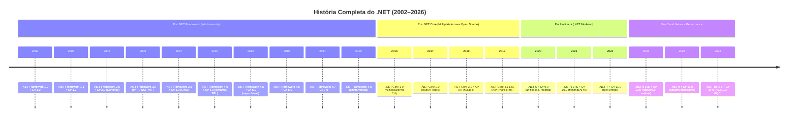
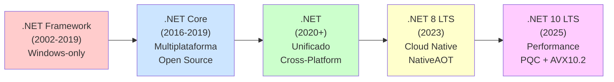
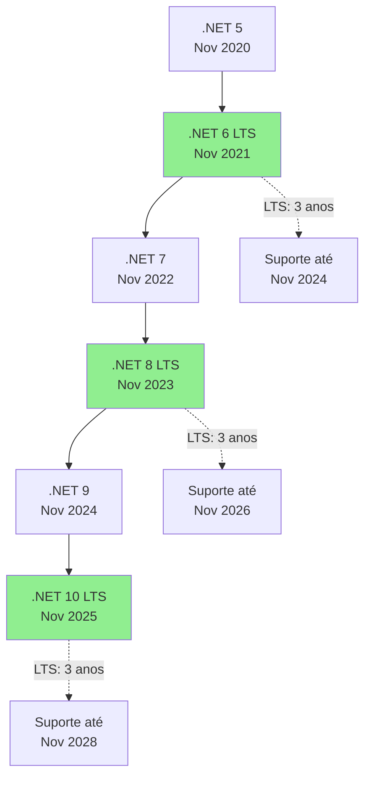
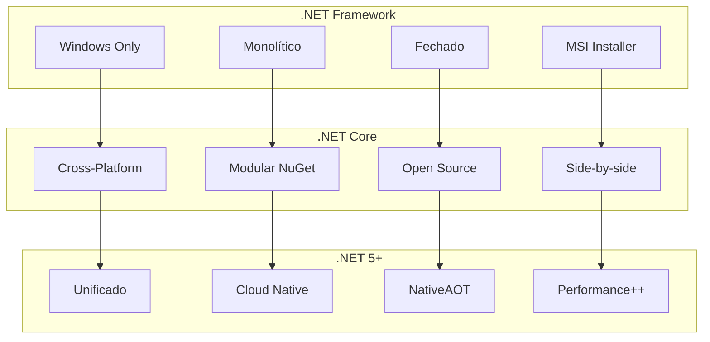
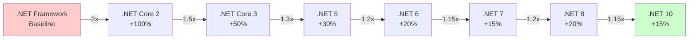
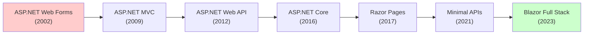
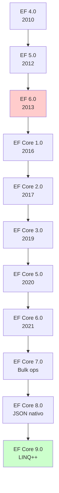
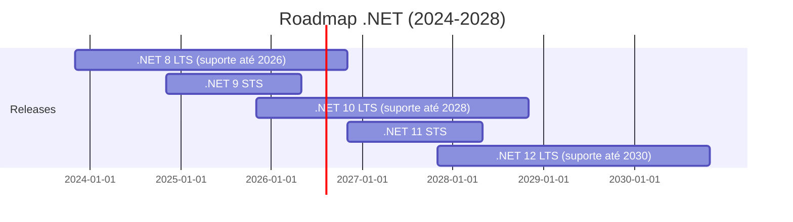
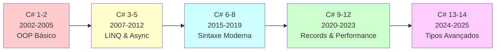
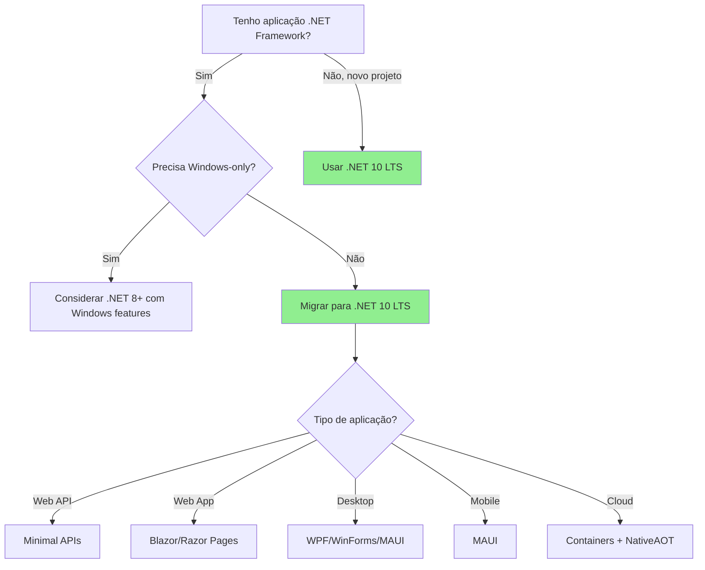

# 📘 Evolução Completa do .NET e C#

> Documento técnico abrangente sobre a evolução do .NET Framework até o .NET moderno e a linguagem C#

## 📑 Índice

- [Linha do Tempo](#-linha-do-tempo)
- [Evolução do .NET](#-evolução-do-net)
- [Evolução do C#](#-evolução-do-c)
- [Comparações e Análises](#-comparações-e-análises)
- [Referências](#-referências)

---

## 🧭 Linha do Tempo



---

## 🏛️ Evolução do .NET

### Arquitetura Geral



---

## 📦 .NET Framework (2002-2019) - Era Windows

### 🔷 .NET Framework 1.0 (2002)

**Características:**
- Primeira versão oficial do .NET
- CLR (Common Language Runtime)
- Base Class Library (BCL)
- ASP.NET Web Forms
- Windows Forms
- ADO.NET

**C# 1.0:**
```csharp
// C# 1.0 - Básico orientado a objetos
public class Pessoa
{
    private string nome;
    
    public Pessoa(string nome)
    {
        this.nome = nome;
    }
    
    public string GetNome()
    {
        return this.nome;
    }
}
```

---

### 🔷 .NET Framework 1.1 (2003)

- Suporte a IPv6
- Mobile ASP.NET controls
- ODBC e Oracle providers

---

### 🔷 .NET Framework 2.0 (2005) + C# 2.0

**Grandes inovações:**
- **Generics** (revolucionário!)
- **Nullable types**
- **Anonymous methods**
- **Iterators (yield)**
- Partial classes

**C# 2.0 - Generics:**
```csharp
// Generics - Type-safe collections
public class Repository<T> where T : class
{
    private List<T> items = new List<T>();
    
    public void Add(T item)
    {
        items.Add(item);
    }
    
    public T GetById(int id)
    {
        return items[id];
    }
}

// Nullable types
int? idade = null;
if (idade.HasValue)
{
    Console.WriteLine(idade.Value);
}

// Iterators
public IEnumerable<int> GetNumeros()
{
    for (int i = 0; i < 10; i++)
    {
        yield return i;
    }
}
```

---

### 🔷 .NET Framework 3.0 (2006)

- **WPF** (Windows Presentation Foundation)
- **WCF** (Windows Communication Foundation)
- **WF** (Windows Workflow Foundation)
- **CardSpace** (identidade digital)

---

### 🔷 .NET Framework 3.5 (2007) + C# 3.0 🎯

**Revolucionário - LINQ e programação funcional:**
- **LINQ** (Language Integrated Query)
- **Lambda expressions**
- **Extension methods**
- **Anonymous types**
- **Expression trees**
- **Var keyword**

**C# 3.0 - LINQ:**
```csharp
// Lambda expressions
Func<int, int> quadrado = x => x * x;

// LINQ
var pessoas = new List<Pessoa>
{
    new Pessoa { Nome = "João", Idade = 30 },
    new Pessoa { Nome = "Maria", Idade = 25 },
    new Pessoa { Nome = "Pedro", Idade = 35 }
};

// Query syntax
var adultos = from p in pessoas
              where p.Idade >= 30
              orderby p.Nome
              select p;

// Method syntax
var adultosMethod = pessoas
    .Where(p => p.Idade >= 30)
    .OrderBy(p => p.Nome)
    .Select(p => p.Nome);

// Extension methods
public static class StringExtensions
{
    public static bool IsValidEmail(this string email)
    {
        return email.Contains("@");
    }
}

string email = "teste@exemplo.com";
bool valido = email.IsValidEmail(); // Extension method

// Anonymous types
var pessoa = new { Nome = "João", Idade = 30 };
Console.WriteLine($"{pessoa.Nome} - {pessoa.Idade}");
```

---

### 🔷 .NET Framework 4.0 (2010) + C# 4.0

**Paralelismo e dynamic:**
- **Task Parallel Library (TPL)**
- **PLINQ** (Parallel LINQ)
- **Dynamic keyword**
- **Named and optional parameters**
- **Covariance and contravariance**

**C# 4.0:**
```csharp
// Dynamic
dynamic obj = GetDynamicObject();
obj.MetodoQualquer(); // Resolvido em runtime

// Named and optional parameters
public void CriarUsuario(string nome, int idade = 18, string cidade = "SP")
{
    // ...
}
CriarUsuario(nome: "João", cidade: "RJ");

// Parallel LINQ
var numeros = Enumerable.Range(1, 1000000);
var pares = numeros
    .AsParallel()
    .Where(n => n % 2 == 0)
    .ToList();

// Task Parallel Library
Task.Run(() => ProcessarDados());
await Task.WhenAll(task1, task2, task3);
```

---

### 🔷 .NET Framework 4.5 (2012) + C# 5.0 🎯

**Async/Await - Outra revolução:**
- **async/await**
- Caller information attributes
- ASP.NET Web API

**C# 5.0 - Async/Await:**
```csharp
// Async/Await - Simplifica código assíncrono
public async Task<string> BuscarDadosAsync(string url)
{
    using (var client = new HttpClient())
    {
        string resultado = await client.GetStringAsync(url);
        return resultado;
    }
}

// Múltiplas operações assíncronas
public async Task ProcessarMultiplosAsync()
{
    var task1 = BuscarDadosAsync("url1");
    var task2 = BuscarDadosAsync("url2");
    var task3 = BuscarDadosAsync("url3");
    
    await Task.WhenAll(task1, task2, task3);
    
    Console.WriteLine($"Resultado 1: {task1.Result}");
    Console.WriteLine($"Resultado 2: {task2.Result}");
    Console.WriteLine($"Resultado 3: {task3.Result}");
}
```

---

### 🔷 .NET Framework 4.6 (2015) + C# 6.0

**Melhorias de sintaxe:**
- **String interpolation**
- **Null-conditional operator (?. e ?[])**
- **Expression-bodied members**
- **Auto-property initializers**
- **nameof operator**

**C# 6.0:**
```csharp
// String interpolation
string nome = "João";
int idade = 30;
string mensagem = $"{nome} tem {idade} anos";

// Null-conditional operator
string primeiroNome = pessoa?.Nome?.Split(' ')[0];
int? tamanho = lista?[0]?.Nome?.Length;

// Expression-bodied members
public string NomeCompleto => $"{Nome} {Sobrenome}";
public void Imprimir() => Console.WriteLine(NomeCompleto);

// Auto-property initializers
public string Nome { get; set; } = "Padrão";
public List<int> Numeros { get; } = new List<int>();

// nameof operator
if (nome == null)
    throw new ArgumentNullException(nameof(nome));
```

---

### 🔷 .NET Framework 4.7 (2017) + C# 7.0

**Pattern matching e tuplas:**
- **Tuples**
- **Pattern matching**
- **Out variables**
- **Local functions**
- **Ref returns and locals**
- **Deconstruction**

**C# 7.0:**
```csharp
// Tuples
(string nome, int idade) GetPessoa()
{
    return ("João", 30);
}

var pessoa = GetPessoa();
Console.WriteLine($"{pessoa.nome} - {pessoa.idade}");

// Deconstruction
var (nome, idade) = GetPessoa();

// Pattern matching
object obj = GetObject();
if (obj is string texto)
{
    Console.WriteLine($"É string: {texto}");
}

switch (obj)
{
    case int numero when numero > 0:
        Console.WriteLine("Inteiro positivo");
        break;
    case string texto:
        Console.WriteLine($"String: {texto}");
        break;
    case null:
        Console.WriteLine("Nulo");
        break;
}

// Out variables
if (int.TryParse("123", out int numero))
{
    Console.WriteLine(numero);
}

// Local functions
int Somar(int a, int b)
{
    return Multiplicar(a, 2) + Multiplicar(b, 2);
    
    int Multiplicar(int x, int y) => x * y;
}
```

---

### 🔷 .NET Framework 4.8 (2019)

**Última versão do .NET Framework:**
- Suporte contínuo, mas sem novas funcionalidades
- Mantido para compatibilidade com aplicações legadas
- Recomendação da Microsoft: migrar para .NET moderno

---

## 🟧 Era .NET Core (2016-2019) - Multiplataforma

### 🟧 .NET Core 1.0 (2016)

**Revolução - Open Source e Cross-Platform:**
- **Multiplataforma** (Windows, Linux, macOS)
- **Open Source** (MIT License)
- **Modular** (NuGet packages)
- **CLI moderna** (dotnet CLI)
- **ASP.NET Core 1.0**
- **EF Core 1.0**

```bash
# dotnet CLI
dotnet new console
dotnet restore
dotnet build
dotnet run
```

---

### 🟧 .NET Core 2.0 (2017)

- **Razor Pages**
- Mais APIs compatíveis com .NET Framework
- .NET Standard 2.0

---

### 🟧 .NET Core 3.0 (2019) + C# 8.0

**WPF/WinForms no .NET Core:**
- **WPF e Windows Forms** portados
- **gRPC**
- **Blazor Server-Side**

**C# 8.0 - Nullable Reference Types:**
```csharp
#nullable enable

// Nullable reference types
string? nome = null; // Pode ser nulo
string sobrenome = "Silva"; // Não pode ser nulo

// Null-coalescing assignment
nome ??= "Padrão";

// Switch expressions
var tipo = forma switch
{
    Circulo c => $"Círculo de raio {c.Raio}",
    Retangulo r => $"Retângulo {r.Largura}x{r.Altura}",
    _ => "Forma desconhecida"
};

// Pattern matching enhancements
if (forma is Circulo { Raio: > 10 })
{
    Console.WriteLine("Círculo grande");
}

// Using declarations
using var file = new StreamReader("arquivo.txt");
// Dispose automático no fim do escopo

// Async streams
async IAsyncEnumerable<int> GetNumerosAsync()
{
    for (int i = 0; i < 10; i++)
    {
        await Task.Delay(100);
        yield return i;
    }
}

await foreach (var numero in GetNumerosAsync())
{
    Console.WriteLine(numero);
}
```

---

### 🟧 .NET Core 3.1 LTS (2019)

- **Long-Term Support** (3 anos)
- Estável e recomendado para produção
- Base para migração do .NET Framework

---

## 🟩 Era .NET Unificado (2020+)



---

### 🟢 .NET 5 (2020) + C# 9.0

**Unificação do ecossistema:**
- Um único .NET para tudo
- **Single file apps**
- Melhorias de performance (20-30%)

**C# 9.0 - Records:**
```csharp
// Records - immutable data classes
public record Pessoa(string Nome, int Idade);

var p1 = new Pessoa("João", 30);
var p2 = p1 with { Idade = 31 }; // Non-destructive mutation

// Top-level statements (Program.cs)
using System;

Console.WriteLine("Hello World!");
ProcessarDados();

void ProcessarDados()
{
    // ...
}

// Init-only properties
public class Usuario
{
    public string Nome { get; init; }
    public int Idade { get; init; }
}

var usuario = new Usuario { Nome = "João", Idade = 30 };
// usuario.Nome = "Maria"; // ERRO - init-only

// Pattern matching enhancements
var resultado = temperatura switch
{
    < 0 => "Congelante",
    >= 0 and < 10 => "Frio",
    >= 10 and < 20 => "Agradável",
    >= 20 and < 30 => "Quente",
    >= 30 => "Muito quente"
};
```

---

### 🟢 .NET 6 LTS (2021) + C# 10.0 🎯

**Minimal APIs e unificação completa:**
- **Minimal APIs**
- **Hot Reload**
- MAUI (substituindo Xamarin)
- Blazor WebAssembly melhorado

**C# 10.0:**
```csharp
// Global usings (no topo do arquivo)
global using System;
global using System.Linq;
global using Microsoft.AspNetCore.Builder;

// File-scoped namespaces
namespace MeuProjeto.Dominio;

public class Produto
{
    // ...
}

// Record structs
public record struct Ponto(int X, int Y);

// Minimal API
var builder = WebApplication.CreateBuilder(args);
var app = builder.Build();

app.MapGet("/", () => "Hello World!");
app.MapGet("/produtos", () => new[] { "Produto 1", "Produto 2" });
app.MapPost("/produtos", (Produto produto) => Results.Created($"/produtos/{produto.Id}", produto));

app.Run();

// Constant interpolated strings
const string Saudacao = $"Bem-vindo!";

// Extended property patterns
if (pessoa is { Endereco.Cidade: "São Paulo", Idade: >= 18 })
{
    // ...
}
```

---

### 🟢 .NET 7 (2022) + C# 11.0

**Foco em performance:**
- Melhorias no JIT
- Observability builtin
- Regex source generators

**C# 11.0:**
```csharp
// Raw string literals
string json = """
{
    "nome": "João",
    "idade": 30,
    "endereco": {
        "cidade": "São Paulo"
    }
}
""";

// Generic math
T Somar<T>(T a, T b) where T : INumber<T>
{
    return a + b;
}

// List patterns
int[] numeros = { 1, 2, 3, 4, 5 };
if (numeros is [1, 2, .., 5])
{
    Console.WriteLine("Começa com 1, 2 e termina com 5");
}

// Required members
public class Usuario
{
    public required string Nome { get; init; }
    public required string Email { get; init; }
}

// var usuario = new Usuario(); // ERRO
var usuario = new Usuario { Nome = "João", Email = "joao@teste.com" };

// File-scoped types (internal por padrão para o arquivo)
file class HelperInterno
{
    public static void Processar() { }
}
```

---

### 🟢 .NET 8 LTS (2023) + C# 12.0 🎯

**Cloud Native e NativeAOT:**
- **NativeAOT estável** (compilação nativa)
- **Blazor Full Stack**
- EF Core 8 com JSON nativo
- Melhorias dramáticas de performance

**C# 12.0:**
```csharp
// Primary constructors (classes)
public class Usuario(string nome, int idade)
{
    public string Nome { get; } = nome;
    public int Idade { get; } = idade;
    
    public void Apresentar()
    {
        Console.WriteLine($"{nome} tem {idade} anos");
    }
}

var usuario = new Usuario("João", 30);

// Collection expressions
int[] numeros = [1, 2, 3, 4, 5];
List<string> nomes = ["João", "Maria", "Pedro"];
Span<int> span = [1, 2, 3];

// Spreading
int[] parte1 = [1, 2, 3];
int[] parte2 = [4, 5, 6];
int[] todos = [..parte1, ..parte2]; // [1, 2, 3, 4, 5, 6]

// Alias any type
using Coordenada = (int x, int y);
Coordenada ponto = (10, 20);

// Inline arrays (performance)
[System.Runtime.CompilerServices.InlineArray(10)]
public struct Buffer
{
    private int _element0;
}

// Lambda default parameters
var incrementar = (int x, int valor = 1) => x + valor;
Console.WriteLine(incrementar(10)); // 11
Console.WriteLine(incrementar(10, 5)); // 15
```

---

### 🟡 .NET 9 (2024) + C# 13.0

**Refinamentos e otimizações:**
- Melhorias em AOT
- Novo modelo de hosting no ASP.NET Core
- Melhorias em JSON, networking e threading

**C# 13.0:**
```csharp
// Params collections (além de arrays)
void Processar(params IEnumerable<int> numeros) { }
void Processar(params ReadOnlySpan<int> numeros) { }

Processar(1, 2, 3, 4, 5);
Processar([1, 2, 3]);

// Implicit indexer access
var lista = new List<int> { 1, 2, 3, 4, 5 };
var ultimo = lista[^1]; // Acesso implícito ao último elemento

// Escape character \e
Console.WriteLine("\e[31mTexto vermelho\e[0m");

// Method group natural type improvements
var metodo = Console.WriteLine; // Infere Action<string>
```

---

### 🔴 .NET 10 LTS (2025) + C# 14.0 🎯

**Performance extrema e segurança pós-quântica:**
- **Suporte AVX10.2 e ARM SVE**
- **Criptografia pós-quântica (PQC)**
- NativeAOT maduro
- Test runner unificado
- Melhorias no JIT e GC

**C# 14.0 (Preview):**
```csharp
// Extension members (beyond methods)
public extension PersonExtensions for Person
{
    public string NomeCompleto => $"{Nome} {Sobrenome}";
    public int IdadeEmMeses => Idade * 12;
}

var pessoa = new Person { Nome = "João", Sobrenome = "Silva", Idade = 30 };
Console.WriteLine(pessoa.NomeCompleto); // João Silva
Console.WriteLine(pessoa.IdadeEmMeses); // 360

// Field keyword (in properties)
public class Produto
{
    public string Nome
    {
        get => field;
        set
        {
            if (string.IsNullOrWhiteSpace(value))
                throw new ArgumentException("Nome não pode ser vazio");
            field = value.Trim();
        }
    }
}

// Discriminated unions (proposal)
public union Result<T>
{
    Success(T Value),
    Error(string Message)
}

Result<int> Dividir(int a, int b)
{
    if (b == 0)
        return new Result<int>.Error("Divisão por zero");
    return new Result<int>.Success(a / b);
}
```

---

## 📊 Comparação: .NET Framework vs .NET Core vs .NET Moderno



---

## 🚀 Evolução de Performance



**Performance acumulada:**
- .NET 10 é aproximadamente **5-6x mais rápido** que .NET Framework 4.8
- Menor uso de memória
- Startup time reduzido (especialmente com NativeAOT)

---

## 📦 Evolução do ASP.NET



**Exemplo Minimal API (.NET 6+):**
```csharp
var builder = WebApplication.CreateBuilder(args);
builder.Services.AddEndpointsApiExplorer();
builder.Services.AddSwaggerGen();

var app = builder.Build();

app.MapGet("/produtos", async (IProdutoService service) => 
    await service.GetAllAsync());

app.MapGet("/produtos/{id}", async (int id, IProdutoService service) => 
    await service.GetByIdAsync(id) is Produto produto
        ? Results.Ok(produto)
        : Results.NotFound());

app.MapPost("/produtos", async (Produto produto, IProdutoService service) =>
{
    await service.AddAsync(produto);
    return Results.Created($"/produtos/{produto.Id}", produto);
});

app.Run();
```

---

## 🗃️ Evolução do Entity Framework



**EF Core 8 - JSON Columns:**
```csharp
public class Produto
{
    public int Id { get; set; }
    public string Nome { get; set; }
    public Metadata Info { get; set; } // Mapeado como JSON
}

public class Metadata
{
    public string Categoria { get; set; }
    public List<string> Tags { get; set; }
    public Dictionary<string, string> Atributos { get; set; }
}

// Configuration
modelBuilder.Entity<Produto>()
    .OwnsOne(p => p.Info, builder => builder.ToJson());

// Query JSON properties
var produtos = await context.Produtos
    .Where(p => p.Info.Tags.Contains("oferta"))
    .ToListAsync();
```

---

## 🎯 Roadmap .NET



---

## 📈 Comparação Direta: Versões LTS

| Aspecto          | .NET 6 LTS    | .NET 8 LTS   | .NET 10 LTS  |
| ---------------- | ------------- | ------------ | ------------ |
| **Release**      | Nov 2021      | Nov 2023     | Nov 2025     |
| **Suporte**      | Até Nov 2024  | Até Nov 2026 | Até Nov 2028 |
| **C#**           | C# 10         | C# 12        | C# 14        |
| **NativeAOT**    | Experimental  | Estável      | Maduro       |
| **Performance**  | Baseline      | +20%         | +35%         |
| **Minimal APIs** | ✅ Introduzido | ✅ Otimizado  | ✅ Completo   |
| **MAUI**         | ✅ GA          | ✅ Melhorado  | ✅ Otimizado  |
| **Blazor**       | Hybrid        | Full Stack   | Otimizado    |
| **AVX**          | AVX2          | AVX-512      | AVX10.2      |
| **IA**           | Básico        | ML.NET 3.0   | Integrado    |
| **PQC**          | ❌             | Experimental | ✅ Estável    |

---

## 🎓 Evolução Completa do C#

### Resumo por Era



### Tabela Resumo C#

| Versão  | Ano  | Framework     | Principais Features                                               |
| ------- | ---- | ------------- | ----------------------------------------------------------------- |
| C# 1.0  | 2002 | .NET 1.0      | Classes, structs, interfaces, delegates                           |
| C# 2.0  | 2005 | .NET 2.0      | Generics, nullable types, iterators, anonymous methods            |
| C# 3.0  | 2007 | .NET 3.5      | LINQ, lambdas, extension methods, var, anonymous types            |
| C# 4.0  | 2010 | .NET 4.0      | dynamic, named parameters, covariance                             |
| C# 5.0  | 2012 | .NET 4.5      | async/await, caller info                                          |
| C# 6.0  | 2015 | .NET 4.6      | String interpolation, null-conditional, expression-bodied members |
| C# 7.0  | 2017 | .NET 4.7      | Tuples, pattern matching, out variables, local functions          |
| C# 8.0  | 2019 | .NET Core 3.0 | Nullable reference types, async streams, switch expressions       |
| C# 9.0  | 2020 | .NET 5        | Records, init-only, top-level statements                          |
| C# 10.0 | 2021 | .NET 6        | Global usings, file-scoped namespaces, record structs             |
| C# 11.0 | 2022 | .NET 7        | Raw strings, generic math, required members                       |
| C# 12.0 | 2023 | .NET 8        | Primary constructors, collection expressions                      |
| C# 13.0 | 2024 | .NET 9        | Params collections, escape character                              |
| C# 14.0 | 2025 | .NET 10       | Extension members, field keyword, discriminated unions            |

---

## 📋 Comparação .NET Framework 4.8 vs .NET 10

| Característica    | .NET Framework 4.8 | .NET 10                    |
| ----------------- | ------------------ | -------------------------- |
| **Plataformas**   | Windows            | Windows, Linux, macOS, ARM |
| **Open Source**   | ❌                  | ✅                          |
| **Distribuição**  | MSI (global)       | NuGet (side-by-side)       |
| **Performance**   | Baseline           | 5-6x mais rápido           |
| **Startup**       | ~500ms             | ~50ms (AOT)                |
| **Tamanho**       | ~150MB             | ~10MB (single-file AOT)    |
| **Cloud Native**  | ❌                  | ✅ Containers, Kubernetes   |
| **Microservices** | Limitado           | ✅ Minimal APIs, gRPC       |
| **Web Framework** | ASP.NET MVC        | ASP.NET Core, Blazor       |
| **C#**            | C# 7.3             | C# 14                      |
| **NativeAOT**     | ❌                  | ✅                          |
| **MAUI**          | ❌ (Xamarin)        | ✅                          |
| **Suporte**       | Contínuo           | LTS (3 anos)               |

---

## 🎯 Quando Migrar?



### Checklist de Migração

✅ **Deve migrar se:**
- Precisa de performance
- Quer rodar em Linux/containers
- Precisa de features modernas (C# 12+)
- Quer reduzir custos de cloud
- Quer NativeAOT para startup rápido

⚠️ **Pode esperar se:**
- App funciona bem no Framework
- Sem necessidade de multiplataforma
- Dependências sem suporte no .NET Core+
- Aplicação legada estável

---

## 📚 Recursos e Referências

### Documentação Oficial
- [.NET Documentation](https://docs.microsoft.com/dotnet)
- [C# Language Reference](https://docs.microsoft.com/dotnet/csharp)
- [.NET Blog](https://devblogs.microsoft.com/dotnet)
- [.NET Roadmap](https://github.com/dotnet/core/blob/main/roadmap.md)

### Performance
- [.NET Performance Improvements](https://devblogs.microsoft.com/dotnet/category/performance/)
- [Benchmarks](https://github.com/dotnet/performance)

### Migração
- [.NET Upgrade Assistant](https://dotnet.microsoft.com/platform/upgrade-assistant)
- [Porting Guide](https://docs.microsoft.com/dotnet/core/porting/)

---

## 🎓 Conclusão

A evolução do .NET representa uma das mais significativas transformações em plataformas de desenvolvimento:

**2002-2015: Consolidação**
- Estabelecimento como plataforma enterprise Windows
- Introdução de conceitos revolucionários (Generics, LINQ, async/await)

**2016-2020: Revolução**
- Open Source e multiplataforma
- Modularização e performance
- Unificação do ecossistema

**2021-2025: Maturidade**
- Cloud Native
- NativeAOT
- Performance extrema
- Segurança pós-quântica

O .NET 10 LTS representa o ápice dessa evolução, oferecendo:
- ✅ Performance excepcional (5-6x mais rápido que Framework)
- ✅ Multiplataforma completo
- ✅ NativeAOT maduro
- ✅ C# 14 moderno e expressivo
- ✅ Segurança de ponta (PQC)
- ✅ Ecossistema rico e maduro

**Recomendação:** Para novos projetos, use .NET 10 LTS. Para projetos existentes, planeje a migração considerando o fim do suporte do .NET 6 LTS em 2024.

---

*Documento atualizado em Junho de 2026*
