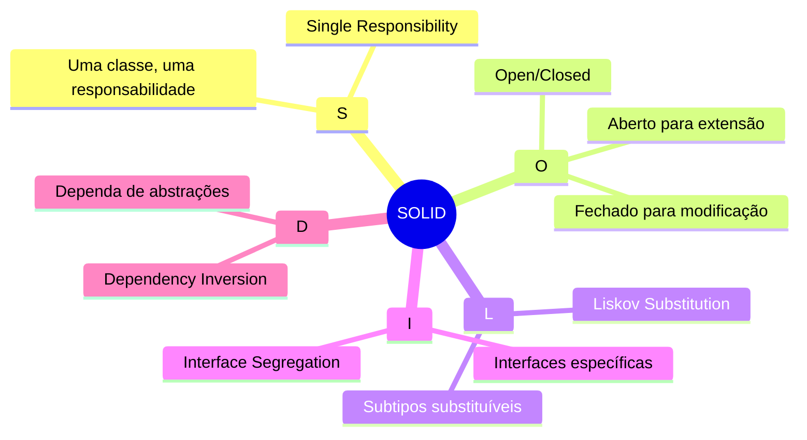
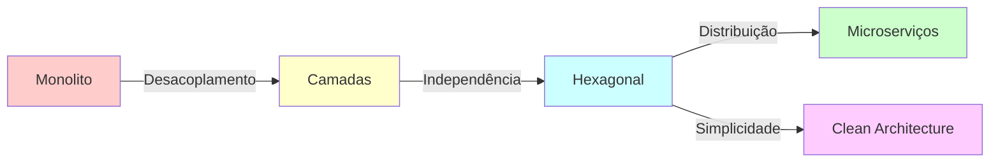
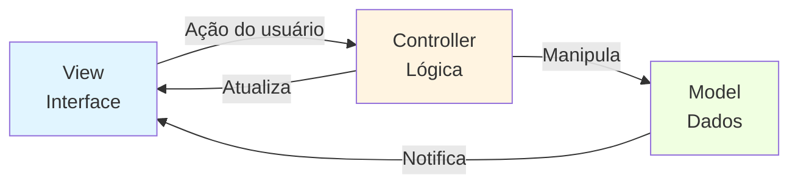
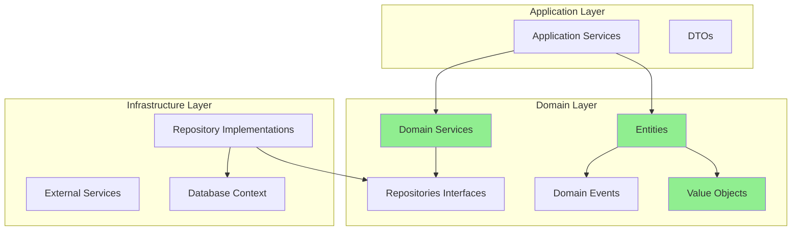
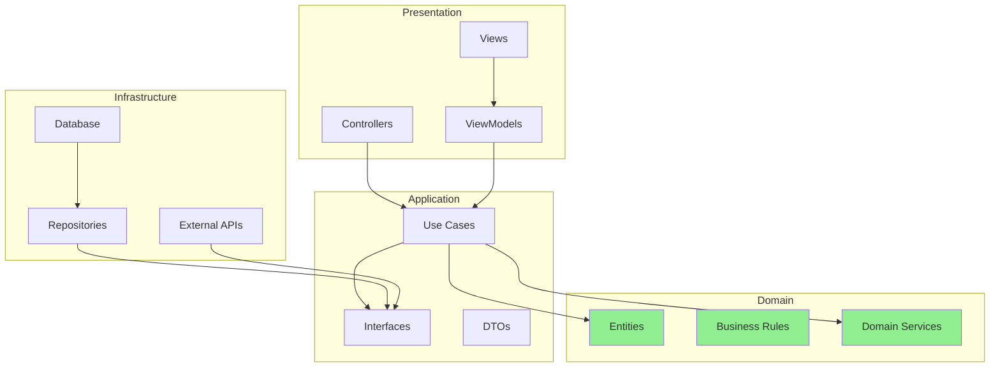
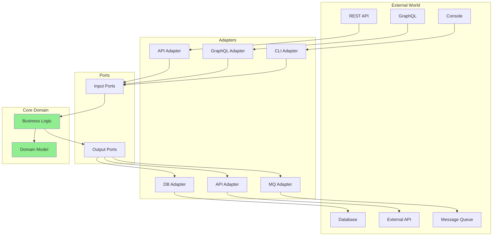
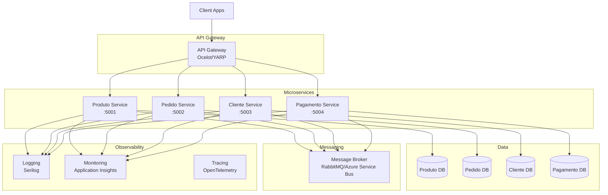

# 🏗️ Engenharia e Arquitetura de Software com .NET/C#

> Guia completo sobre princípios, padrões e práticas de engenharia de software com exemplos em .NET/C#

## 📑 Índice

- [Princípios Fundamentais](#-princípios-fundamentais)
- [Arquiteturas de Software](#-arquiteturas-de-software)
- [Metodologias e Práticas](#-metodologias-e-práticas)
- [Padrões de Projeto](#-padrões-de-projeto)
- [Qualidade de Código](#-qualidade-de-código)

---

## 🎯 Princípios Fundamentais

### SOLID



#### 1️⃣ Single Responsibility Principle (SRP)

**Princípio:** Uma classe deve ter apenas uma razão para mudar.

**❌ Violação do SRP:**
```csharp
public class Usuario
{
    public string Nome { get; set; }
    public string Email { get; set; }
    
    // Responsabilidade 1: Lógica de negócio
    public bool ValidarEmail()
    {
        return Email.Contains("@");
    }
    
    // Responsabilidade 2: Persistência
    public void Salvar()
    {
        // Salva no banco de dados
        var connection = new SqlConnection("...");
        // ...
    }
    
    // Responsabilidade 3: Notificação
    public void EnviarEmailBoasVindas()
    {
        var smtp = new SmtpClient();
        // ...
    }
}
```

**✅ Seguindo SRP:**
```csharp
// Responsabilidade única: Representar o domínio
public class Usuario
{
    public string Nome { get; set; }
    public string Email { get; set; }
    
    public bool EmailValido()
    {
        return !string.IsNullOrWhiteSpace(Email) && Email.Contains("@");
    }
}

// Responsabilidade única: Validação
public class UsuarioValidator
{
    public ValidationResult Validar(Usuario usuario)
    {
        var result = new ValidationResult();
        
        if (string.IsNullOrWhiteSpace(usuario.Nome))
            result.AddError("Nome é obrigatório");
            
        if (!usuario.EmailValido())
            result.AddError("Email inválido");
            
        return result;
    }
}

// Responsabilidade única: Persistência
public class UsuarioRepository
{
    private readonly DbContext _context;
    
    public async Task SalvarAsync(Usuario usuario)
    {
        _context.Usuarios.Add(usuario);
        await _context.SaveChangesAsync();
    }
}

// Responsabilidade única: Notificação
public class UsuarioNotificador
{
    private readonly IEmailService _emailService;
    
    public async Task EnviarBoasVindasAsync(Usuario usuario)
    {
        await _emailService.EnviarAsync(
            usuario.Email,
            "Bem-vindo!",
            $"Olá {usuario.Nome}, bem-vindo ao sistema!"
        );
    }
}
```

---

#### 2️⃣ Open/Closed Principle (OCP)

**Princípio:** Aberto para extensão, fechado para modificação.

**❌ Violação do OCP:**
```csharp
public class CalculadoraDesconto
{
    public decimal Calcular(decimal valor, string tipoCliente)
    {
        if (tipoCliente == "Regular")
            return valor;
        else if (tipoCliente == "Prata")
            return valor * 0.9m;
        else if (tipoCliente == "Ouro")
            return valor * 0.8m;
        else if (tipoCliente == "Platina")
            return valor * 0.7m;
        
        return valor;
    }
}
```

**✅ Seguindo OCP:**
```csharp
// Abstração
public interface IEstrategiaDesconto
{
    decimal Calcular(decimal valor);
}

// Implementações concretas (extensão sem modificação)
public class DescontoRegular : IEstrategiaDesconto
{
    public decimal Calcular(decimal valor) => valor;
}

public class DescontoPrata : IEstrategiaDesconto
{
    public decimal Calcular(decimal valor) => valor * 0.9m;
}

public class DescontoOuro : IEstrategiaDesconto
{
    public decimal Calcular(decimal valor) => valor * 0.8m;
}

public class DescontoPlatina : IEstrategiaDesconto
{
    public decimal Calcular(decimal valor) => valor * 0.7m;
}

// Calculadora fechada para modificação
public class CalculadoraDesconto
{
    private readonly IEstrategiaDesconto _estrategia;
    
    public CalculadoraDesconto(IEstrategiaDesconto estrategia)
    {
        _estrategia = estrategia;
    }
    
    public decimal Calcular(decimal valor)
    {
        return _estrategia.Calcular(valor);
    }
}

// Uso
var calculadora = new CalculadoraDesconto(new DescontoOuro());
var valorFinal = calculadora.Calcular(1000m); // 800
```

---

#### 3️⃣ Liskov Substitution Principle (LSP)

**Princípio:** Objetos de subtipos devem ser substituíveis por objetos de seus supertipos.

**❌ Violação do LSP:**
```csharp
public class Retangulo
{
    public virtual int Largura { get; set; }
    public virtual int Altura { get; set; }
    
    public int CalcularArea() => Largura * Altura;
}

public class Quadrado : Retangulo
{
    public override int Largura
    {
        get => base.Largura;
        set
        {
            base.Largura = value;
            base.Altura = value; // Quebra LSP!
        }
    }
    
    public override int Altura
    {
        get => base.Altura;
        set
        {
            base.Largura = value;
            base.Altura = value; // Quebra LSP!
        }
    }
}

// Problema:
void TestarRetangulo(Retangulo r)
{
    r.Largura = 5;
    r.Altura = 4;
    // Esperado: 20, mas com Quadrado será 16!
    Assert.Equal(20, r.CalcularArea());
}
```

**✅ Seguindo LSP:**
```csharp
public interface IForma
{
    int CalcularArea();
}

public class Retangulo : IForma
{
    public int Largura { get; set; }
    public int Altura { get; set; }
    
    public int CalcularArea() => Largura * Altura;
}

public class Quadrado : IForma
{
    public int Lado { get; set; }
    
    public int CalcularArea() => Lado * Lado;
}

// Agora não há herança problemática
void ProcessarForma(IForma forma)
{
    Console.WriteLine($"Área: {forma.CalcularArea()}");
}
```

---

#### 4️⃣ Interface Segregation Principle (ISP)

**Princípio:** Clientes não devem depender de interfaces que não usam.

**❌ Violação do ISP:**
```csharp
public interface ITrabalho
{
    void Trabalhar();
    void Comer();
    void Dormir();
    void ReceberSalario();
}

// Robô não come nem dorme!
public class Robo : ITrabalho
{
    public void Trabalhar() { /* ... */ }
    public void ReceberSalario() { /* ... */ }
    
    // Implementações vazias - violação ISP
    public void Comer() { throw new NotImplementedException(); }
    public void Dormir() { throw new NotImplementedException(); }
}
```

**✅ Seguindo ISP:**
```csharp
public interface ITrabalhador
{
    void Trabalhar();
}

public interface IRemunerado
{
    void ReceberSalario();
}

public interface INecessidadesBasicas
{
    void Comer();
    void Dormir();
}

// Humano implementa todas
public class Humano : ITrabalhador, IRemunerado, INecessidadesBasicas
{
    public void Trabalhar() { /* ... */ }
    public void ReceberSalario() { /* ... */ }
    public void Comer() { /* ... */ }
    public void Dormir() { /* ... */ }
}

// Robô implementa apenas as relevantes
public class Robo : ITrabalhador, IRemunerado
{
    public void Trabalhar() { /* ... */ }
    public void ReceberSalario() { /* ... */ }
}
```

---

#### 5️⃣ Dependency Inversion Principle (DIP)

**Princípio:** Dependa de abstrações, não de implementações concretas.

**❌ Violação do DIP:**
```csharp
public class EmailService
{
    public void Enviar(string para, string assunto, string corpo)
    {
        // Envia email via SMTP
        var smtp = new SmtpClient();
        // ...
    }
}

public class NotificacaoService
{
    private readonly EmailService _emailService; // Dependência concreta!
    
    public NotificacaoService()
    {
        _emailService = new EmailService(); // Acoplamento forte!
    }
    
    public void Notificar(string mensagem)
    {
        _emailService.Enviar("admin@site.com", "Notificação", mensagem);
    }
}
```

**✅ Seguindo DIP:**
```csharp
// Abstração
public interface INotificacaoService
{
    Task EnviarAsync(string destinatario, string assunto, string mensagem);
}

// Implementações concretas
public class EmailNotificacao : INotificacaoService
{
    public async Task EnviarAsync(string destinatario, string assunto, string mensagem)
    {
        // Implementação SMTP
        await Task.CompletedTask;
    }
}

public class SmsNotificacao : INotificacaoService
{
    public async Task EnviarAsync(string destinatario, string assunto, string mensagem)
    {
        // Implementação SMS
        await Task.CompletedTask;
    }
}

public class PushNotificacao : INotificacaoService
{
    public async Task EnviarAsync(string destinatario, string assunto, string mensagem)
    {
        // Implementação Push
        await Task.CompletedTask;
    }
}

// Service depende da abstração
public class PedidoService
{
    private readonly INotificacaoService _notificacao;
    
    public PedidoService(INotificacaoService notificacao)
    {
        _notificacao = notificacao; // Injeção de dependência
    }
    
    public async Task ProcessarPedidoAsync(Pedido pedido)
    {
        // Processar pedido...
        await _notificacao.EnviarAsync(
            pedido.ClienteEmail,
            "Pedido Confirmado",
            $"Seu pedido #{pedido.Id} foi confirmado!"
        );
    }
}

// Configuração (DI Container)
services.AddScoped<INotificacaoService, EmailNotificacao>();
// Ou: services.AddScoped<INotificacaoService, SmsNotificacao>();
```

---

## 🏛️ Arquiteturas de Software

### Comparação de Arquiteturas



---

### 1. MVC (Model-View-Controller)

**Conceito:** Separação entre dados (Model), interface (View) e lógica de controle (Controller).



**Implementação ASP.NET Core MVC:**

```csharp
// Model
public class Produto
{
    public int Id { get; set; }
    
    [Required(ErrorMessage = "Nome é obrigatório")]
    [StringLength(100)]
    public string Nome { get; set; }
    
    [Range(0.01, 10000)]
    public decimal Preco { get; set; }
    
    public string Descricao { get; set; }
}

// Controller
public class ProdutoController : Controller
{
    private readonly IProdutoRepository _repository;
    
    public ProdutoController(IProdutoRepository repository)
    {
        _repository = repository;
    }
    
    // GET: /Produto
    public async Task<IActionResult> Index()
    {
        var produtos = await _repository.GetAllAsync();
        return View(produtos);
    }
    
    // GET: /Produto/Details/5
    public async Task<IActionResult> Details(int id)
    {
        var produto = await _repository.GetByIdAsync(id);
        if (produto == null)
            return NotFound();
            
        return View(produto);
    }
    
    // GET: /Produto/Create
    public IActionResult Create()
    {
        return View();
    }
    
    // POST: /Produto/Create
    [HttpPost]
    [ValidateAntiForgeryToken]
    public async Task<IActionResult> Create(Produto produto)
    {
        if (!ModelState.IsValid)
            return View(produto);
            
        await _repository.AddAsync(produto);
        TempData["Success"] = "Produto criado com sucesso!";
        return RedirectToAction(nameof(Index));
    }
    
    // GET: /Produto/Edit/5
    public async Task<IActionResult> Edit(int id)
    {
        var produto = await _repository.GetByIdAsync(id);
        if (produto == null)
            return NotFound();
            
        return View(produto);
    }
    
    // POST: /Produto/Edit/5
    [HttpPost]
    [ValidateAntiForgeryToken]
    public async Task<IActionResult> Edit(int id, Produto produto)
    {
        if (id != produto.Id)
            return BadRequest();
            
        if (!ModelState.IsValid)
            return View(produto);
            
        await _repository.UpdateAsync(produto);
        TempData["Success"] = "Produto atualizado com sucesso!";
        return RedirectToAction(nameof(Index));
    }
    
    // POST: /Produto/Delete/5
    [HttpPost]
    [ValidateAntiForgeryToken]
    public async Task<IActionResult> Delete(int id)
    {
        await _repository.DeleteAsync(id);
        TempData["Success"] = "Produto excluído com sucesso!";
        return RedirectToAction(nameof(Index));
    }
}
```

**View (Razor):**
```html
@model IEnumerable<Produto>

<h1>Produtos</h1>

<p>
    <a asp-action="Create" class="btn btn-primary">Criar Novo</a>
</p>

<table class="table table-striped">
    <thead>
        <tr>
            <th>Nome</th>
            <th>Preço</th>
            <th>Ações</th>
        </tr>
    </thead>
    <tbody>
        @foreach (var produto in Model)
        {
            <tr>
                <td>@produto.Nome</td>
                <td>@produto.Preco.ToString("C")</td>
                <td>
                    <a asp-action="Details" asp-route-id="@produto.Id">Detalhes</a> |
                    <a asp-action="Edit" asp-route-id="@produto.Id">Editar</a> |
                    <form asp-action="Delete" asp-route-id="@produto.Id" method="post" style="display:inline;">
                        <button type="submit" class="btn-link" onclick="return confirm('Confirma exclusão?')">
                            Excluir
                        </button>
                    </form>
                </td>
            </tr>
        }
    </tbody>
</table>
```

---

### 2. DDD (Domain-Driven Design)

**Conceito:** O design do software é guiado pelo domínio do negócio.



**Implementação DDD:**

```csharp
// 1. Value Object - Imutável, sem identidade
public class Email : ValueObject
{
    public string Endereco { get; private set; }
    
    private Email(string endereco)
    {
        Endereco = endereco;
    }
    
    public static Result<Email> Criar(string endereco)
    {
        if (string.IsNullOrWhiteSpace(endereco))
            return Result<Email>.Failure("Email não pode ser vazio");
            
        if (!endereco.Contains("@"))
            return Result<Email>.Failure("Email inválido");
            
        return Result<Email>.Success(new Email(endereco.ToLower()));
    }
    
    protected override IEnumerable<object> GetEqualityComponents()
    {
        yield return Endereco;
    }
}

// 2. Entity - Tem identidade
public class Cliente : Entity
{
    public string Nome { get; private set; }
    public Email Email { get; private set; }
    public Cpf Cpf { get; private set; }
    private List<Pedido> _pedidos = new();
    public IReadOnlyCollection<Pedido> Pedidos => _pedidos.AsReadOnly();
    
    private Cliente() { } // EF Core
    
    private Cliente(string nome, Email email, Cpf cpf)
    {
        Nome = nome;
        Email = email;
        Cpf = cpf;
    }
    
    public static Result<Cliente> Criar(string nome, string email, string cpf)
    {
        if (string.IsNullOrWhiteSpace(nome))
            return Result<Cliente>.Failure("Nome é obrigatório");
            
        var emailResult = Email.Criar(email);
        if (emailResult.IsFailure)
            return Result<Cliente>.Failure(emailResult.Error);
            
        var cpfResult = Cpf.Criar(cpf);
        if (cpfResult.IsFailure)
            return Result<Cliente>.Failure(cpfResult.Error);
            
        return Result<Cliente>.Success(
            new Cliente(nome, emailResult.Value, cpfResult.Value)
        );
    }
    
    public Result AdicionarPedido(Pedido pedido)
    {
        if (pedido == null)
            return Result.Failure("Pedido inválido");
            
        _pedidos.Add(pedido);
        AddDomainEvent(new PedidoCriadoEvent(pedido.Id, Id));
        return Result.Success();
    }
}

// 3. Aggregate Root
public class Pedido : AggregateRoot
{
    public int ClienteId { get; private set; }
    public DateTime DataCriacao { get; private set; }
    public StatusPedido Status { get; private set; }
    private List<ItemPedido> _itens = new();
    public IReadOnlyCollection<ItemPedido> Itens => _itens.AsReadOnly();
    
    public decimal ValorTotal => _itens.Sum(i => i.Subtotal);
    
    private Pedido() { } // EF Core
    
    private Pedido(int clienteId)
    {
        ClienteId = clienteId;
        DataCriacao = DateTime.UtcNow;
        Status = StatusPedido.Pendente;
    }
    
    public static Result<Pedido> Criar(int clienteId)
    {
        if (clienteId <= 0)
            return Result<Pedido>.Failure("Cliente inválido");
            
        return Result<Pedido>.Success(new Pedido(clienteId));
    }
    
    public Result AdicionarItem(int produtoId, int quantidade, decimal precoUnitario)
    {
        if (Status != StatusPedido.Pendente)
            return Result.Failure("Não é possível adicionar itens a um pedido não pendente");
            
        var item = ItemPedido.Criar(produtoId, quantidade, precoUnitario);
        if (item.IsFailure)
            return Result.Failure(item.Error);
            
        _itens.Add(item.Value);
        return Result.Success();
    }
    
    public Result Confirmar()
    {
        if (Status != StatusPedido.Pendente)
            return Result.Failure("Pedido já foi confirmado");
            
        if (!_itens.Any())
            return Result.Failure("Pedido sem itens");
            
        Status = StatusPedido.Confirmado;
        AddDomainEvent(new PedidoConfirmadoEvent(Id, ClienteId, ValorTotal));
        return Result.Success();
    }
}

// 4. Domain Service
public class DescontoDomainService
{
    public decimal CalcularDesconto(Cliente cliente, decimal valorPedido)
    {
        // Regra de negócio complexa envolvendo múltiplas entidades
        var totalPedidos = cliente.Pedidos.Count;
        
        if (totalPedidos >= 10)
            return valorPedido * 0.15m; // 15% de desconto
        else if (totalPedidos >= 5)
            return valorPedido * 0.10m; // 10% de desconto
        else if (totalPedidos >= 1)
            return valorPedido * 0.05m; // 5% de desconto
            
        return 0m;
    }
}

// 5. Domain Event
public class PedidoConfirmadoEvent : IDomainEvent
{
    public int PedidoId { get; }
    public int ClienteId { get; }
    public decimal ValorTotal { get; }
    public DateTime OcorridoEm { get; }
    
    public PedidoConfirmadoEvent(int pedidoId, int clienteId, decimal valorTotal)
    {
        PedidoId = pedidoId;
        ClienteId = clienteId;
        ValorTotal = valorTotal;
        OcorridoEm = DateTime.UtcNow;
    }
}

// 6. Repository Interface (Domain Layer)
public interface IPedidoRepository
{
    Task<Pedido> GetByIdAsync(int id);
    Task<IEnumerable<Pedido>> GetByClienteIdAsync(int clienteId);
    Task AddAsync(Pedido pedido);
    Task UpdateAsync(Pedido pedido);
}

// 7. Repository Implementation (Infrastructure Layer)
public class PedidoRepository : IPedidoRepository
{
    private readonly AppDbContext _context;
    
    public PedidoRepository(AppDbContext context)
    {
        _context = context;
    }
    
    public async Task<Pedido> GetByIdAsync(int id)
    {
        return await _context.Pedidos
            .Include(p => p.Itens)
            .FirstOrDefaultAsync(p => p.Id == id);
    }
    
    public async Task<IEnumerable<Pedido>> GetByClienteIdAsync(int clienteId)
    {
        return await _context.Pedidos
            .Include(p => p.Itens)
            .Where(p => p.ClienteId == clienteId)
            .ToListAsync();
    }
    
    public async Task AddAsync(Pedido pedido)
    {
        await _context.Pedidos.AddAsync(pedido);
        await _context.SaveChangesAsync();
    }
    
    public async Task UpdateAsync(Pedido pedido)
    {
        _context.Pedidos.Update(pedido);
        await _context.SaveChangesAsync();
    }
}

// 8. Application Service
public class PedidoAppService
{
    private readonly IPedidoRepository _pedidoRepository;
    private readonly IClienteRepository _clienteRepository;
    private readonly DescontoDomainService _descontoService;
    private readonly IEventBus _eventBus;
    
    public PedidoAppService(
        IPedidoRepository pedidoRepository,
        IClienteRepository clienteRepository,
        DescontoDomainService descontoService,
        IEventBus eventBus)
    {
        _pedidoRepository = pedidoRepository;
        _clienteRepository = clienteRepository;
        _descontoService = descontoService;
        _eventBus = eventBus;
    }
    
    public async Task<Result<int>> CriarPedidoAsync(int clienteId, List<ItemPedidoDto> itens)
    {
        // 1. Buscar cliente
        var cliente = await _clienteRepository.GetByIdAsync(clienteId);
        if (cliente == null)
            return Result<int>.Failure("Cliente não encontrado");
        
        // 2. Criar pedido
        var pedidoResult = Pedido.Criar(clienteId);
        if (pedidoResult.IsFailure)
            return Result<int>.Failure(pedidoResult.Error);
            
        var pedido = pedidoResult.Value;
        
        // 3. Adicionar itens
        foreach (var item in itens)
        {
            var result = pedido.AdicionarItem(item.ProdutoId, item.Quantidade, item.PrecoUnitario);
            if (result.IsFailure)
                return Result<int>.Failure(result.Error);
        }
        
        // 4. Aplicar desconto (Domain Service)
        var desconto = _descontoService.CalcularDesconto(cliente, pedido.ValorTotal);
        
        // 5. Confirmar pedido
        var confirmResult = pedido.Confirmar();
        if (confirmResult.IsFailure)
            return Result<int>.Failure(confirmResult.Error);
        
        // 6. Salvar
        await _pedidoRepository.AddAsync(pedido);
        
        // 7. Publicar eventos de domínio
        foreach (var evento in pedido.GetDomainEvents())
        {
            await _eventBus.PublishAsync(evento);
        }
        
        return Result<int>.Success(pedido.Id);
    }
}
```

**Estrutura de Pastas DDD:**
```
src/
├── Domain/
│   ├── Entities/
│   │   ├── Cliente.cs
│   │   ├── Pedido.cs
│   │   └── ItemPedido.cs
│   ├── ValueObjects/
│   │   ├── Email.cs
│   │   ├── Cpf.cs
│   │   └── Endereco.cs
│   ├── Services/
│   │   └── DescontoDomainService.cs
│   ├── Repositories/
│   │   ├── IClienteRepository.cs
│   │   └── IPedidoRepository.cs
│   ├── Events/
│   │   └── PedidoConfirmadoEvent.cs
│   └── Enums/
│       └── StatusPedido.cs
├── Application/
│   ├── Services/
│   │   ├── PedidoAppService.cs
│   │   └── ClienteAppService.cs
│   └── DTOs/
│       ├── PedidoDto.cs
│       └── ClienteDto.cs
└── Infrastructure/
    ├── Repositories/
    │   ├── PedidoRepository.cs
    │   └── ClienteRepository.cs
    └── Data/
        └── AppDbContext.cs
```

---

### 3. Clean Architecture (Arquitetura Limpa)

**Conceito:** Independência de frameworks, testabilidade, independência de UI e banco de dados.



**Implementação Clean Architecture:**

```csharp
// ========== DOMAIN LAYER ==========

// Entities
public class Produto : Entity
{
    public string Nome { get; private set; }
    public decimal Preco { get; private set; }
    public int QuantidadeEstoque { get; private set; }
    
    private Produto() { }
    
    public static Result<Produto> Criar(string nome, decimal preco, int quantidadeEstoque)
    {
        var produto = new Produto();
        
        var result = produto.AtualizarDados(nome, preco, quantidadeEstoque);
        if (result.IsFailure)
            return Result<Produto>.Failure(result.Error);
            
        return Result<Produto>.Success(produto);
    }
    
    public Result AtualizarDados(string nome, decimal preco, int quantidadeEstoque)
    {
        if (string.IsNullOrWhiteSpace(nome))
            return Result.Failure("Nome é obrigatório");
            
        if (preco <= 0)
            return Result.Failure("Preço deve ser maior que zero");
            
        if (quantidadeEstoque < 0)
            return Result.Failure("Quantidade em estoque não pode ser negativa");
        
        Nome = nome;
        Preco = preco;
        QuantidadeEstoque = quantidadeEstoque;
        
        return Result.Success();
    }
    
    public Result BaixarEstoque(int quantidade)
    {
        if (quantidade <= 0)
            return Result.Failure("Quantidade inválida");
            
        if (quantidade > QuantidadeEstoque)
            return Result.Failure($"Estoque insuficiente. Disponível: {QuantidadeEstoque}");
        
        QuantidadeEstoque -= quantidade;
        AddDomainEvent(new EstoqueBaixadoEvent(Id, quantidade));
        
        return Result.Success();
    }
}

// ========== APPLICATION LAYER ==========

// Use Case Interface
public interface ICriarProdutoUseCase
{
    Task<Result<ProdutoDto>> ExecuteAsync(CriarProdutoRequest request);
}

// Use Case Implementation
public class CriarProdutoUseCase : ICriarProdutoUseCase
{
    private readonly IProdutoRepository _repository;
    private readonly IUnitOfWork _unitOfWork;
    
    public CriarProdutoUseCase(IProdutoRepository repository, IUnitOfWork unitOfWork)
    {
        _repository = repository;
        _unitOfWork = unitOfWork;
    }
    
    public async Task<Result<ProdutoDto>> ExecuteAsync(CriarProdutoRequest request)
    {
        // 1. Validar se já existe produto com mesmo nome
        var existente = await _repository.GetByNomeAsync(request.Nome);
        if (existente != null)
            return Result<ProdutoDto>.Failure("Já existe um produto com este nome");
        
        // 2. Criar entidade de domínio
        var produtoResult = Produto.Criar(request.Nome, request.Preco, request.QuantidadeEstoque);
        if (produtoResult.IsFailure)
            return Result<ProdutoDto>.Failure(produtoResult.Error);
        
        // 3. Persistir
        await _repository.AddAsync(produtoResult.Value);
        await _unitOfWork.CommitAsync();
        
        // 4. Retornar DTO
        var dto = ProdutoDto.FromEntity(produtoResult.Value);
        return Result<ProdutoDto>.Success(dto);
    }
}

// Request/Response (DTOs)
public record CriarProdutoRequest(string Nome, decimal Preco, int QuantidadeEstoque);

public class ProdutoDto
{
    public int Id { get; set; }
    public string Nome { get; set; }
    public decimal Preco { get; set; }
    public int QuantidadeEstoque { get; set; }
    
    public static ProdutoDto FromEntity(Produto produto)
    {
        return new ProdutoDto
        {
            Id = produto.Id,
            Nome = produto.Nome,
            Preco = produto.Preco,
            QuantidadeEstoque = produto.QuantidadeEstoque
        };
    }
}

// Repository Interface (Application Layer)
public interface IProdutoRepository
{
    Task<Produto> GetByIdAsync(int id);
    Task<Produto> GetByNomeAsync(string nome);
    Task<IEnumerable<Produto>> GetAllAsync();
    Task AddAsync(Produto produto);
    Task UpdateAsync(Produto produto);
    Task DeleteAsync(int id);
}

// ========== INFRASTRUCTURE LAYER ==========

// Repository Implementation
public class ProdutoRepository : IProdutoRepository
{
    private readonly AppDbContext _context;
    
    public ProdutoRepository(AppDbContext context)
    {
        _context = context;
    }
    
    public async Task<Produto> GetByIdAsync(int id)
    {
        return await _context.Produtos.FindAsync(id);
    }
    
    public async Task<Produto> GetByNomeAsync(string nome)
    {
        return await _context.Produtos
            .FirstOrDefaultAsync(p => p.Nome.ToLower() == nome.ToLower());
    }
    
    public async Task<IEnumerable<Produto>> GetAllAsync()
    {
        return await _context.Produtos.ToListAsync();
    }
    
    public async Task AddAsync(Produto produto)
    {
        await _context.Produtos.AddAsync(produto);
    }
    
    public async Task UpdateAsync(Produto produto)
    {
        _context.Produtos.Update(produto);
    }
    
    public async Task DeleteAsync(int id)
    {
        var produto = await GetByIdAsync(id);
        if (produto != null)
            _context.Produtos.Remove(produto);
    }
}

// ========== PRESENTATION LAYER ==========

// API Controller
[ApiController]
[Route("api/[controller]")]
public class ProdutosController : ControllerBase
{
    private readonly ICriarProdutoUseCase _criarProduto;
    private readonly IListarProdutosUseCase _listarProdutos;
    
    public ProdutosController(
        ICriarProdutoUseCase criarProduto,
        IListarProdutosUseCase listarProdutos)
    {
        _criarProduto = criarProduto;
        _listarProdutos = listarProdutos;
    }
    
    [HttpPost]
    public async Task<IActionResult> Criar([FromBody] CriarProdutoRequest request)
    {
        var result = await _criarProduto.ExecuteAsync(request);
        
        if (result.IsFailure)
            return BadRequest(new { error = result.Error });
            
        return CreatedAtAction(
            nameof(ObterPorId),
            new { id = result.Value.Id },
            result.Value
        );
    }
    
    [HttpGet]
    public async Task<IActionResult> ListarTodos()
    {
        var result = await _listarProdutos.ExecuteAsync();
        return Ok(result.Value);
    }
    
    [HttpGet("{id}")]
    public async Task<IActionResult> ObterPorId(int id)
    {
        // Implementation...
        return Ok();
    }
}

// Dependency Injection Setup
public static class DependencyInjection
{
    public static IServiceCollection AddApplication(this IServiceCollection services)
    {
        // Use Cases
        services.AddScoped<ICriarProdutoUseCase, CriarProdutoUseCase>();
        services.AddScoped<IListarProdutosUseCase, ListarProdutosUseCase>();
        
        return services;
    }
    
    public static IServiceCollection AddInfrastructure(
        this IServiceCollection services,
        IConfiguration configuration)
    {
        // Database
        services.AddDbContext<AppDbContext>(options =>
            options.UseSqlServer(configuration.GetConnectionString("DefaultConnection")));
        
        // Repositories
        services.AddScoped<IProdutoRepository, ProdutoRepository>();
        services.AddScoped<IUnitOfWork, UnitOfWork>();
        
        return services;
    }
}
```

**Estrutura de Pastas Clean Architecture:**
```
src/
├── CleanArch.Domain/
│   ├── Entities/
│   ├── ValueObjects/
│   ├── Enums/
│   └── Events/
├── CleanArch.Application/
│   ├── UseCases/
│   │   ├── Produtos/
│   │   │   ├── CriarProduto/
│   │   │   │   ├── ICriarProdutoUseCase.cs
│   │   │   │   ├── CriarProdutoUseCase.cs
│   │   │   │   └── CriarProdutoRequest.cs
│   │   │   └── ListarProdutos/
│   │   └── Pedidos/
│   ├── DTOs/
│   ├── Interfaces/
│   │   └── Repositories/
│   └── Common/
├── CleanArch.Infrastructure/
│   ├── Persistence/
│   │   ├── Repositories/
│   │   ├── Configurations/
│   │   └── AppDbContext.cs
│   ├── ExternalServices/
│   └── DependencyInjection.cs
└── CleanArch.API/
    ├── Controllers/
    ├── Middlewares/
    └── Program.cs
```

---

### 4. Arquitetura Hexagonal (Ports & Adapters)

**Conceito:** O núcleo da aplicação (domínio) é independente de detalhes externos através de portas (interfaces) e adaptadores (implementações).



**Implementação Arquitetura Hexagonal:**

```csharp
// ========== CORE/DOMAIN (Centro do Hexágono) ==========

// Domain Entity
public class Conta
{
    public Guid Id { get; private set; }
    public string Titular { get; private set; }
    public decimal Saldo { get; private set; }
    private List<Transacao> _transacoes = new();
    public IReadOnlyCollection<Transacao> Transacoes => _transacoes.AsReadOnly();
    
    private Conta() { Id = Guid.NewGuid(); }
    
    public static Result<Conta> Criar(string titular, decimal saldoInicial = 0)
    {
        if (string.IsNullOrWhiteSpace(titular))
            return Result<Conta>.Failure("Titular é obrigatório");
            
        if (saldoInicial < 0)
            return Result<Conta>.Failure("Saldo inicial não pode ser negativo");
        
        var conta = new Conta
        {
            Titular = titular,
            Saldo = saldoInicial
        };
        
        if (saldoInicial > 0)
            conta._transacoes.Add(new Transacao(TransacaoTipo.Deposito, saldoInicial, "Saldo inicial"));
        
        return Result<Conta>.Success(conta);
    }
    
    public Result Depositar(decimal valor, string descricao = "Depósito")
    {
        if (valor <= 0)
            return Result.Failure("Valor deve ser maior que zero");
        
        Saldo += valor;
        _transacoes.Add(new Transacao(TransacaoTipo.Deposito, valor, descricao));
        
        return Result.Success();
    }
    
    public Result Sacar(decimal valor, string descricao = "Saque")
    {
        if (valor <= 0)
            return Result.Failure("Valor deve ser maior que zero");
            
        if (valor > Saldo)
            return Result.Failure($"Saldo insuficiente. Disponível: {Saldo:C}");
        
        Saldo -= valor;
        _transacoes.Add(new Transacao(TransacaoTipo.Saque, valor, descricao));
        
        return Result.Success();
    }
    
    public Result Transferir(Conta destino, decimal valor)
    {
        var saqueResult = Sacar(valor, $"Transferência para {destino.Titular}");
        if (saqueResult.IsFailure)
            return saqueResult;
        
        var depositoResult = destino.Depositar(valor, $"Transferência de {Titular}");
        if (depositoResult.IsFailure)
        {
            // Reverter saque
            Depositar(valor, "Reversão de transferência");
            return depositoResult;
        }
        
        return Result.Success();
    }
}

// ========== PORTS (Interfaces) ==========

// INPUT PORTS (Use Cases)
public interface IDepositarUseCase
{
    Task<Result> ExecuteAsync(Guid contaId, decimal valor, string descricao);
}

public interface ISacarUseCase
{
    Task<Result> ExecuteAsync(Guid contaId, decimal valor, string descricao);
}

public interface ITransferirUseCase
{
    Task<Result> ExecuteAsync(Guid contaOrigemId, Guid contaDestinoId, decimal valor);
}

public interface IConsultarSaldoUseCase
{
    Task<Result<decimal>> ExecuteAsync(Guid contaId);
}

// OUTPUT PORTS (Repositórios e Serviços Externos)
public interface IContaRepository
{
    Task<Conta> GetByIdAsync(Guid id);
    Task<IEnumerable<Conta>> GetAllAsync();
    Task SaveAsync(Conta conta);
    Task UpdateAsync(Conta conta);
}

public interface INotificacaoService
{
    Task NotificarAsync(string destinatario, string mensagem);
}

public interface IAuditoriaService
{
    Task RegistrarAsync(string operacao, Guid contaId, decimal valor);
}

// ========== CORE (Implementação dos Use Cases) ==========

public class DepositarUseCase : IDepositarUseCase
{
    private readonly IContaRepository _repository;
    private readonly INotificacaoService _notificacao;
    private readonly IAuditoriaService _auditoria;
    
    public DepositarUseCase(
        IContaRepository repository,
        INotificacaoService notificacao,
        IAuditoriaService auditoria)
    {
        _repository = repository;
        _notificacao = notificacao;
        _auditoria = auditoria;
    }
    
    public async Task<Result> ExecuteAsync(Guid contaId, decimal valor, string descricao)
    {
        // 1. Buscar conta
        var conta = await _repository.GetByIdAsync(contaId);
        if (conta == null)
            return Result.Failure("Conta não encontrada");
        
        // 2. Executar operação de domínio
        var result = conta.Depositar(valor, descricao);
        if (result.IsFailure)
            return result;
        
        // 3. Persistir
        await _repository.UpdateAsync(conta);
        
        // 4. Notificar (porta de saída)
        await _notificacao.NotificarAsync(
            conta.Titular,
            $"Depósito de {valor:C} realizado com sucesso. Novo saldo: {conta.Saldo:C}"
        );
        
        // 5. Auditar (porta de saída)
        await _auditoria.RegistrarAsync("DEPOSITO", contaId, valor);
        
        return Result.Success();
    }
}

public class TransferirUseCase : ITransferirUseCase
{
    private readonly IContaRepository _repository;
    private readonly INotificacaoService _notificacao;
    private readonly IAuditoriaService _auditoria;
    
    public TransferirUseCase(
        IContaRepository repository,
        INotificacaoService notificacao,
        IAuditoriaService auditoria)
    {
        _repository = repository;
        _notificacao = notificacao;
        _auditoria = auditoria;
    }
    
    public async Task<Result> ExecuteAsync(Guid contaOrigemId, Guid contaDestinoId, decimal valor)
    {
        // 1. Buscar contas
        var contaOrigem = await _repository.GetByIdAsync(contaOrigemId);
        if (contaOrigem == null)
            return Result.Failure("Conta de origem não encontrada");
            
        var contaDestino = await _repository.GetByIdAsync(contaDestinoId);
        if (contaDestino == null)
            return Result.Failure("Conta de destino não encontrada");
        
        // 2. Executar transferência (lógica de domínio)
        var result = contaOrigem.Transferir(contaDestino, valor);
        if (result.IsFailure)
            return result;
        
        // 3. Persistir ambas as contas
        await _repository.UpdateAsync(contaOrigem);
        await _repository.UpdateAsync(contaDestino);
        
        // 4. Notificar ambos
        await _notificacao.NotificarAsync(
            contaOrigem.Titular,
            $"Transferência de {valor:C} para {contaDestino.Titular} realizada. Saldo: {contaOrigem.Saldo:C}"
        );
        
        await _notificacao.NotificarAsync(
            contaDestino.Titular,
            $"Recebida transferência de {valor:C} de {contaOrigem.Titular}. Saldo: {contaDestino.Saldo:C}"
        );
        
        // 5. Auditar
        await _auditoria.RegistrarAsync("TRANSFERENCIA", contaOrigemId, valor);
        
        return Result.Success();
    }
}

// ========== ADAPTERS (Implementações Concretas) ==========

// INPUT ADAPTER: API REST
[ApiController]
[Route("api/[controller]")]
public class ContasController : ControllerBase
{
    private readonly IDepositarUseCase _depositar;
    private readonly ISacarUseCase _sacar;
    private readonly ITransferirUseCase _transferir;
    private readonly IConsultarSaldoUseCase _consultarSaldo;
    
    public ContasController(
        IDepositarUseCase depositar,
        ISacarUseCase sacar,
        ITransferirUseCase transferir,
        IConsultarSaldoUseCase consultarSaldo)
    {
        _depositar = depositar;
        _sacar = sacar;
        _transferir = transferir;
        _consultarSaldo = consultarSaldo;
    }
    
    [HttpPost("{id}/depositar")]
    public async Task<IActionResult> Depositar(Guid id, [FromBody] OperacaoRequest request)
    {
        var result = await _depositar.ExecuteAsync(id, request.Valor, request.Descricao);
        
        if (result.IsFailure)
            return BadRequest(new { error = result.Error });
            
        return Ok(new { message = "Depósito realizado com sucesso" });
    }
    
    [HttpPost("{id}/sacar")]
    public async Task<IActionResult> Sacar(Guid id, [FromBody] OperacaoRequest request)
    {
        var result = await _sacar.ExecuteAsync(id, request.Valor, request.Descricao);
        
        if (result.IsFailure)
            return BadRequest(new { error = result.Error });
            
        return Ok(new { message = "Saque realizado com sucesso" });
    }
    
    [HttpPost("transferir")]
    public async Task<IActionResult> Transferir([FromBody] TransferenciaRequest request)
    {
        var result = await _transferir.ExecuteAsync(
            request.ContaOrigemId,
            request.ContaDestinoId,
            request.Valor
        );
        
        if (result.IsFailure)
            return BadRequest(new { error = result.Error });
            
        return Ok(new { message = "Transferência realizada com sucesso" });
    }
    
    [HttpGet("{id}/saldo")]
    public async Task<IActionResult> ConsultarSaldo(Guid id)
    {
        var result = await _consultarSaldo.ExecuteAsync(id);
        
        if (result.IsFailure)
            return NotFound(new { error = result.Error });
            
        return Ok(new { saldo = result.Value });
    }
}

// OUTPUT ADAPTER: Repository (Entity Framework)
public class ContaRepository : IContaRepository
{
    private readonly AppDbContext _context;
    
    public ContaRepository(AppDbContext context)
    {
        _context = context;
    }
    
    public async Task<Conta> GetByIdAsync(Guid id)
    {
        return await _context.Contas
            .Include(c => c.Transacoes)
            .FirstOrDefaultAsync(c => c.Id == id);
    }
    
    public async Task<IEnumerable<Conta>> GetAllAsync()
    {
        return await _context.Contas
            .Include(c => c.Transacoes)
            .ToListAsync();
    }
    
    public async Task SaveAsync(Conta conta)
    {
        await _context.Contas.AddAsync(conta);
        await _context.SaveChangesAsync();
    }
    
    public async Task UpdateAsync(Conta conta)
    {
        _context.Contas.Update(conta);
        await _context.SaveChangesAsync();
    }
}

// OUTPUT ADAPTER: Notificação (Email)
public class EmailNotificacaoService : INotificacaoService
{
    private readonly IEmailSender _emailSender;
    
    public EmailNotificacaoService(IEmailSender emailSender)
    {
        _emailSender = emailSender;
    }
    
    public async Task NotificarAsync(string destinatario, string mensagem)
    {
        await _emailSender.SendEmailAsync(
            destinatario,
            "Notificação Bancária",
            mensagem
        );
    }
}

// OUTPUT ADAPTER: Auditoria (Log File)
public class FileAuditoriaService : IAuditoriaService
{
    private readonly string _logPath;
    
    public FileAuditoriaService(IConfiguration configuration)
    {
        _logPath = configuration["AuditoriaLogPath"];
    }
    
    public async Task RegistrarAsync(string operacao, Guid contaId, decimal valor)
    {
        var log = $"{DateTime.UtcNow:yyyy-MM-dd HH:mm:ss} | {operacao} | {contaId} | {valor:C}\n";
        await File.AppendAllTextAsync(_logPath, log);
    }
}

// Dependency Injection
public static class DependencyInjection
{
    public static IServiceCollection AddHexagonalArchitecture(
        this IServiceCollection services,
        IConfiguration configuration)
    {
        // Core (Use Cases)
        services.AddScoped<IDepositarUseCase, DepositarUseCase>();
        services.AddScoped<ISacarUseCase, SacarUseCase>();
        services.AddScoped<ITransferirUseCase, TransferirUseCase>();
        services.AddScoped<IConsultarSaldoUseCase, ConsultarSaldoUseCase>();
        
        // Output Adapters
        services.AddScoped<IContaRepository, ContaRepository>();
        services.AddScoped<INotificacaoService, EmailNotificacaoService>();
        services.AddScoped<IAuditoriaService, FileAuditoriaService>();
        
        // Database
        services.AddDbContext<AppDbContext>(options =>
            options.UseSqlServer(configuration.GetConnectionString("DefaultConnection")));
        
        return services;
    }
}
```

**Estrutura de Pastas Hexagonal:**
```
src/
├── Core/
│   ├── Domain/
│   │   ├── Entities/
│   │   ├── ValueObjects/
│   │   └── Enums/
│   ├── Ports/
│   │   ├── Input/  (Use Cases interfaces)
│   │   └── Output/ (Repository interfaces, Service interfaces)
│   └── UseCases/ (Implementação das Ports de Input)
└── Adapters/
    ├── Input/
    │   ├── Api/
    │   │   └── Controllers/
    │   ├── Cli/
    │   └── GraphQL/
    └── Output/
        ├── Persistence/
        │   └── EntityFramework/
        ├── Messaging/
        └── ExternalServices/
```

---

### 5. Microserviços

**Conceito:** Arquitetura distribuída com serviços independentes e autônomos.



**(Continuação no próximo documento devido ao tamanho...)**

---

**Este documento continua no arquivo: [03-design-patterns-dotnet.md](./03-design-patterns-dotnet.md)**

---

*Documento atualizado em Junho de 2026*
