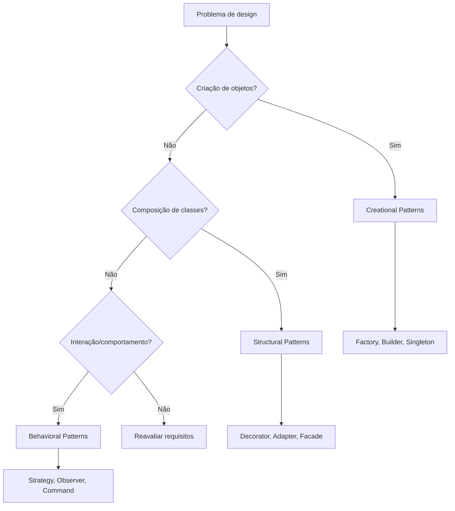
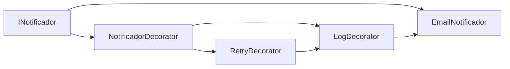
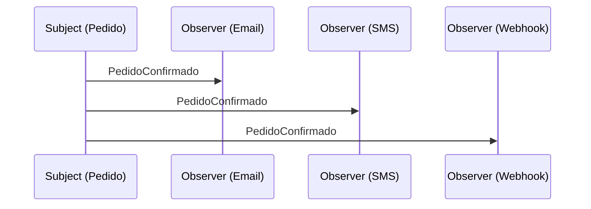
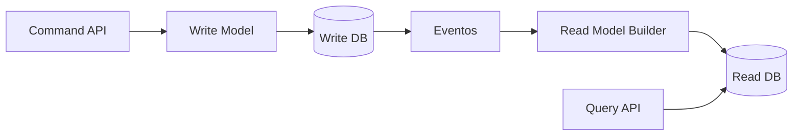
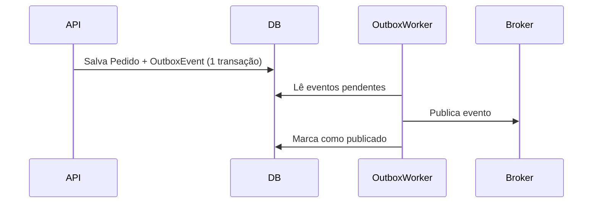
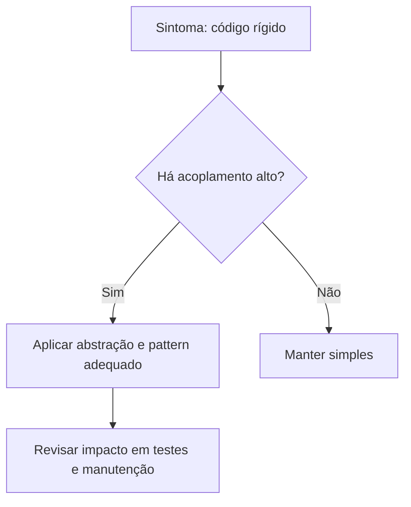

# 🎯 Design Patterns em .NET/C# (Guia Completo)

> Continuação do documento de engenharia e arquitetura, com foco em padrões de projeto clássicos e modernos aplicados ao ecossistema .NET.

## 📑 Índice

- [Como Escolher um Pattern](#-como-escolher-um-pattern)
- [Padrões Criacionais](#-padrões-criacionais)
- [Padrões Estruturais](#-padrões-estruturais)
- [Padrões Comportamentais](#-padrões-comportamentais)
- [Padrões Arquiteturais Modernos em .NET](#-padrões-arquiteturais-modernos-em-net)
- [Anti-Patterns Comuns](#-anti-patterns-comuns)
- [Resumo Prático](#-resumo-prático)

---

## 🧭 Como Escolher um Pattern



Checklist rápido:
- Use pattern para reduzir acoplamento real, não por moda.
- Prefira composição a herança quando possível.
- Evite abstrações prematuras.
- Em .NET, aproveite DI nativo antes de criar factories complexas.

---

## 🏗️ Padrões Criacionais

### 1. Singleton

**Quando usar:** recurso único por processo (ex.: cache global de metadados, provider de configuração).

**Cuidado:** não transformar tudo em estado global.

```csharp
public sealed class AppConfigCache
{
    private static readonly Lazy<AppConfigCache> _instance =
        new(() => new AppConfigCache());

    private readonly Dictionary<string, string> _values = new();

    private AppConfigCache() { }

    public static AppConfigCache Instance => _instance.Value;

    public void Set(string key, string value) => _values[key] = value;
    public string? Get(string key) => _values.TryGetValue(key, out var v) ? v : null;
}
```

Observação .NET:
- Em ASP.NET Core, muitas vezes `Singleton` no container (`services.AddSingleton`) já resolve com melhor testabilidade.

---

### 2. Factory Method

**Quando usar:** criação de objetos varia conforme contexto/entrada.

```csharp
public interface INotificador
{
    Task EnviarAsync(string destino, string mensagem);
}

public class EmailNotificador : INotificador
{
    public Task EnviarAsync(string destino, string mensagem)
    {
        Console.WriteLine($"EMAIL para {destino}: {mensagem}");
        return Task.CompletedTask;
    }
}

public class SmsNotificador : INotificador
{
    public Task EnviarAsync(string destino, string mensagem)
    {
        Console.WriteLine($"SMS para {destino}: {mensagem}");
        return Task.CompletedTask;
    }
}

public static class NotificadorFactory
{
    public static INotificador Criar(string canal) => canal.ToLowerInvariant() switch
    {
        "email" => new EmailNotificador(),
        "sms" => new SmsNotificador(),
        _ => throw new NotSupportedException("Canal não suportado")
    };
}
```

---

### 3. Abstract Factory

**Quando usar:** famílias de objetos relacionados (ex.: tema claro/escuro, provedores de banco, gateways regionais).

```csharp
public interface IRepositorioPedido
{
    Task SalvarAsync(string pedidoId);
}

public interface IRepositorioCliente
{
    Task SalvarAsync(string clienteId);
}

public interface IRepositorioFactory
{
    IRepositorioPedido CriarPedidoRepo();
    IRepositorioCliente CriarClienteRepo();
}

public class SqlServerRepositorioFactory : IRepositorioFactory
{
    public IRepositorioPedido CriarPedidoRepo() => new SqlPedidoRepo();
    public IRepositorioCliente CriarClienteRepo() => new SqlClienteRepo();
}
```

---

### 4. Builder

**Quando usar:** objeto complexo com muitas combinações opcionais.

```csharp
public class Relatorio
{
    public string Titulo { get; init; } = string.Empty;
    public bool IncluirGraficos { get; init; }
    public bool IncluirResumoExecutivo { get; init; }
    public string Formato { get; init; } = "PDF";
}

public class RelatorioBuilder
{
    private readonly Relatorio _relatorio = new();

    public RelatorioBuilder ComTitulo(string titulo)
    {
        _relatorio = _relatorio with { Titulo = titulo };
        return this;
    }

    public RelatorioBuilder ComGraficos()
    {
        _relatorio = _relatorio with { IncluirGraficos = true };
        return this;
    }

    public RelatorioBuilder ComResumoExecutivo()
    {
        _relatorio = _relatorio with { IncluirResumoExecutivo = true };
        return this;
    }

    public RelatorioBuilder EmFormato(string formato)
    {
        _relatorio = _relatorio with { Formato = formato };
        return this;
    }

    public Relatorio Build() => _relatorio;
}
```

---

### 5. Prototype

**Quando usar:** clonar objetos custosos de criar.

```csharp
public class ConfiguracaoPipeline : ICloneable
{
    public string Nome { get; set; } = string.Empty;
    public List<string> Etapas { get; set; } = new();

    public object Clone()
    {
        return new ConfiguracaoPipeline
        {
            Nome = Nome,
            Etapas = new List<string>(Etapas)
        };
    }
}
```

---

## 🧩 Padrões Estruturais

### 1. Adapter

**Quando usar:** integrar API legada/externa com contrato novo.

```csharp
public interface IPagamentoService
{
    Task<bool> PagarAsync(decimal valor);
}

// Serviço legado
public class GatewayAntigo
{
    public bool RealizarPagamento(double amount) => amount > 0;
}

public class GatewayAntigoAdapter : IPagamentoService
{
    private readonly GatewayAntigo _legacy;

    public GatewayAntigoAdapter(GatewayAntigo legacy)
    {
        _legacy = legacy;
    }

    public Task<bool> PagarAsync(decimal valor)
    {
        return Task.FromResult(_legacy.RealizarPagamento((double)valor));
    }
}
```

---

### 2. Facade

**Quando usar:** simplificar subsistema complexo.

```csharp
public class CheckoutFacade
{
    private readonly IEstoqueService _estoque;
    private readonly IPagamentoService _pagamento;
    private readonly IEntregaService _entrega;

    public CheckoutFacade(IEstoqueService estoque, IPagamentoService pagamento, IEntregaService entrega)
    {
        _estoque = estoque;
        _pagamento = pagamento;
        _entrega = entrega;
    }

    public async Task<bool> FinalizarAsync(string produtoId, decimal valor)
    {
        if (!await _estoque.ReservarAsync(produtoId)) return false;
        if (!await _pagamento.PagarAsync(valor)) return false;
        await _entrega.CriarEnvioAsync(produtoId);
        return true;
    }
}
```

---

### 3. Decorator

**Quando usar:** adicionar comportamento sem alterar classe base.



```csharp
public interface IConsultaPreco
{
    Task<decimal> ObterPrecoAsync(string sku);
}

public class ConsultaPrecoBase : IConsultaPreco
{
    public Task<decimal> ObterPrecoAsync(string sku) => Task.FromResult(199.90m);
}

public abstract class ConsultaPrecoDecorator : IConsultaPreco
{
    protected readonly IConsultaPreco Inner;
    protected ConsultaPrecoDecorator(IConsultaPreco inner) => Inner = inner;
    public virtual Task<decimal> ObterPrecoAsync(string sku) => Inner.ObterPrecoAsync(sku);
}

public class LogConsultaPrecoDecorator : ConsultaPrecoDecorator
{
    public LogConsultaPrecoDecorator(IConsultaPreco inner) : base(inner) { }

    public override async Task<decimal> ObterPrecoAsync(string sku)
    {
        Console.WriteLine($"Consultando preço: {sku}");
        var valor = await base.ObterPrecoAsync(sku);
        Console.WriteLine($"Preço retornado: {valor}");
        return valor;
    }
}
```

---

### 4. Composite

**Quando usar:** estruturas em árvore (menu, categorias, permissões).

```csharp
public interface IComponenteMenu
{
    string Nome { get; }
    void Renderizar(int nivel = 0);
}

public class ItemMenu : IComponenteMenu
{
    public string Nome { get; }
    public ItemMenu(string nome) => Nome = nome;

    public void Renderizar(int nivel = 0)
    {
        Console.WriteLine($"{new string(' ', nivel * 2)}- {Nome}");
    }
}

public class GrupoMenu : IComponenteMenu
{
    public string Nome { get; }
    private readonly List<IComponenteMenu> _filhos = new();

    public GrupoMenu(string nome) => Nome = nome;
    public void Adicionar(IComponenteMenu filho) => _filhos.Add(filho);

    public void Renderizar(int nivel = 0)
    {
        Console.WriteLine($"{new string(' ', nivel * 2)}+ {Nome}");
        foreach (var f in _filhos) f.Renderizar(nivel + 1);
    }
}
```

---

### 5. Proxy

**Quando usar:** controle de acesso, cache, lazy loading, circuit breaker.

```csharp
public interface IRelatorioService
{
    Task<string> GerarAsync(int id);
}

public class RelatorioService : IRelatorioService
{
    public async Task<string> GerarAsync(int id)
    {
        await Task.Delay(500);
        return $"Relatório {id}";
    }
}

public class RelatorioCacheProxy : IRelatorioService
{
    private readonly IRelatorioService _inner;
    private readonly Dictionary<int, string> _cache = new();

    public RelatorioCacheProxy(IRelatorioService inner) => _inner = inner;

    public async Task<string> GerarAsync(int id)
    {
        if (_cache.TryGetValue(id, out var value)) return value;
        value = await _inner.GerarAsync(id);
        _cache[id] = value;
        return value;
    }
}
```

---

## 🔄 Padrões Comportamentais

### 1. Strategy

**Quando usar:** trocar algoritmo dinamicamente.

```csharp
public interface IFreteStrategy
{
    decimal Calcular(decimal pesoKg, decimal distanciaKm);
}

public class FreteEconomico : IFreteStrategy
{
    public decimal Calcular(decimal pesoKg, decimal distanciaKm) => (pesoKg * 0.5m) + (distanciaKm * 0.1m);
}

public class FreteExpresso : IFreteStrategy
{
    public decimal Calcular(decimal pesoKg, decimal distanciaKm) => (pesoKg * 1.2m) + (distanciaKm * 0.25m);
}

public class CalculadoraFrete
{
    private IFreteStrategy _strategy;
    public CalculadoraFrete(IFreteStrategy strategy) => _strategy = strategy;
    public void DefinirStrategy(IFreteStrategy strategy) => _strategy = strategy;
    public decimal Calcular(decimal pesoKg, decimal distanciaKm) => _strategy.Calcular(pesoKg, distanciaKm);
}
```

---

### 2. Observer

**Quando usar:** notificar múltiplos assinantes sobre eventos.



```csharp
public interface IObserver<in T>
{
    Task UpdateAsync(T evento);
}

public class PedidoConfirmado
{
    public string PedidoId { get; init; } = string.Empty;
    public string ClienteEmail { get; init; } = string.Empty;
}

public class PedidoSubject
{
    private readonly List<IObserver<PedidoConfirmado>> _observers = new();

    public void Subscribe(IObserver<PedidoConfirmado> observer) => _observers.Add(observer);

    public async Task NotifyAsync(PedidoConfirmado evento)
    {
        foreach (var obs in _observers)
            await obs.UpdateAsync(evento);
    }
}
```

---

### 3. Command

**Quando usar:** encapsular ação como objeto (fila, retry, auditoria, undo).

```csharp
public interface ICommand
{
    Task ExecuteAsync();
}

public class CriarPedidoCommand : ICommand
{
    private readonly IPedidoAppService _service;
    private readonly CriarPedidoInput _input;

    public CriarPedidoCommand(IPedidoAppService service, CriarPedidoInput input)
    {
        _service = service;
        _input = input;
    }

    public Task ExecuteAsync() => _service.CriarPedidoAsync(_input);
}

public class CommandBus
{
    public async Task DispatchAsync(ICommand command)
    {
        await command.ExecuteAsync();
    }
}
```

---

### 4. State

**Quando usar:** regras mudam conforme estado interno.

```csharp
public interface IPedidoEstado
{
    string Nome { get; }
    IPedidoEstado Confirmar();
    IPedidoEstado Cancelar();
}

public class PendenteEstado : IPedidoEstado
{
    public string Nome => "Pendente";
    public IPedidoEstado Confirmar() => new ConfirmadoEstado();
    public IPedidoEstado Cancelar() => new CanceladoEstado();
}

public class ConfirmadoEstado : IPedidoEstado
{
    public string Nome => "Confirmado";
    public IPedidoEstado Confirmar() => this;
    public IPedidoEstado Cancelar() => throw new InvalidOperationException("Pedido confirmado não pode cancelar sem estorno");
}

public class CanceladoEstado : IPedidoEstado
{
    public string Nome => "Cancelado";
    public IPedidoEstado Confirmar() => throw new InvalidOperationException("Pedido cancelado não pode confirmar");
    public IPedidoEstado Cancelar() => this;
}
```

---

### 5. Template Method

**Quando usar:** fluxo padrão com etapas variáveis.

```csharp
public abstract class ImportadorBase
{
    public async Task ImportarAsync(Stream arquivo)
    {
        var dados = await LerAsync(arquivo);
        var validos = Validar(dados);
        await SalvarAsync(validos);
    }

    protected abstract Task<List<string>> LerAsync(Stream arquivo);
    protected abstract List<string> Validar(List<string> dados);
    protected abstract Task SalvarAsync(List<string> dados);
}
```

---

### 6. Chain of Responsibility

**Quando usar:** pipeline de validações/regras.

```csharp
public interface IRegraCredito
{
    IRegraCredito SetNext(IRegraCredito next);
    Task<bool> AvaliarAsync(SolicitacaoCredito solicitacao);
}

public abstract class RegraCreditoBase : IRegraCredito
{
    private IRegraCredito? _next;

    public IRegraCredito SetNext(IRegraCredito next)
    {
        _next = next;
        return next;
    }

    public virtual async Task<bool> AvaliarAsync(SolicitacaoCredito solicitacao)
    {
        if (_next is null) return true;
        return await _next.AvaliarAsync(solicitacao);
    }
}
```

---

## ☁️ Padrões Arquiteturais Modernos em .NET

### 1. Repository + Unit of Work

```csharp
public interface IRepository<T> where T : class
{
    Task<T?> GetByIdAsync(int id);
    Task AddAsync(T entity);
    void Update(T entity);
    void Remove(T entity);
}

public interface IUnitOfWork
{
    Task<int> SaveChangesAsync(CancellationToken ct = default);
}
```

Quando usar:
- Aplicações com EF Core e domínio mais rico.

Quando evitar:
- CRUD simples onde DbContext já é suficiente.

---

### 2. CQRS



```csharp
public record CriarProdutoCommand(string Nome, decimal Preco) : IRequest<int>;
public record ObterProdutoPorIdQuery(int Id) : IRequest<ProdutoViewModel?>;
```

Use quando:
- alta leitura, regras de escrita complexas, escalabilidade separada.

---

### 3. Mediator (MediatR)

```csharp
public class CriarProdutoHandler : IRequestHandler<CriarProdutoCommand, int>
{
    public async Task<int> Handle(CriarProdutoCommand request, CancellationToken cancellationToken)
    {
        // lógica de aplicação
        await Task.Delay(1, cancellationToken);
        return 123;
    }
}
```

Benefícios:
- desacopla controller de serviços internos.
- facilita pipeline behavior (log, validação, transação).

---

### 4. Outbox Pattern

**Problema:** salvar no banco e publicar evento sem inconsistência.

Solução:
- persistir evento na tabela Outbox na mesma transação.
- worker publica depois no broker.



---

### 5. Saga (orquestração)

Use em microserviços quando transação distribuída é inviável.

Exemplo de fluxo:
- Pedido criado
- Reserva estoque
- Processa pagamento
- Falha no pagamento => compensação (libera estoque, cancela pedido)

---

## 🚫 Anti-Patterns Comuns

- God Class: classe faz tudo.
- Anemic Domain Model: domínio sem comportamento.
- Singleton indiscriminado: estado global difícil de testar.
- Repository para tudo: abstração desnecessária em CRUD simples.
- Overengineering: pattern sem problema real.



---

## ✅ Resumo Prático

Mapa rápido de decisão em .NET/C#:
- Criação flexível: `Factory`, `Builder`.
- Variação de algoritmo: `Strategy`.
- Eventos de domínio/integração: `Observer` + mensageria.
- Extensão sem mexer na base: `Decorator`.
- Fluxo de validações: `Chain of Responsibility`.
- Sistemas distribuídos: `CQRS`, `Outbox`, `Saga`.

Recomendação para times:
1. Comece simples (Clean Architecture leve + DI + testes).
2. Introduza patterns apenas onde a dor é real.
3. Padronize nomenclatura e convenções no repositório.
4. Meça impacto em lead time, defeitos e custo de manutenção.

---

## 🔗 Relação com o Documento 02

Este arquivo foi criado para continuar exatamente a referência indicada em [Arquitetura/02-engenharia-arquitetura-software.md](Arquitetura/02-engenharia-arquitetura-software.md), encerrando a trilha de engenharia/arquitetura com foco em patterns aplicados no .NET moderno.

---

*Documento atualizado em Junho de 2026*
