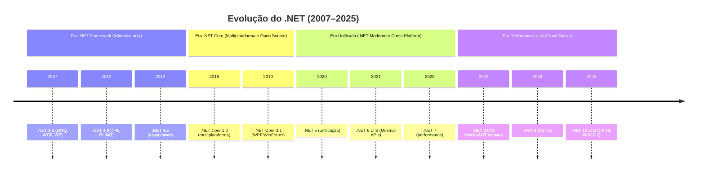
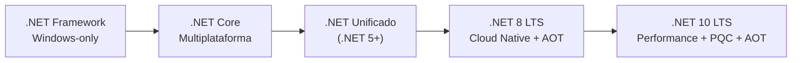
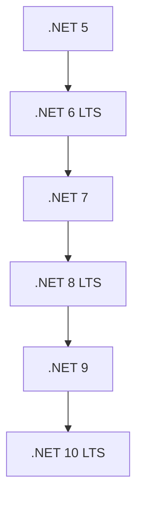
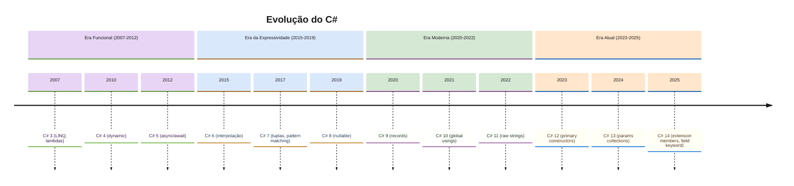
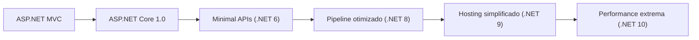
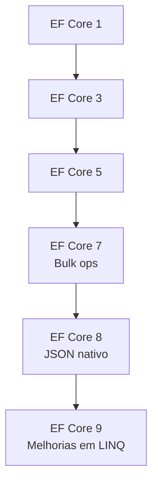

# 📘 Evolução do .NET — Do .NET 3.5 ao .NET 10

- Documento técnico em Markdown com diagramas Mermaid

## 🧭 Linha do Tempo Geral

## 🏛️ Evolução Arquitetural

## 📚 Evolução por Versão

## 🔷 .NET 3.5 (2007)

- Introdução do LINQ
- C# 3.0 (lambdas, var, extension methods)
- WCF, WF, ASP.NET AJAX

## 🔷 .NET 4.0 → 4.8 (2010–2019)
- TPL (Task Parallel Library)
- PLINQ
- async/await (C# 5)
- Web API
- Última versão: 4.8 (suporte contínuo, sem evolução)

## 🟧 Era .NET Core

### 🟧 .NET Core 1.0 (2016)

- Multiplataforma
- CLI moderna
- ASP.NET Core 1.0

### 🟧 .NET Core 2.x

- Razor Pages
- EF Core amadurecendo

### 🟧 .NET Core 3.0 / 3.1

- WPF e WinForms (Windows)
- gRPC
- C# 8

## 🟩 Era .NET Unificado (5 → 10)

## 🔵 Comparação Direta: .NET 7 vs 8 vs 9 vs 10

## 📊 Tabela Comparativa
| Versão  | Tipo | Foco                    | Destaques                                             |
| ------- | ---- | ----------------------- | ----------------------------------------------------- |
| .NET 7  | STS  | Performance             | JIT otimizado, containers, ASP.NET Core mais rápido   |
| .NET 8  | LTS  | Cloud-native            | NativeAOT estável, EF Core 8, WASM multithread        |
| .NET 9  | STS  | Incremental             | C# 13, melhorias em JSON, networking, AOT             |
| .NET 10 | LTS  | Performance + AOT + PQC | AVX10.2, C# 14, AOT maduro, criptografia pós‑quântica |

## 🔥 .NET 7 (2022)

- Foco em performance
- Melhorias no JIT
- ASP.NET Core mais rápido
- EF Core 7 com bulk operations
- NativeAOT ainda experimental

## 🟢 .NET 8 (2023 – LTS)

- NativeAOT estável
- ASP.NET Core com pipeline otimizado
- EF Core 8 com JSON nativo
- WASM com multithreading
- System.Text.Json mais rápido

## 🟡 .NET 9 (2024)

- C# 13
- Melhorias em AOT
- Novo modelo de hosting no ASP.NET Core
- Melhorias em networking, threading e JSON

## 🔴 .NET 10 (2025 – LTS)

- C# 14
- Suporte a AVX10.2 e ARM SVE
- NativeAOT maduro
- Criptografia pós‑quântica
- Test runner unificado
- Melhorias no JIT e GC

## ⚙️ Evolução do C# (3 → 14)

## 🚀 Evolução de Performance

## 🧩 Evolução do ASP.NET Core

## 📦 Evolução do EF Core

## 📄 Conclusão

| O .NET evoluiu de uma plataforma Windows‑only para um ecossistema multiplataforma, unificado, cloud‑native e altamente otimizado, com foco crescente em:

- Performance extrema
- AOT
- IA e cloud
- Segurança pós‑quântica
- Ferramentas modernas
- C# cada vez mais expressivo
- O .NET 10 representa o maior salto desde o .NET 6.

