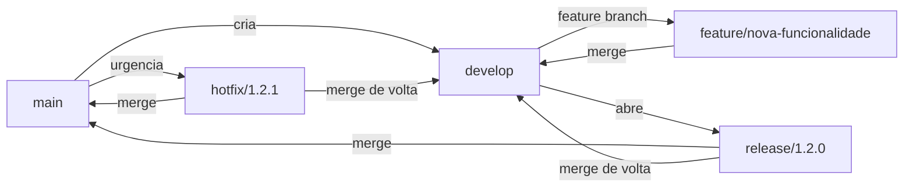
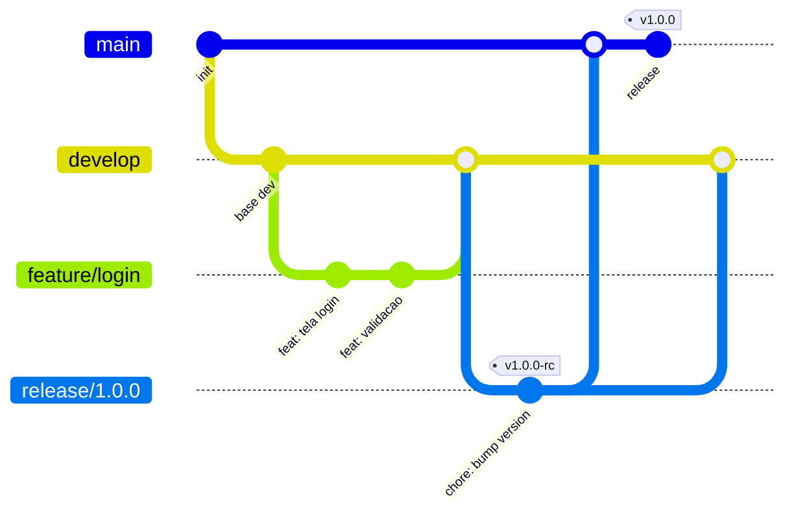
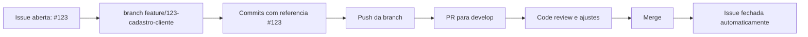

# Git Flow: Tutorial Inicial (Resumo Pratico)

Este guia mostra o essencial do Git Flow para voce comecar rapido em times que trabalham com versoes e releases.

## 1. Conceito rapido

No Git Flow, cada tipo de trabalho acontece em uma branch especifica:

- `main`: codigo em producao, sempre estavel.
- `develop`: integracao das features da proxima versao.
- `feature/*`: desenvolvimento de funcionalidades.
- `release/*`: preparacao de versao (ajustes finais e versionamento).
- `hotfix/*`: correcao urgente em producao.

## 2. Fluxo principal de branches



## 3. Exemplo visual de historico (Git Graph)



## 4. Casos de uso com comandos

### Caso 1: Nova funcionalidade (feature)

```bash
# cria e entra na feature a partir de develop
git checkout develop
git pull origin develop
git checkout -b feature/cadastro-cliente

# trabalha normalmente
git add .
git commit -m "feat: adiciona cadastro de cliente"

# finaliza integrando em develop
git checkout develop
git pull origin develop
git merge --no-ff feature/cadastro-cliente
git push origin develop
git branch -d feature/cadastro-cliente
```

### Caso 2: Preparar release

```bash
# cria branch de release a partir de develop
git checkout develop
git pull origin develop
git checkout -b release/1.3.0

# ajustes finais de versao
git add .
git commit -m "chore: prepara release 1.3.0"

# publica release em main e volta para develop
git checkout main
git pull origin main
git merge --no-ff release/1.3.0
git tag -a v1.3.0 -m "release 1.3.0"
git push origin main --tags

git checkout develop
git merge --no-ff release/1.3.0
git push origin develop
git branch -d release/1.3.0
```

### Caso 3: Correcao urgente (hotfix)

```bash
# hotfix sempre nasce de main
git checkout main
git pull origin main
git checkout -b hotfix/1.3.1

# corrige bug critico
git add .
git commit -m "fix: corrige erro de pagamento em producao"

# publica em main e sincroniza develop
git checkout main
git merge --no-ff hotfix/1.3.1
git tag -a v1.3.1 -m "hotfix 1.3.1"
git push origin main --tags

git checkout develop
git merge --no-ff hotfix/1.3.1
git push origin develop
git branch -d hotfix/1.3.1
```

## 5. Boas praticas minimas

- Prefira nomes claros: `feature/login-social`, `hotfix/erro-token`.
- Use commits pequenos e com mensagem objetiva (`feat:`, `fix:`, `chore:`).
- Sempre sincronize (`git pull`) antes de criar ou mesclar branches.
- Em times, use Pull Request para revisar antes do merge.

## 6. Criacao de Issue e Pull Request (PR)

Use este fluxo para rastrear trabalho de forma organizada: primeiro abre a issue, depois cria a branch da feature vinculada, e por fim abre o PR referenciando a issue.



### Caso 4: Criar issue

Exemplo com GitHub CLI (`gh`):

```bash
# cria uma issue com labels
gh issue create \
   --title "Cadastro de cliente com validacao" \
   --body "Implementar tela e validacoes do formulario de cadastro." \
   --label "feature" \
   --label "prioridade:media"
```

### Caso 5: Criar PR vinculado a issue

Depois de implementar a feature na branch `feature/123-cadastro-cliente`:

```bash
# envia branch
git push -u origin feature/123-cadastro-cliente

# cria PR para develop e referencia issue #123
gh pr create \
   --base develop \
   --head feature/123-cadastro-cliente \
   --title "feat: cadastro de cliente (#123)" \
   --body "Closes #123\n\n- adiciona tela de cadastro\n- adiciona validacoes de campos"
```

Boas praticas para PR:

- Titulo curto e objetivo, com referencia da issue.
- Descricao com contexto, mudancas e como testar.
- PR pequeno e focado facilita review e reduz conflitos.
- Use `Closes #<numero>` para fechar issue automaticamente no merge.
