# Linguagem R — Fundamentos e Prática

## 1. O que é R?

R é uma linguagem de programação open-source voltada para **análise estatística**, **manipulação de dados** e **visualização**. Criada por Ross Ihaka e Robert Gentleman na Universidade de Auckland, tornou-se o padrão na academia e indústria para ciência de dados, bioestatística, econometria e machine learning.

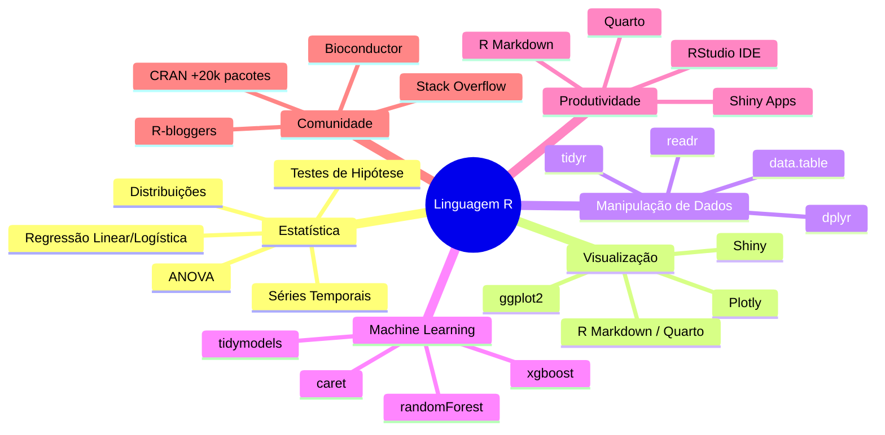

**Principais vantagens:**
- **CRAN** — repositório com mais de 20.000 pacotes
- **Ecosistema tidyverse** — coleção coesa de pacotes para ciência de dados
- **ggplot2** — gramática de gráficos mais poderosa do mercado
- **RStudio / Positron** — IDEs maduras e produtivas
- **Shiny** — web apps interativos sem precisar de JavaScript
- **Reprodutibilidade** — R Markdown e Quarto para relatórios dinâmicos

---

## 2. Instalação e Setup

```bash
# Baixar R: https://cran.r-project.org/
# Baixar RStudio: https://posit.co/download/rstudio-desktop/
# Ou Positron (VS Code fork): https://positron.posit.co/
```

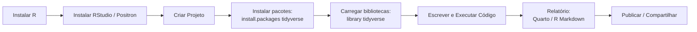

---

## 3. Sintaxe Básica

### 3.1 Operadores

| Operador | Descrição | Exemplo | Resultado |
|---|---|---|---|
| `+`, `-`, `*`, `/` | Aritmética | `10 / 3` | `3.333...` |
| `^` ou `**` | Potência | `2^3` | `8` |
| `%%` | Módulo | `10 %% 3` | `1` |
| `%/%` | Divisão inteira | `10 %/% 3` | `3` |
| `==`, `!=`, `<`, `>`, `<=`, `>=` | Comparação | `5 > 3` | `TRUE` |
| `&`, `|`, `!` | Lógicos (vetorizados) | `c(TRUE, FALSE) & c(TRUE, TRUE)` | `TRUE FALSE` |
| `&&`, `||` | Lógicos (escalares) | `TRUE && FALSE` | `FALSE` |
| `%>%` | Pipe (magrittr/tidyverse) | `x %>% mean()` | média de x |
| `|>` | Pipe nativo (R >= 4.1) | `x |> mean()` | média de x |

### 3.2 Variáveis e Tipos Básicos

```r
# Atribuição (recomendado: <-)
nome <- "Alice"
idade <- 30L           # inteiro (L)
altura <- 1.75          # double
aprovado <- TRUE        # lógico
nota <- 9.5             # numeric (double por padrão)

# Verificar tipo
typeof(nome)     # "character"
typeof(idade)    # "integer"
typeof(altura)   # "double"
is.numeric(nota) # TRUE
is.character(nome) # TRUE

# Coerção automática
c(1, "texto")    # "1" "texto"  (character)

# Valores especiais
NA          # Missing (ausente)
NULL        # Vazio (inexistente)
NaN         # Not a Number (0/0)
Inf         # Infinito
```

### 3.3 Tipos de Dados

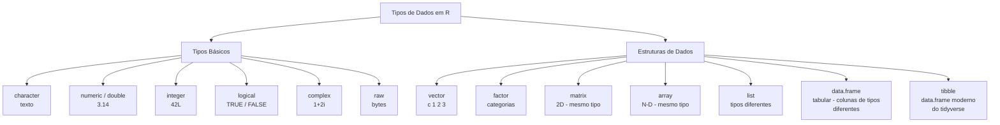

---

## 4. Estruturas de Dados

### 4.1 Vetores

```r
# Criação
v1 <- c(1, 2, 3, 4, 5)
v2 <- 1:5                # mesmo que c(1,2,3,4,5)
v3 <- seq(1, 10, by = 2) # 1 3 5 7 9
v4 <- rep(3, 5)           # 3 3 3 3 3

# Indexação (começa em 1!)
v1[1]           # 1
v1[c(1, 3, 5)]  # 1 3 5
v1[-1]          # todos menos o 1º
v1[v1 > 3]      # 4 5 (filtro lógico)

# Comprimento
length(v1)      # 5

# Operações vetorizadas (evite loops!)
v1 * 2          # 2 4 6 8 10
v1 + v2         # 2 4 6 8 10
sqrt(v1)        # 1.00 1.41 1.73 2.00 2.24
```

### 4.2 Fatores (Factor)

```r
# Dados categóricos
cores <- factor(c("vermelho", "azul", "verde", "azul", "vermelho"))
levels(cores)   # "azul" "verde" "vermelho"
table(cores)    # azul 2, verde 1, vermelho 2

# Ordenados
tamanho <- factor(c("P", "M", "G", "M", "P"),
                  levels = c("P", "M", "G"),
                  ordered = TRUE)
tamanho[1] < tamanho[2]  # TRUE (P < M)
```

### 4.3 Listas

```r
# Coleção heterogênea
lista <- list(
  nome = "João",
  idade = 25,
  notas = c(8, 9, 7),
  aprovado = TRUE
)

# Acesso
lista$nome          # "João"
lista[["idade"]]    # 25
lista[[3]]          # 8 9 7
lista[[3]][2]       # 9
```

### 4.4 Matrizes

```r
# 2D - mesmo tipo
m <- matrix(1:9, nrow = 3, ncol = 3)
#      [,1] [,2] [,3]
# [1,]    1    4    7
# [2,]    2    5    8
# [3,]    3    6    9

m[2, 3]     # 8
m[1, ]      # linha 1: 1 4 7
m[, 2]      # coluna 2: 4 5 6
t(m)        # transposta
```

### 4.5 Data Frames

```r
# Base R
df <- data.frame(
  nome = c("Ana", "Bob", "Eva"),
  idade = c(28, 35, 22),
  salario = c(5000, 8000, 4500),
  stringsAsFactors = FALSE
)

df$nome             # coluna
df[1, ]             # linha 1
df[df$idade > 25, ] # filtro
```

### 4.6 Tibble (tidyverse)

```r
library(tidyverse)

tb <- tibble(
  nome = c("Ana", "Bob", "Eva"),
  idade = c(28, 35, 22),
  salario = c(5000, 8000, 4500)
)

# Vantagens: não converte string em factor,
# print adaptável, melhor para listas
```

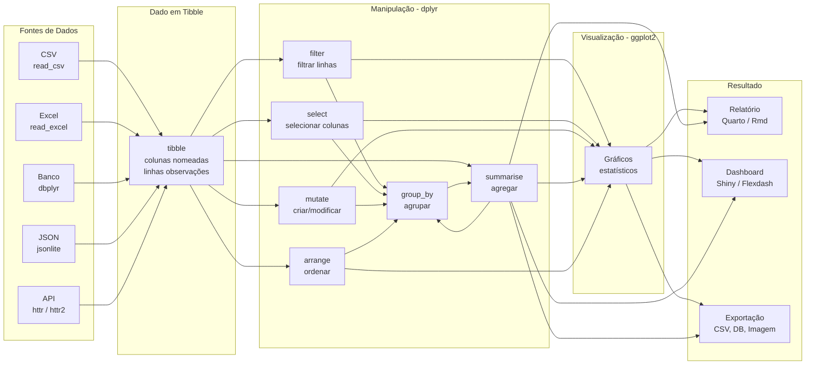

---

## 5. Estruturas de Controle

### 5.1 Condicionais

```r
# if / else if / else
nota <- 7.5

if (nota >= 9) {
  cat("Conceito A")
} else if (nota >= 7) {
  cat("Conceito B")
} else {
  cat("Conceito C")
}

# ifelse vetorizado
notas <- c(8, 5, 6, 9, 3)
ifelse(notas >= 7, "Aprovado", "Reprovado")
# "Aprovado" "Reprovado" "Reprovado" "Aprovado" "Reprovado"

# case_when (dplyr) — múltiplas condições
library(dplyr)
case_when(
  notas >= 9 ~ "A",
  notas >= 7 ~ "B",
  notas >= 5 ~ "C",
  TRUE ~ "D"
)
```

### 5.2 Loops

```r
# for — mais comum
for (i in 1:5) {
  print(i^2)
}

# while
x <- 1
while (x <= 5) {
  print(x)
  x <- x + 1
}

# repeat + break
x <- 1
repeat {
  print(x)
  x <- x + 1
  if (x > 5) break
}

# apply family (evite for quando possível)
lapply(1:5, function(x) x^2)  # retorna lista
sapply(1:5, function(x) x^2)  # simplifica para vetor
```

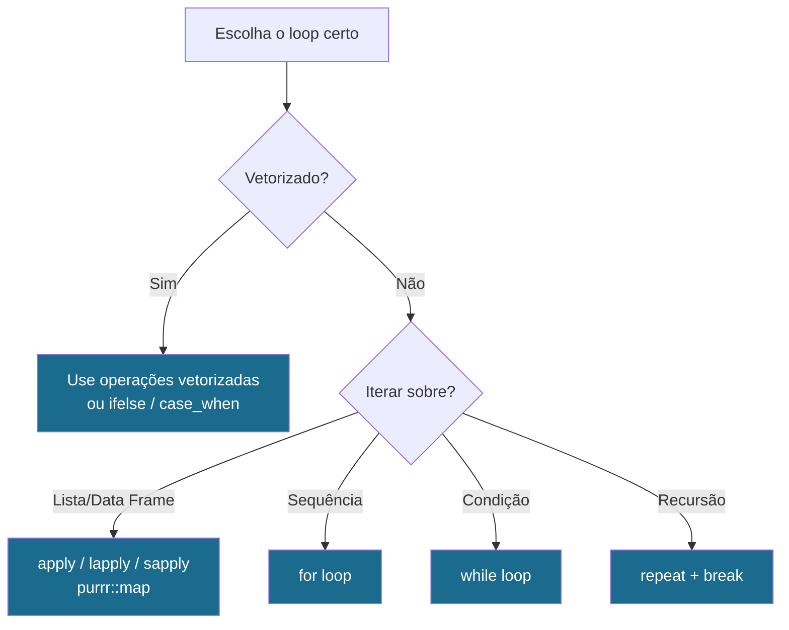

---

## 6. Funções

### 6.1 Criando Funções

```r
# Função simples
media <- function(x) {
  sum(x) / length(x)
}
media(1:10)  # 5.5

# Argumentos com valor padrão
pad <- function(x, decimal = 2) {
  round(x, decimal)
}
pad(pi)      # 3.14
pad(pi, 4)   # 3.1416

# ... (argumentos variáveis)
soma_tudo <- function(...) {
  sum(...)
}
soma_tudo(1, 2, 3, 4)  # 10

# Função anônima (lambda)
sapply(1:5, \(x) x^2)   # R >= 4.1
sapply(1:5, function(x) x^2)
```

### 6.2 Programação Funcional com purrr

```r
library(purrr)

map(1:5, ~ .x^2)              # lista
map_dbl(1:5, ~ .x^2)          # vetor numérico
map_chr(1:5, ~ paste0("N", .x)) # vetor character

# walk — efeito colateral (sem retorno)
walk(1:3, ~ print(.x))

# keep / discard — filtrar por função
keep(1:10, ~ .x > 5)          # 6 7 8 9 10

# reduce — acumular
reduce(1:5, `*`)              # 120 (produto)
```

---

## 7. Manipulação de Dados com dplyr e tidyr

### 7.1 dplyr — Verbos Principais

```r
library(dplyr)

# Dataset de exemplo
dados <- tibble(
  cliente = c("Ana", "Bob", "Eva", "Ana", "Bob", "Eva"),
  produto  = c("A", "B", "A", "B", "A", "B"),
  vendas   = c(100, 200, 150, 300, 250, 180),
  mes      = c("Jan", "Jan", "Jan", "Fev", "Fev", "Fev")
)

# filter — filtrar linhas
dados |> filter(vendas > 150)

# select — selecionar/remover colunas
dados |> select(cliente, vendas)
dados |> select(-mes)

# mutate — criar/modificar colunas
dados |> mutate(
  bonus = vendas * 0.1,
  categoria = ifelse(vendas > 200, "Alta", "Baixa")
)

# arrange — ordenar
dados |> arrange(desc(vendas))

# summarise + group_by — agregação
dados |>
  group_by(cliente) |>
  summarise(
    total_vendas = sum(vendas),
    media_vendas = mean(vendas),
    n_pedidos = n()
  )

# count — atalho para group_by + summarise(n)
dados |> count(cliente)

# slice — selecionar linhas por posição
dados |> slice_head(n = 3)   # primeiras 3
dados |> slice_max(vendas, n = 2)  # top 2

# join — combinar tabelas
pedidos <- tibble(
  pedido_id = 1:3,
  cliente = c("Ana", "Bob", "Eva"),
  valor = c(500, 300, 450)
)
info <- tibble(
  cliente = c("Ana", "Bob", "Eva"),
  cidade = c("SP", "RJ", "BH")
)
pedidos |> left_join(info, by = "cliente")
```

### 7.2 tidyr — Organização de Dados

```r
library(tidyr)

# pivot_wider — largo (long -> wide)
# Útil para tabelas cruzadas
dados_long <- tibble(
  cliente = c("Ana", "Ana", "Bob", "Bob"),
  mes     = c("Jan", "Fev", "Jan", "Fev"),
  vendas  = c(100, 300, 200, 250)
)
dados_long |>
  pivot_wider(
    names_from = mes,
    values_from = vendas
  )
# # A tibble: 2 x 3
#   cliente   Jan   Fev
#   Ana      100   300
#   Bob      200   250

# pivot_longer — longo (wide -> long)
dados_wide <- tibble(
  cliente = c("Ana", "Bob"),
  Jan = c(100, 200),
  Fev = c(300, 250)
)
dados_wide |>
  pivot_longer(
    cols = c(Jan, Fev),
    names_to = "mes",
    values_to = "vendas"
  )

# separate / unite (legado: agora use separate_wider / unite)
# Exemplo com separate_wider_delim
dados <- tibble(nome_completo = c("Silva, Ana", "Santos, Bob"))
dados |>
  separate_wider_delim(nome_completo,
    delim = ", ",
    names = c("sobrenome", "nome")
  )

# drop_na — remover NAs
dados_com_na <- tibble(x = c(1, NA, 3), y = c(NA, 2, 3))
dados_com_na |> drop_na()

# replace_na — substituir NAs
dados_com_na |> replace_na(list(x = 0, y = 0))
```

### 7.3 Pipeline Completo de Análise

```r
library(tidyverse)

# Dataset: mtcars (nativo do R)
mtcars |>
  as_tibble() |>
  filter(cyl >= 6) |>                     # apenas 6+ cilindros
  select(mpg, cyl, hp, wt, am) |>         # colunas de interesse
  mutate(
    eficiencia = mpg / wt,                 # nova métrica
    am_label = ifelse(am == 1, "Automático", "Manual")
  ) |>
  group_by(cyl, am_label) |>               # agrupar
  summarise(
    n = n(),
    media_hp = mean(hp),
    media_mpg = mean(mpg),
    .groups = "drop"
  ) |>
  arrange(desc(media_mpg))

# Resultado esperado:
# # A tibble: 3 x 5
#     cyl am_label       n media_hp media_mpg
#   <dbl> <chr>      <int>    <dbl>     <dbl>
# 1     6 Automático     3    117.       20.9
# 2     6 Manual         4    128.       21.0
# 3     8 Automático    14    194.       14.5
```

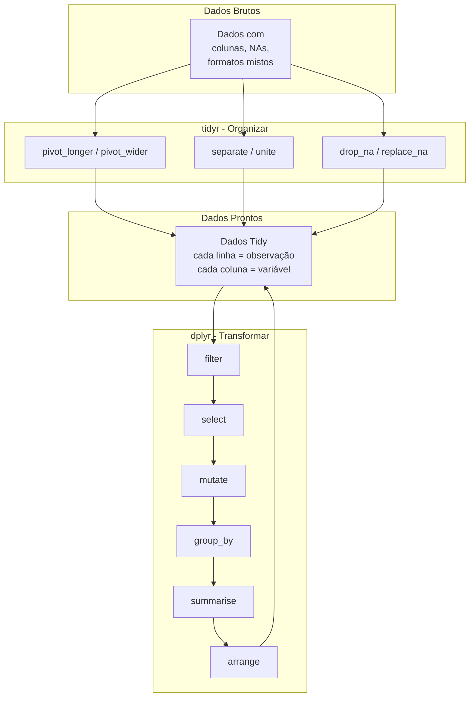

---

## 8. Visualização com ggplot2

### 8.1 Anatomia de um Gráfico

```r
library(ggplot2)

# Estrutura:
# ggplot(data = <dados>) +
#   geom_<tipo>(aes(<mapeamento>)) +
#   labs(...) +
#   theme_...()

# Gráfico de dispersão básico
ggplot(mtcars, aes(x = wt, y = mpg)) +
  geom_point(size = 3, alpha = 0.7) +
  labs(
    title = "Consumo vs Peso",
    x = "Peso (1000 lbs)",
    y = "Milhas por Galão"
  ) +
  theme_minimal()
```

### 8.2 Principais Geoms

| Geom | Tipo | Exemplo |
|---|---|---|
| `geom_point()` | Dispersão | `aes(x, y)` |
| `geom_line()` | Linha | `aes(x, y)` |
| `geom_bar()` | Barras | `aes(x)` |
| `geom_col()` | Barras (altura explícita) | `aes(x, y)` |
| `geom_histogram()` | Histograma | `aes(x)` |
| `geom_boxplot()` | Boxplot | `aes(x, y)` |
| `geom_density()` | Densidade | `aes(x)` |
| `geom_smooth()` | Suavização/Regressão | `aes(x, y)` |
| `geom_tile()` | Heatmap | `aes(x, y, fill)` |
| `geom_text()` | Texto/Rótulo | `aes(x, y, label)` |

### 8.3 Exemplos

```r
# Histograma
ggplot(mtcars, aes(x = mpg)) +
  geom_histogram(bins = 10, fill = "#3498db", color = "white") +
  labs(title = "Distribuição do Consumo") +
  theme_minimal()

# Barras (contagem de cilindros)
ggplot(mtcars, aes(x = factor(cyl), fill = factor(cyl))) +
  geom_bar() +
  scale_fill_brewer(palette = "Set2") +
  labs(title = "Contagem de Cilindros", x = "Cilindros", fill = "Cil.") +
  theme_minimal()

# Boxplot (consumo por cilindro)
ggplot(mtcars, aes(x = factor(cyl), y = mpg, fill = factor(cyl))) +
  geom_boxplot() +
  geom_jitter(width = 0.2, alpha = 0.5) +
  scale_fill_brewer(palette = "Set1") +
  labs(title = "Consumo por Cilindro", x = "Cilindros", y = "MPG") +
  theme_minimal()

# Dispersão com regressão linear
ggplot(mtcars, aes(x = wt, y = mpg)) +
  geom_point(aes(color = factor(cyl), size = hp)) +
  geom_smooth(method = "lm", se = TRUE, color = "#e74c3c") +
  scale_color_brewer(palette = "Dark2") +
  labs(
    title = "Consumo vs Peso",
    subtitle = "Tamanho = HP, Cor = Cilindros",
    x = "Peso", y = "MPG",
    color = "Cilindros", size = "HP"
  ) +
  theme_classic()

# Facet (subgráficos)
ggplot(mtcars, aes(x = wt, y = mpg)) +
  geom_point() +
  geom_smooth(method = "lm") +
  facet_wrap(~ cyl, scales = "free") +
  labs(title = "Relação por Nº de Cilindros") +
  theme_bw()
```

### 8.4 Gráficos com dados tidy (iris)

```r
# Iris dataset
glimpse(iris)
# Species: setosa, versicolor, virginica

# Densidade por espécie
ggplot(iris, aes(x = Sepal.Length, fill = Species)) +
  geom_density(alpha = 0.4) +
  scale_fill_brewer(palette = "Set1") +
  labs(title = "Densidade do Comprimento da Sépala") +
  theme_minimal()

# Matriz de dispersão com cores
library(GGally)
ggpairs(iris, aes(color = Species))
```

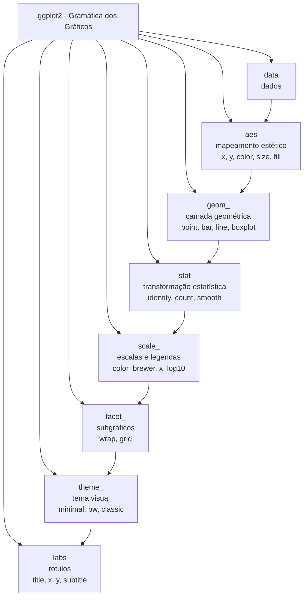

---

## 9. Análise Estatística Básica

### 9.1 Estatísticas Descritivas

```r
library(tidyverse)

# Dataset mtcars
summary(mtcars)        # resumo geral

# Estatísticas por grupo
mtcars |>
  group_by(cyl) |>
  summarise(
    n = n(),
    media_mpg = mean(mpg),
    mediana_mpg = median(mpg),
    desvio_padrao = sd(mpg),
    variancia = var(mpg),
    min = min(mpg),
    max = max(mpg),
    q1 = quantile(mpg, 0.25),
    q3 = quantile(mpg, 0.75),
    iqr = IQR(mpg)
  )

# Correlação
cor(mtcars$mpg, mtcars$wt)                 # -0.867...
cor(mtcars |> select(mpg, wt, hp, disp))   # matriz de correlação

# Visualizar correlação
library(corrplot)
cor(mtcars |> select(mpg, wt, hp, disp, cyl)) |>
  corrplot(method = "color", type = "upper",
           addCoef.col = "black", number.cex = 0.7)
```

### 9.2 Testes de Hipótese

```r
# Teste t de Student (comparar duas médias)
# H0: média mpg de carros automáticos = manual
t.test(mpg ~ am, data = mtcars)

# Teste t pareado
t.test(mpg ~ am, data = mtcars, paired = FALSE)

# Wilcoxon (não paramétrico)
wilcox.test(mpg ~ am, data = mtcars)

# ANOVA (comparar 3+ grupos)
# H0: médias de mpg são iguais entre cilindros
anova <- aov(mpg ~ factor(cyl), data = mtcars)
summary(anova)
TukeyHSD(anova)  # post-hoc

# Correlação de Pearson
cor.test(mtcars$mpg, mtcars$wt)

# Qui-quadrado (associação entre variáveis categóricas)
chisq.test(table(mtcars$cyl, mtcars$am))
```

### 9.3 Regressão Linear

```r
# Modelo simples
modelo <- lm(mpg ~ wt, data = mtcars)
summary(modelo)

# Modelo múltiplo
modelo2 <- lm(mpg ~ wt + hp + factor(cyl), data = mtcars)
summary(modelo2)

# Diagnosticar o modelo
par(mfrow = c(2, 2))
plot(modelo2)

# Coeficientes
coef(modelo2)

# Predição
novos_dados <- tibble(wt = c(2.5, 3.0, 3.5), hp = c(100, 150, 200), cyl = c(6, 8, 8))
predict(modelo2, newdata = novos_dados)

# Visualizar regressão
mtcars |>
  mutate(predito = predict(modelo)) |>
  ggplot(aes(x = wt, y = mpg)) +
  geom_point(size = 3, alpha = 0.6) +
  geom_line(aes(y = predito), color = "#e74c3c", size = 1.2) +
  geom_ribbon(
    aes(ymin = predict(modelo, interval = "confidence")[, 2],
        ymax = predict(modelo, interval = "confidence")[, 3]),
    alpha = 0.2, fill = "#3498db"
  ) +
  labs(title = "Regressão Linear: MPG ~ Peso",
       subtitle = "Com intervalo de confiança (95%)",
       x = "Peso (1000 lbs)", y = "MPG") +
  theme_minimal()
```

### 9.4 Pipeline Estatístico Completo

```r
library(tidyverse)
library(broom)

# Análise completa iris
iris |>
  # Estatísticas descritivas
  group_by(Species) |>
  summarise(
    across(where(is.numeric),
           list(media = mean, sd = sd, min = min, max = max),
           .names = "{.col}_{.fn}")
  ) |>
  ungroup() |>
  # Pivot para formato longo (tidy)
  pivot_longer(-Species, names_to = "medida", values_to = "valor") |>
  # Visualizar
  ggplot(aes(x = Species, y = valor, fill = Species)) +
  geom_bar(stat = "identity", position = "dodge") +
  facet_wrap(~ medida, scales = "free_y") +
  scale_fill_brewer(palette = "Set2") +
  labs(title = "Estatísticas Iris por Espécie") +
  theme_minimal()

# Teste ANOVA para todas as variáveis numéricas
iris |>
  select(where(is.numeric)) |>
  names() |>
  map(function(var) {
    f <- as.formula(paste(var, "~ Species"))
    aov(f, data = iris) |> tidy()
  }) |>
  set_names(names(iris |> select(where(is.numeric))))
```

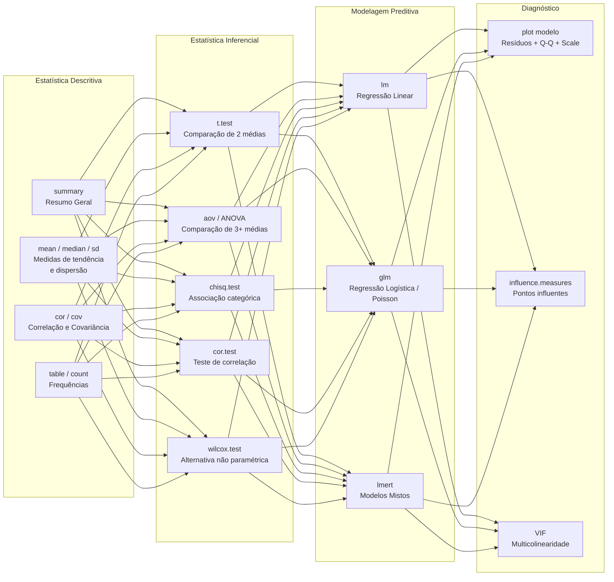

---

## 10. Pacotes Essenciais

| Pacote | Categoria | Função Principal |
|---|---|---|
| **tidyverse** | Coleção | Carrega dplyr, ggplot2, tidyr, readr, purrr, stringr, forcats, tibble |
| **dplyr** | Manipulação | `filter()`, `select()`, `mutate()`, `summarise()`, `group_by()` |
| **ggplot2** | Visualização | Gramática de gráficos |
| **tidyr** | Organização | `pivot_longer()`, `pivot_wider()`, `drop_na()` |
| **readr** | Leitura | `read_csv()`, `read_rds()` |
| **purrr** | Funcional | `map()`, `reduce()`, `keep()` |
| **stringr** | Texto | `str_detect()`, `str_replace()`, `str_extract()` |
| **lubridate** | Datas | `ymd()`, `floor_date()`, `interval()` |
| **forcats** | Factors | `fct_reorder()`, `fct_lump()` |
| **broom** | Modelos | `tidy()`, `glance()`, `augment()` |
| **data.table** | Performance | `fread()`, `DT[i, j, by]` |
| **plotly** | Interatividade | `ggplotly()` |
| **shiny** | Web Apps | `reactive()`, `renderPlot()` |
| **rmarkdown** | Relatórios | `render()` |
| **quarto** | Publicação | Next-gen R Markdown |
| **tidymodels** | ML | Framework moderno de machine learning |
| **janitor** | Limpeza | `clean_names()`, `tabyl()` |

---

## 11. Entrada e Saída de Dados

```r
library(tidyverse)

# CSV
df <- read_csv("dados.csv")
write_csv(df, "dados_limpos.csv")

# Excel
library(readxl)
df <- read_excel("dados.xlsx", sheet = 1)
library(writexl)
write_xlsx(df, "dados.xlsx")

# RDS (formato nativo R)
saveRDS(df, "dados.rds")
df <- readRDS("dados.rds")

# Feather / Parquet (rápido,跨语言)
library(arrow)
write_parquet(df, "dados.parquet")
df <- read_parquet("dados.parquet")

# Banco de dados
library(DBI)
library(RSQLite)
con <- dbConnect(SQLite(), "banco.db")
dbWriteTable(con, "tabela", df)
dbListTables(con)
dbGetQuery(con, "SELECT * FROM tabela WHERE vendas > 100")

# dbplyr — dplyr em SQL
library(dbplyr)
tbl(con, "tabela") |>
  filter(vendas > 100) |>
  collect()
```

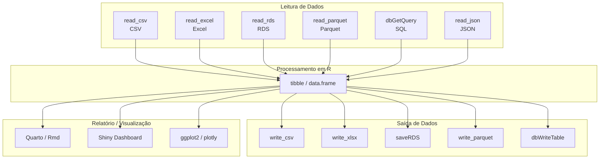

---

## 12. R Markdown / Quarto

Relatórios dinâmicos que combinam texto, código e gráficos.

```yaml
---
title: "Análise de Vendas"
author: "Seu Nome"
format: html
editor: visual
---
```
----

```r
    library(tidyverse)
    dados <- read_csv("vendas.csv")
    dados |> count(produto) |> ggplot(aes(x = produto, y = n)) + geom_col()
```

**Quarto** é a evolução do R Markdown — suporta R, Python, Julia, Observable JS e mais.

---

## 13. Boas Práticas

```r
# 1. Use pacotes (não reinvente a roda)
library(tidyverse)   # em vez de loops manuais

# 2. Prefira pipes
df |> filter(x > 0) |> mutate(z = x + y)
# em vez de aninhar: mutate(filter(df, x > 0), z = x + y)

# 3. Nomes claros e consistentes
vendas_por_mes <- dados |>
  group_by(mes) |>
  summarise(total = sum(vendas))

# 4. Use tibble em vez de data.frame
tibble(x = 1:3)  # melhor que data.frame

# 5. Evite crescimento dinâmico (pré-aloque)
n <- 1000
resultado <- vector("numeric", n)
for (i in seq_len(n)) resultado[i] <- i^2

# 6. Documente com Roxygen (em pacotes)
# 7. Use projetos RStudio / renv para reprodutibilidade
```

---

## 14. Exemplo Prático Completo

```r
# ============================================================
# Análise Exploratória do Dataset diamonds (ggplot2)
# ============================================================

library(tidyverse)

# --- 1. Conhecer os dados ---
glimpse(diamonds)
# 53.940 linhas, 10 colunas
# price, carat, cut, color, clarity, depth, table, x, y, z

# --- 2. Limpeza básica ---
diamonds_clean <- diamonds |>
  filter(price > 0, carat > 0) |>
  mutate(
    price_k = price / 1000,          # preço em milhares
    cut = fct_reorder(cut, price)    # reordenar fator
  )

# --- 3. Análise exploratória ---
# Estatísticas por tipo de corte
diamonds_clean |>
  group_by(cut) |>
  summarise(
    n = n(),
    preco_medio = mean(price),
    preco_mediano = median(price),
    carat_medio = mean(carat),
    .groups = "drop"
  )

# --- 4. Visualizações ---

# 4.1 Distribuição do preço
p1 <- ggplot(diamonds_clean, aes(x = price_k)) +
  geom_histogram(bins = 50, fill = "#2c3e50", color = "white") +
  labs(title = "Distribuição do Preço dos Diamantes",
       x = "Preço (milhares USD)", y = "Contagem") +
  theme_minimal()

# 4.2 Preço por tipo de corte
p2 <- ggplot(diamonds_clean, aes(x = cut, y = price_k, fill = cut)) +
  geom_boxplot() +
  scale_fill_brewer(palette = "Set1") +
  labs(title = "Preço por Tipo de Corte",
       x = "Corte", y = "Preço (milhares USD)") +
  theme_minimal() +
  theme(legend.position = "none")

# 4.3 Preço vs Quilate por cor
p3 <- diamonds_clean |>
  sample_n(5000) |>
  ggplot(aes(x = carat, y = price_k, color = color)) +
  geom_point(alpha = 0.5) +
  geom_smooth(method = "lm", se = FALSE, color = "#e74c3c") +
  scale_color_brewer(palette = "Spectral") +
  labs(title = "Preço vs Quilate (por Cor)",
       x = "Quilate", y = "Preço (milhares USD)") +
  theme_minimal()

# 4.4 Heatmap: corte vs cor vs preço médio
p4 <- diamonds_clean |>
  group_by(cut, color) |>
  summarise(preco_medio = mean(price), .groups = "drop") |>
  ggplot(aes(x = cut, y = color, fill = preco_medio)) +
  geom_tile() +
  scale_fill_viridis_c(option = "C") +
  labs(title = "Preço Médio: Corte vs Cor",
       x = "Corte", y = "Cor", fill = "Preço Médio") +
  theme_minimal()

# --- 5. Modelagem ---
modelo_diamante <- lm(log(price) ~ carat + cut + color + clarity,
                      data = diamonds_clean)
summary(modelo_diamante)

# --- 6. Relatório com broom ---
library(broom)
tidy(modelo_diamante) |>
  filter(term != "(Intercept)") |>
  arrange(desc(abs(estimate))) |>
  mutate(significancia = ifelse(p.value < 0.001, "***",
                                ifelse(p.value < 0.01, "**",
                                       ifelse(p.value < 0.05, "*", ""))))
```

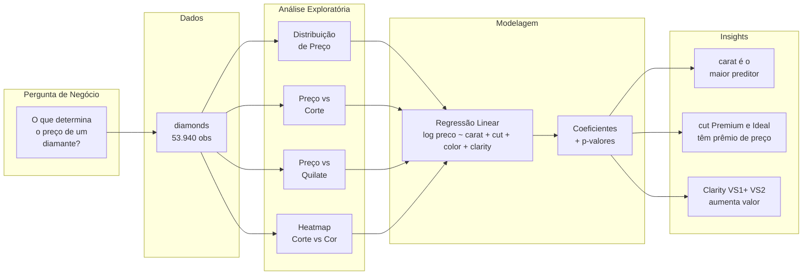

---

## 15. Recursos de Aprendizado

| Recurso | Link |
|---|---|
| R for Data Science (2ed) | https://r4ds.hadley.nz/ |
| ggplot2: Elegant Graphics for Data Analysis | https://ggplot2-book.org/ |
| R Graphics Cookbook | https://r-graphics.org/ |
| Advanced R | https://adv-r.hadley.nz/ |
| R-bloggers | https://www.r-bloggers.com/ |
| Posit (antigo RStudio) | https://posit.co/resources/ |
| R Weekly | https://rweekly.org/ |
| Stack Overflow (R tag) | https://stackoverflow.com/questions/tagged/r |
| Quarto | https://quarto.org/ |
| Shiny | https://shiny.posit.co/ |

---

## 16. Integração: Leitura de Arquivos e Interação com Dados

### 16.1 CSV

```r
library(tidyverse)

# readr (tidyverse) — mais rápido e consistente
df_csv <- read_csv("vendas.csv")
df_csv <- read_csv("vendas.csv", skip = 2)        # pular linhas
df_csv <- read_csv("vendas.csv", na = c("", "NA", "NULO"))  # definir NAs
df_csv <- read_csv("vendas.csv", col_types = cols(
  data     = col_date(format = "%Y-%m-%d"),
  valor    = col_number(),
  categoria = col_factor()
))

# Base R
df_csv_base <- read.csv("vendas.csv", stringsAsFactors = FALSE)

# Interação com dados carregados
glimpse(df_csv)                     # estrutura
summary(df_csv)                     # resumo estatístico
unique(df_csv$categoria)            # valores únicos
df_csv |> count(categoria)          # frequência

# Filtrar e salvar
df_csv |>
  filter(valor > 1000) |>
  write_csv("vendas_acima_1000.csv")
```

### 16.2 TXT (Delimitado)

```r
library(tidyverse)

# Tabulação
df_txt <- read_delim("dados.txt", delim = "\t")

# Pipe
df_pipe <- read_delim("dados.txt", delim = "|")

# Largura fixa (FWFs)
df_fwf <- read_fwf("dados_fwf.txt",
  fwf_widths(c(10, 8, 15), col_names = c("id", "data", "nome"))
)

# Posições das colunas
df_fwf2 <- read_fwf("dados_fwf.txt",
  fwf_positions(c(1, 11, 19), c(10, 18, 33), col_names = c("id", "data", "nome"))
)

# Sem header
df_sem_header <- read_delim("dados_sem_header.txt",
  delim = ",", col_names = c("nome", "idade", "cidade")
)

# Interação
df_txt |>
  mutate(across(where(is.character), str_trim)) |>    # limpar espaços
  filter(if_any(everything(), ~ !is.na(.x))) |>        # remover linhas tudo NA
  summarise(across(where(is.numeric), mean, na.rm = TRUE))
```

### 16.3 Excel

```r
library(readxl)
library(writexl)
library(tidyverse)

# Listar abas
excel_sheets("relatorio.xlsx")

# Ler aba específica
df_excel <- read_excel("relatorio.xlsx", sheet = "Vendas")
df_excel <- read_excel("relatorio.xlsx", sheet = 2)

# Intervalo específico
df_range <- read_excel("relatorio.xlsx", sheet = 1, range = "A1:F100")

# Pular linhas e definir NAs
df_excel <- read_excel("relatorio.xlsx",
  sheet = 1, skip = 3, na = "---"
)

# Todas as abas de uma vez
todas_abas <- excel_sheets("relatorio.xlsx") |>
  set_names() |>
  map(~ read_excel("relatorio.xlsx", sheet = .x))

# Escrever Excel
write_xlsx(list(Vendas = df_csv, Clientes = df_clientes), "output.xlsx")

# Interação típica pós-leitura
df_excel |>
  rename_with(tolower) |>                                # colunas minúsculas
  mutate(data = as.Date(data)) |>                        # converter data
  filter(!is.na(valor)) |>                               # remover NAs
  group_by(categoria) |>
  summarise(total = sum(valor, na.rm = TRUE), .groups = "drop") |>
  arrange(desc(total))
```

### 16.4 Exemplo Completo: Carga, Limpeza e Análise

```r
library(tidyverse)
library(readxl)

# --- 1. Carregar múltiplas fontes ---
vendas_csv <- read_csv("vendas_2024.csv")
vendas_txt <- read_delim("vendas_2024_aux.txt", delim = "|")
clientes   <- read_excel("clientes.xlsx", sheet = 1)

# --- 2. Padronizar e integrar ---
vendas <- bind_rows(vendas_csv, vendas_txt) |>
  left_join(clientes, by = "cliente_id")

# --- 3. Limpeza ---
vendas_clean <- vendas |>
  janitor::clean_names() |>                              # nomes consistentes
  mutate(
    data = coalesce(data, parse_date(data_alt)),         # unificar colunas de data
    valor = parse_number(as.character(valor)),            # garantir numérico
    across(where(is.character), str_squish)               # remover espaços extras
  ) |>
  filter(!is.na(valor), valor > 0)                       # remover inválidos

# --- 4. Enriquecimento ---
vendas_final <- vendas_clean |>
  mutate(
    mes = floor_date(data, "month"),
    faixa_valor = case_when(
      valor < 100 ~ "Baixo",
      valor < 500 ~ "Médio",
      TRUE ~ "Alto"
    )
  )

# --- 5. Análise ---
vendas_final |>
  group_by(mes, faixa_valor) |>
  summarise(
    total = sum(valor),
    n = n(),
    .groups = "drop"
  ) |>
  ggplot(aes(x = mes, y = total, fill = faixa_valor)) +
  geom_col() +
  scale_fill_brewer(palette = "Set2") +
  labs(title = "Evolução de Vendas por Faixa de Valor",
       x = "Mês", y = "Total (R$)", fill = "Faixa") +
  theme_minimal()

# --- 6. Exportar resultado ---
vendas_final |>
  filter(total > 1000) |>
  write_csv("vendas_acima_1000.csv")

vendas_final |>
  write_xlsx("relatorio_vendas_limpo.xlsx")
```

### 16.5 Fluxo Completo de Integração

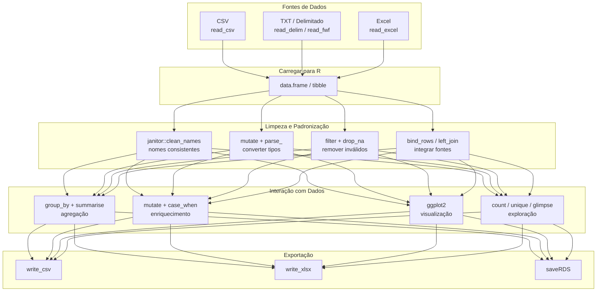

---

**R** é uma linguagem madura, com comunidade ativa e ecossistema incomparável para análise de dados. Combinando **tidyverse** para manipulação, **ggplot2** para visualização e **Quarto** para relatórios, você tem um fluxo de trabalho completo, reprodutível e profissional.
